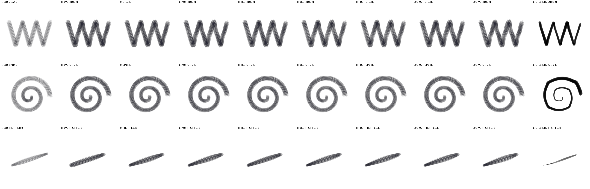
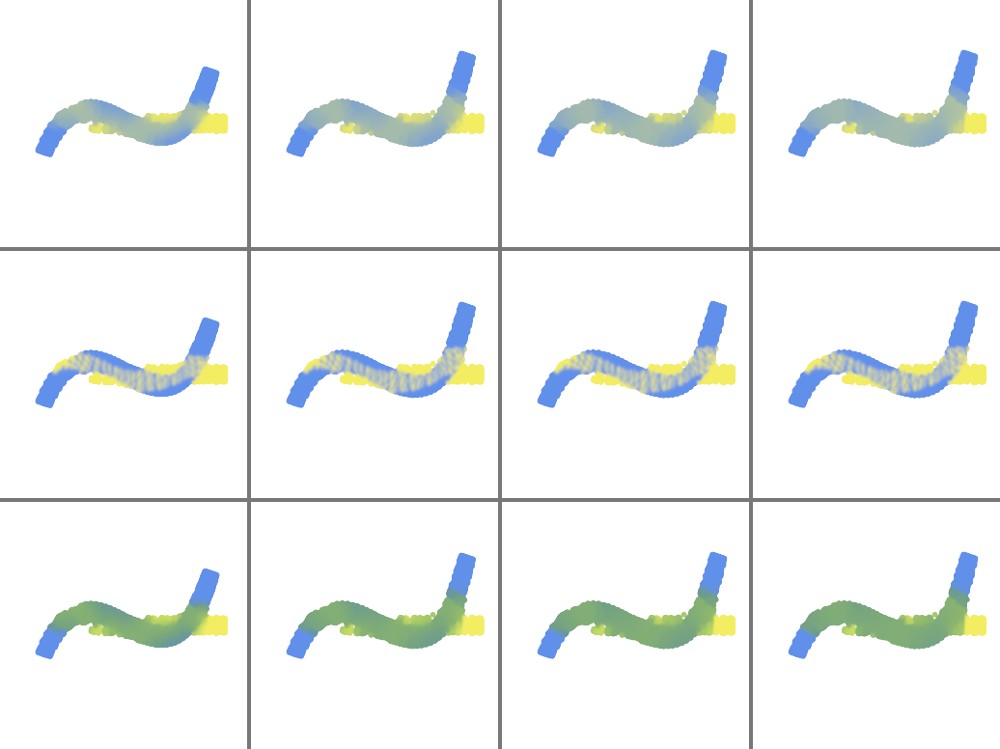
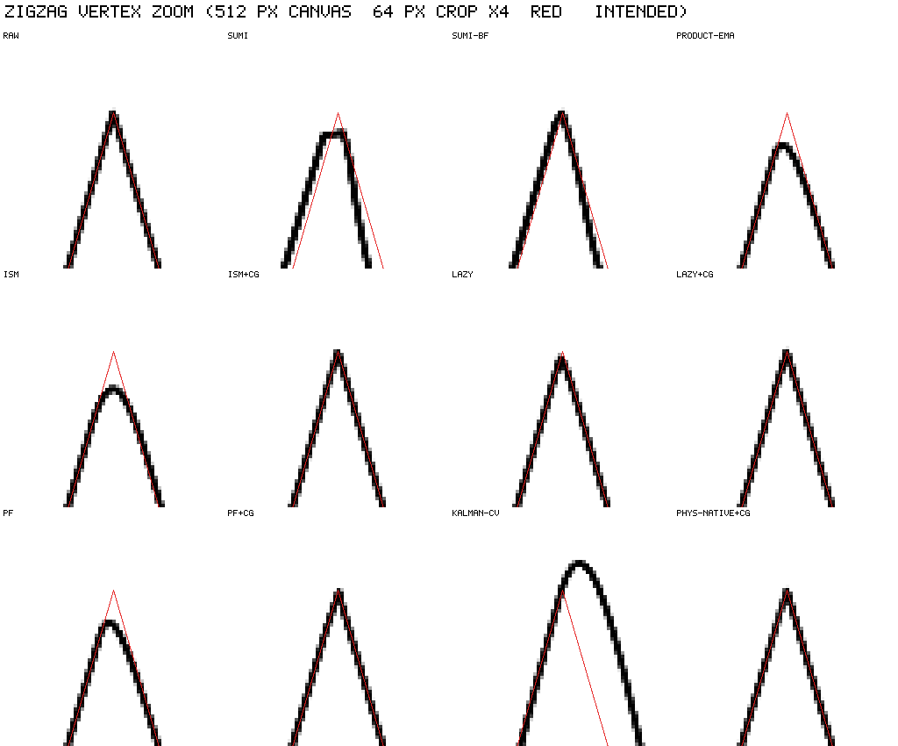
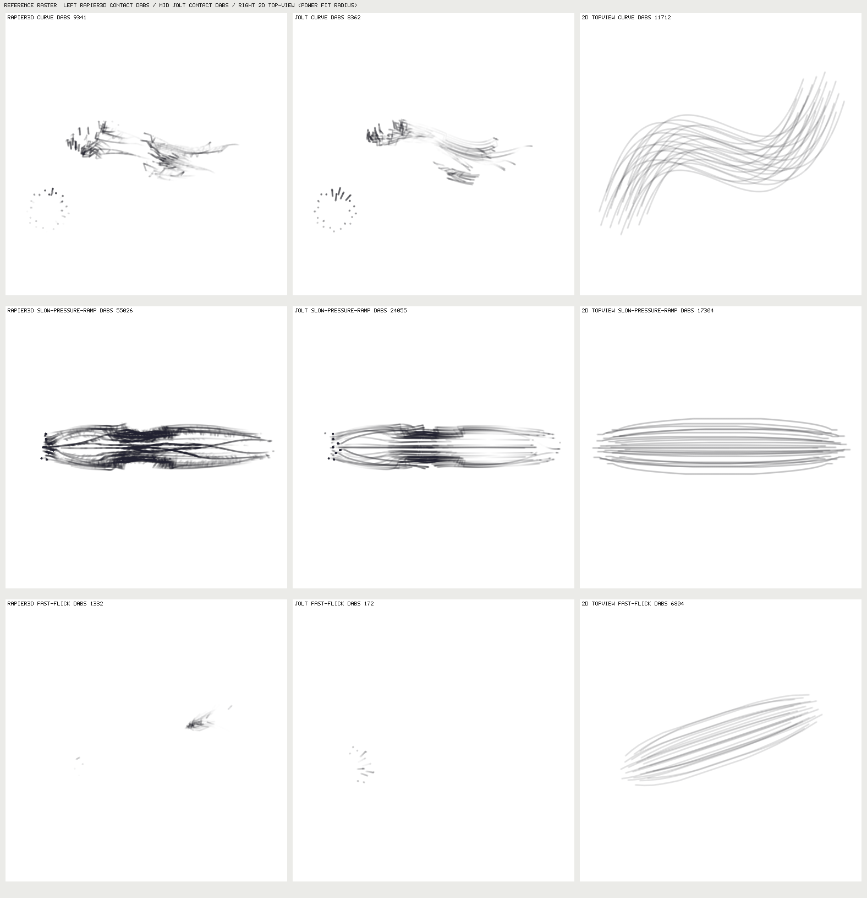
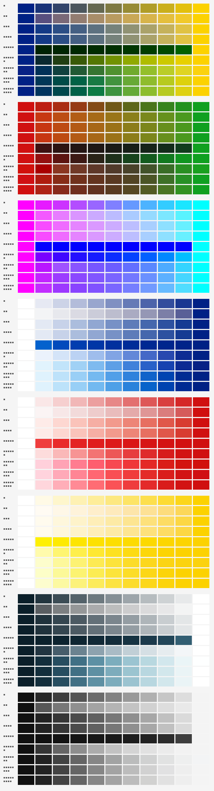

# brush-lab 스파이크 5건 결과: 물리엔진·입자 물감·입력 단계·3D 붓털·혼색 (2026-10-08)

- 상태: **기록(실험 결과 보존)** + 8절 **BL-3 통합 결과(2026-10-08, Z-1)** + 8.4 **mpm-paint 1024×640 정지의 원인 규명과 수정(2026-10-08, MP-2)**. 구현 상태의 권위는 `apps/brush-lab/README.md`와 `src/lanes/registry.ts`다.
  1~7절의 판정은 **채택 결정이 아니라 스파이크 시점의 권고**이고 저장소 반영 상태는 8절과 5절 표에 따로 적었다. 1~7절의 수치는 스파이크(샌드박스) 값이고,
  8절의 수치는 저장소 코드로 다시 잰 값이다(둘이 다르면 8절이 현재 값이며 이유를 적었다).
- 작성: 문서화 작업 DOC-1. 원본은 임시 샌드박스(`/tmp/.../scratchpad/brush/spikes/SP-A … SP-E`)에 있었고, 컨테이너가 회수되면 사라지므로
  구조화 보고서 5종과 요약 지표·대표 이미지만 이 디렉터리에 옮겼다.
- 수치 규약: 이 문서의 모든 수치는 [`2026-10-08-spikes/reports/`](2026-10-08-spikes/reports/)의 구조화 보고서 JSON과
  [`2026-10-08-spikes/metrics/`](2026-10-08-spikes/metrics/)의 지표 파일에서 확인한 값만 옮겼다. 보고서에 없는 수치는 쓰지 않았다.
- 보존하지 않은 것: 스파이크 소스·`node_modules`·큰 원시 JSON·SP-C `out/patch-A+B.diff`·SP-A/C/E의 샌드박스 `report.md`(보고서 JSON이 같은 내용의 요약을 담는다).
  SP-B와 SP-D는 보고서 파일(.md)을 쓰지 못해 JSON의 `summary`가 보고서 본문이다.

## 1. 목적과 제약

**목적.** 사용자 요구는 "다양한 라이브러리를 실험적·모험적으로 테스트하되 **상업적으로 이용 가능한 설계**만"이다. 그래서 스파이크 5건은
(1) 후보 라이브러리·알고리즘을 실제로 돌려 정량 비교하고, (2) 상용 배포 가능성(라이선스·고지 의무)을 설치본 파일로 확인하고,
(3) 채택·보류·거부 판정을 근거와 함께 남기는 것을 목표로 했다. 정책은 [license-policy.md](../license-policy.md)의 절차(3절: 샌드박스 스파이크 → 라이선스 원문 확인 → 채택 결정)를 따른다.

**제약.**

- 상용 라이선스만 채택 후보다. 모호하면 `review`로 두고 법무 검토 전 채택하지 않는다(license-policy 1절). mixbox(CC BY-NC)·LYGIA(Prosperity)·GPL/AGPL 계열은 후보에서 제외했다.
- 방법: 저장소 밖 샌드박스에서 `npm install --ignore-scripts`로 설치(설치 스크립트 실행 금지), **Node 22 단일 스레드**로 측정했다. 저장소 소스는 읽기 전용으로만 참조했다.
- **측정하지 못한 것(전 스파이크 공통)**: 브라우저(Chromium·Firefox·Safari)·모바일·GPU/WebGPU 경로의 비용과 결정성, 교차 기계·교차 브라우저 결정성,
  브라우저 Web Worker(Node `worker_threads`만 측정), 실제 펜 입력과 사람의 손맛. 모든 ms·Mpx/s는 Node 22 값이며 브라우저 성능으로 읽으면 안 된다.
  측정 머신은 4코어 공유 머신(load average 5~15)이라 절대값 신뢰도는 낮고 상대 비교용이다.
- 라이선스 확인 방식 표기: **설치본**은 설치된 패키지의 `LICENSE`와 `package.json`을 직접 읽은 것, **원격**은 crates.io API·GitHub raw 등 외부 조회다.
  설치본으로 확인하지 못한 항목은 아래 표에서 따로 표시한다.

## 2. 결정 레지스터

판정 어휘: `adopt-lane`(레인으로 채택 후보), `adopt-input-stage`(입력 단계 채택 후보), `adopt-engine-module`(`engine/**` 모듈 채택 후보),
`experiment-only`(실험 배지 한정), `defer`(보류), `reject`(거부). 라이선스 검토가 필요한 항목은 `review`를 함께 쓴다.
번들 크기는 esbuild minify 후 gzip(바이트)이며 측정 도구는 스파이크 보고서 기준이다. `-`는 외부 번들이 없는 자체 코드다.
**표의 판정은 스파이크 시점 권고다. 저장소 반영 상태는 8절을 본다.**

### A. 2D 물리엔진 (SP-A)

| 항목 | 라이선스(SPDX) / 확인 방법 | 번들(gzip) | 핵심 수치 | 판정 | 근거 |
| --- | --- | --- | --- | --- | --- |
| 자체 2차계 펜 스프링(지면 항력) | 자체 코드 | - | 해석 대비 평균 오차 0.56 px, 지연 15.4 ms, 틱 0.28 µs | adopt-input-stage | 외부 의존 0, 끌림은 상대 감쇠가 아니라 지면 항력이어야 한다는 실측 근거 |
| @dimforge/rapier2d-compat 0.21.0 | Apache-2.0 / 설치본 LICENSE·package.json 확인, wasm 내장 crate는 원격(crates.io) | 1,282,042 | N=128 반경비 표준편차 0.018, 틱 575 µs, 프레임 예산 100% 최대 N 448, 초기화 약 150 ms | adopt-lane | 퍼짐 일관성·dt 스파이크 내성 최고, 단 지연 로딩과 THIRD-PARTY 고지 생성 필요 |
| rapier2d-deterministic-compat 0.21.0 | Apache-2.0 / 설치본 | 1,294,207 | 같은 머신에서 일반 빌드와 해시 동일, wasm +31 KB | experiment-only | 교차 기계 결정성 이점은 이 환경에서 측정 불가 |
| 자체 PBD 붓털(오일러 스프링+PBD) | 자체 코드 | - | N=128 틱 168 µs, 프레임 예산 100% 최대 N 832, 반경비 표준편차 0.263 | adopt-engine-module | 가장 빠르나 밀집 N=128 퍼짐이 불균일, N≤32·폴백용 |
| p2-es 1.2.3 | MIT / 설치본 | 27,119 | 해석 오차 0.53 px, 지연 15.0 ms, 연속 50 ms 틱에서 2.95e12 px 폭주 | experiment-only | 전역 id 카운터 때문에 첫 월드 해시가 달라지고(리셋 필요) 폭주 |
| planck 1.5.0 | MIT / 설치본 | 47,934 | N=128 틱 16,461 µs(최악) | defer | 단일 펜은 자체 구현과 같은 수식, engines node>=24 경고 |
| matter-js 0.20.0 | MIT / 설치본 | 27,731 | 해석 오차 1.56 px, 50 ms 틱 폭주 7.7e4 px | reject | 라이선스가 아니라 기술 사유: 물리 단위 스프링·kinematic·로프 없음 |
| box2d3-wasm 5.2.0 | MIT(래퍼) / 설치본. 번들 Box2D(MIT)·enkiTS(zlib 계열)는 원격, box2cpp는 원격 404로 미확인 | 26,491(JS) + wasm 155 KB(compat) | N=128 틱 1,817 µs, Node 기본 초기화 386~750 ms | defer, review | 패키지에 Box2D·enkiTS 저작권 고지 없음 |
| box2d-wasm 7.0.0 | Zlib(래퍼) / 설치본. 번들 Box2D 2.4(MIT)는 원격 | 77,348 | N=128 틱 3,507 µs, 영 길이 거리 조인트가 목표 앞 0.16 px에서 정지 | defer, review | 패키지에 번들 Box2D 2.4 MIT 고지 없음 |

### B. 입자 유체·물감 (SP-B)

| 항목 | 라이선스(SPDX) / 확인 방법 | 번들(gzip) | 핵심 수치 | 판정 | 근거 |
| --- | --- | --- | --- | --- | --- |
| @box2d/particles 0.11.0 (LiquidFun TS 포팅) | MIT(package.json·LICENSE) + 소스 헤더 Zlib 13개 / 설치본, 원 저장소 google/liquidfun 헤더는 원격 대조 | 74,088(core 포함) | 5k 입자 틱 4.67 ms(water), 해시 5/5 상이, 속도 상한 192 px/s | experiment-only | Math.random 피벗 정렬로 비결정, 균일 불투명 리본뿐, NOTICE에 Zlib 원문 필요 |
| @box2d/core 0.11.0 | MIT / 설치본 | 53,249 | 전이 의존 0, wasm 없음 | experiment-only | particles의 의존 패키지 |
| LiquidFun colorMixing(sRGB 쌍별 교환) | 해당 없음(알고리즘) | - | 노랑+파랑 (0.668,0.748,0.649) 회청색, 저장소 KM은 (0.528,0.697,0.448) 초록 | reject | 감마 공간 성분의 선형 교환이라 물감 혼색이 아님 |
| 자체 MLS-MPM 점탄성 물감 솔버 | 자체 코드(Hu et al. 2018 수식, 코드 복제 없음) | 2,979 | 해시 5+5 동일, 약 220~320 ns/입자/서브스텝, 16.7 ms에 약 3.4k~19k 입자(강성 의존) | adopt-lane | 외부 의존 0, 점탄성·항복 거동 관측, 단 CFL 위반 시 붕괴하므로 clampEvents 감시 필수(실험 레인으로 시작) |
| 농도 t 수송(입자) + 저장소 KM 색 결정 | 자체 코드 | - | 노랑+파랑이 초록(KM 0.528,0.697,0.448) | adopt-engine-module | 입자에는 t만 싣고 색은 기존 engine/pigment가 결정 |
| 입자→이미지 가우시안 스플랫(문턱 알파) | 자체 코드 | - | 평면 리본, 가장자리 매끈 | adopt-lane | 질감은 저장소 종이 단계가 담당 |
| MPM WASM·SIMD·WGSL 이식, 입자→wet 풀 결합 | - | - | 미구현·미측정 | defer | CPU 실험 레인 성과 이후 |

### C. 입력 단계·코너 편차 (SP-C)

| 항목 | 라이선스(SPDX) / 확인 방법 | 번들(gzip) | 핵심 수치 | 판정 | 근거 |
| --- | --- | --- | --- | --- | --- |
| Sumi 1€ + 정점 재방출(수정안 A) + 용량 추정 보정(수정안 B) | 자체 코드 | - | pencil-hb zigzag 128² 2.55→1.26 px, 512² 6.16→0.97 px | adopt-engine-module | #9 코너 편차 FAIL의 원인이 입력 단계 설계 결함(4절) |
| 코너 게이트(메타 단계, 속도 0.2 px/ms 가드) | 자체 코드 | - | 지연형 단계 앞에 붙여 zigzag 편차 128² 1.17~1.56, 512² 0.97~1.37, 비용 +0.3~1.4 µs/표본 | adopt-input-stage | 가드 없이는 저속 손떨림 오탐으로 지터 악화 |
| lazy-brush 2.0.2 | MIT / 설치본 LICENSE·package.json | 956 | 0.5~0.7 µs/표본, 반경 1.8 px에서 지터 기준(0.5 px) 달성 | adopt-input-stage | 코너 게이트와 획 끝 catch-up을 함께 써야 함 |
| 안정화 슬라이더 로그 매핑 B | 자체 코드 | - | 지터 0.738→0.112 px 단조, 지연(512²) 1.7→15.3 ms | adopt-engine-module | 현행 앱 매핑은 s=0에서도 지터 0.335 |
| google/ink-stroke-modeler(저장소 wasm) 입력 단계 | Apache-2.0 / 복사된 LICENSE 두 건의 sha256을 pinned commit의 GitHub raw와 대조(원격) | 48,647(wasm 44,300 + mjs 4,347) | iso 코너 3.55/10.5 px, 지연 15.1 ms | defer, review | Sumi+재방출보다 나은 항이 없고, NOTICE의 wasm sha256 불일치·Emscripten/libc++abi 인벤토리 누락(6절) |
| perfect-freehand 1.2.3(getStrokePoints를 입력 단계로) | MIT / 설치본 | 2,009 | 표본당 약 61 µs(4000표본 말미 약 0.9 ms), O(1) 재귀는 0.12 µs | reject | 표본마다 호출하면 O(n²). 수식만 차용 |
| kalmanjs 1.1.0 | MIT / 설치본 | 1,325 | iso 조건에서 EMA와 수치까지 동일(지연 7.9 ms, 길이 -6.4%) | reject | dt 무시, 이점 없음 |
| 1eurofilter 1.3.0 | package.json BSD-3-Clause, **LICENSE 파일 없음** / 설치본 | 2,137 | 사용 안 함 | review | 법무 확인 전 채택 금지. Sumi 1€는 논문 수식 자체 구현이라 불필요 |
| 자체 등속(CV) 칼만 | 자체 코드 | - | iso 지연 2.4 ms(최저), 코너 오버슈트 1.50/6.76 px | experiment-only | 코너에서 넘침, 코너 게이트와 함께일 때만 |
| 물리 펜(자체 오일러, SP-A 모델) | 자체 코드 | - | 지연 15.8 ms, flick 오버슈트 3.7/14.9 px(ζ=0.55) | experiment-only | 끌림 감각 선택지, ζ≥1은 미측정 |
| Rapier 0.21 물리 펜 입력 단계 | Apache-2.0 / 설치본 | 1,282,042 | 표본당 22 µs(자체 오일러 0.47 µs의 약 47배), 지연 20.1 ms | reject | 점 하나를 끄는 모델에 이점 없음 |
| cornerDeviationPx 지표 정리 | - | - | 31종 중 20종은 입력 통과로도 1.5 px 초과 | defer | 변경은 별도 승인 후(4절) |

### D. 3D 붓털 (SP-D)

| 항목 | 라이선스(SPDX) / 확인 방법 | 번들(gzip) | 핵심 수치 | 판정 | 근거 |
| --- | --- | --- | --- | --- | --- |
| 2D 상면 모델 + 압력→반경 곡선 | 자체 코드 | - | 단조 구간 거듭제곱 r=10.17 p^0.188, RMSE 0.108 u(약 0.43 px) | adopt-engine-module | 3D 결과를 재현하면서 wasm 1.6 MB·초기화 170 ms를 쓰지 않음 |
| @dimforge/rapier3d-compat 0.21.0 | Apache-2.0 / 설치본, wasm 내장 crate는 원격(crates.io) | 1,644,031 | 400 바디 틱 1.83 ms, 초기화 약 172 ms | experiment-only | 550 px/s에서 접촉 끊김, 압력 0.9 이상 좌굴, 격자 단조 46/90 |
| rapier3d-deterministic-compat 0.21.0 | Apache-2.0 / 설치본 | 1,650,831 | 일반 빌드와 해시 동일(44ac97cbe8f37f8f) | experiment-only | 교차 기계 이점 측정 불가 |
| 오프라인 3D 베이크 → 2D 룩업 하이브리드 | 자체 코드 | - | 곡선 피팅·2D 상면 렌더만 검증 | experiment-only | 베이크 도구 품질 미검증 |
| jolt-physics 1.1.0 | MIT / 설치본 LICENSE·JS 헤더. wasm 안 libc++abi 경로는 wasm 문자열 확인 | 948,292(wasm-compat) | 400 바디 틱 3.20 ms, dt 1/30 관통 11틱 | defer, review | wasm에 Apache-2.0 WITH LLVM-exception 코드가 링크됐으나 THIRD-PARTY 고지 없음 |
| cannon-es 0.20.0 | MIT / 설치본 | 36,084 | 400 바디 틱 23.48 ms, dt 1/30 폭주(5.5e8 u) | reject | 라이선스가 아니라 성능·안정성 사유 |
| @babylonjs/havok(**미설치**) | npm 메타 표기 MIT(원격), **설치본 미확인**, GitHub LICENSE 원문 404 | - | 측정 안 함 | defer, review | 바이너리 엔진 약관이 래퍼 MIT와 같은지 확인 못 함, 정책상 이름으로 금지 |

### E. 혼색 (SP-E)

| 항목 | 라이선스(SPDX) / 확인 방법 | 번들(gzip) | 핵심 수치 | 판정 | 근거 |
| --- | --- | --- | --- | --- | --- |
| 자체 KM 밴드 근사(8밴드 기본, 6밴드 저사양) | 자체 코드, 기저 표는 spectral.js(MIT) 파생이라 MIT 고지 필요 | 1,728(두 표 포함) | spectral.js 대비 평균 ΔE00 0.45(8밴드, p95 2.01), 6밴드 0.92, 약 3 Mpx/s | adopt-engine-module | 파랑+노랑=초록 재현, 외부 의존 0, 결정적 |
| 3채널 KM 조정형(mixKm3Tuned) | 자체 코드 | 286 | 평균 ΔE00 2.45(p95 10.16, max 33.97), 18.9 Mpx/s | adopt-engine-module | 속도 우선 계층, 기존 kmMixRgb(평균 11.46) 교체 검토 |
| spectral.js 3.0.0 | MIT / 설치본 LICENSE·package.json | 6,209 | 0.12~0.25 Mpx/s | adopt-lane(오프라인·골든 전용), review 메모 | 스펙트럼 데이터가 Burns LHTSS 변형 유래라는 README 서술 때문에 데이터 출처 법무 확인 메모 1건 |
| culori 4.0.2 OKLab 혼합 | MIT / 설치본 LICENSE·package.json | 6,618(fn+oklab+lrgb) | 자체 OKLab과 전 쌍 ΔE 0 | reject | 라이선스 문제 아님, 자체 수 줄과 같고 초록이 안 됨 |
| 선형 광 혼합·sRGB 감마 혼합 | 해당 없음 | - | 선형 39.9, 감마 LUT 25.9 Mpx/s | experiment-only | 물감 혼색이 안 되는 기준선 |
| 합성 4안료 2상수 KM·RGB 역변환 | 자체 코드 | - | 임의 sRGB 근사 평균 ΔE00 8.18 | defer | 파장 격자·곡선이 가정이라 판정 불가 |
| Mixbox·LYGIA 계열 | CC BY-NC / Prosperity | - | spectral.js 소스에 Mixbox 식별자 grep 0건 | reject | 저장소 정책상 금지 |

## 3. 스파이크별 결과

### A. SP-A 2D 물리엔진 8종

**질문.** 2D 물리엔진을 (1) 관성감 있는 물리 펜과 (2) 붓털 다발(N=8/32/128)에 쓸 때 어떤 것이 정확·빠르고 상용으로 쓸 수 있는가.

**방법.** Rapier(일반/deterministic), planck, matter-js, p2-es, box2d3-wasm, box2d-wasm과 자체 오일러+PBD를 공통 어댑터 `PhysicsWorld2D` 뒤에 두고,
저장소 nib-flex 직접 호출을 함께 측정했다. 펜 시나리오 6 fixture(추적 지연·오버슈트·코너·지터·해석 오차), 붓털 N 스윕, dt 스파이크, 결정성 해시(메인·`worker_threads`·자식 프로세스), 번들·초기화 시간.

**핵심 수치.**

1. 스프링 감쇠를 포인터와 펜의 상대 속도에만 걸면 추적 지연이 0.7~1.1 ms로 사라진다. 지면 항력 λ=2ζωn(약 83/s)으로 바꾸자 해석 기준해(15.1 ms)에 맞는 11.5~15.4 ms가 나왔다.
2. 영 길이 스프링은 Box2D 계열 거리 조인트로 만들 수 없다(box2d-wasm은 목표 앞 0.16 px에서 정지, planck은 최소 길이 0.005 m). 어댑터가 힘으로 대체하면 자체 구현과 같은 수치(0.56 px, 15.4 ms)가 나온다.
3. 붓털 N=128 반경비 표준편차: Rapier 0.018, box2d3 0.019, matter 0.032, planck 0.045, box2d-wasm 0.049, p2 0.062, 자체 PBD 0.263.
4. 100 ms dt 스파이크(N=32) 최대 늘어남: Rapier 1.2×R, planck·box2d-wasm 5.0, 자체 5.3, box2d3 7.9, p2 15.7, matter 18.4. 50 ms×10 연속 틱 폭주는 matter 7.7e4 px, p2 2.95e12 px(폭주 후 복귀).
5. N=128 틱 비용(µs): native 168, p2 401, matter 411, rapier 575, box2d3 1,817, box2d-wasm 3,507, planck 16,461.
6. 결정성: 8종 모두 메인·`worker_threads`·자식 프로세스 해시 동일. p2-es만 기본 상태에서 첫 월드 해시가 달랐고 `Body._idCounter`·`Shape.idCounter` 리셋 후 일치.

**대표 이미지.** CPU 참조 래스터러 비교 시트(N=32, zigzag·spiral·fast-flick × 10열).

직접 열어 확인한 내용: 물리 열은 붓털 한 올의 세로 줄무늬와 꺾이는 지점의 진한 뭉침이 보이고, RIGID(물리 없음) 열은 옅은 회색 띠, 맨 오른쪽 REPO-SCALAR는
털 질감 없는 균일한 외곽선이다. 물리 엔진 8종 사이의 차이는 이 해상도에서 육안으로 거의 구분되지 않는다(보고서의 휘도 차 수치와 일치).

**한계.** Node 22 단일 스레드 값만이다. Rapier 일반 대 deterministic의 교차 기계·교차 브라우저 결정성은 측정하지 못했다(같은 머신에서 해시 동일).
정지 이미지라 시간축 손맛은 평가하지 못했다. 샌드박스 자체 구현은 f64이며 `engine/**` 이전 시 `Math.fround` 미러로 재측정해야 한다. 프레임당 허용 N은 ±20%, 펜 틱 비용은 ±50% 흔들린다.

**제안(미반영).** 순수 TS는 `src/engine/physics/world2d/`, 외부 패키지 어댑터는 `src/lanes/physics/`, 시나리오·지표는 `src/bench/physics/`에 두고
`boundary.test.ts`에 외부 물리 패키지 허용 범위 규칙을 추가한다. 의존성 추가는 통합 담당이 한다.

### B. SP-B 입자 유체·물감

**질문.** LiquidFun(`@box2d/particles`)과 자체 MLS-MPM이 번짐·젖은 물감·혼색에 쓸 만한가. 저장소 wet(LBM D2Q9)과 어떻게 다른가.

**방법.** LiquidFun TS 포팅과 자체 2D MLS-MPM(`mpm.ts` 562줄, Maxwell 이완+항복)을 같은 장면에서 틱 비용, 결정성(해시 5회), 폭주, 단일 획·두 색 혼합·번짐 시나리오로 측정하고 저장소 CPU 참조 래스터러 결과와 PNG로 대조했다.

**핵심 수치.**

1. LiquidFun 틱(p50, 1k/5k/20k 입자): water 0.83/4.67/18.2 ms, colorMixing 0.88/5.27/23.2 ms. 16.7 ms에 water 약 15k 입자(p95 기준 약 10k).
2. MLS-MPM 프레임(128², K=6e4, 8서브) 1.83/9.58/38.2 ms, 16.7 ms에 약 8.7k 입자. 비용은 입자 수×서브스텝 수가 지배하고 격자 크기와 거의 무관하다.
3. 결정성: LiquidFun 그대로는 같은 프로세스 5개·별도 프로세스 5개 모두 해시가 다르다(위치 차 최대 0.30 px). `Math.random`을 시드 Pcg32로 바꾸면 5/5 동일(257550f5a0cb7e68). MLS-MPM은 패치 없이 5+5 동일(1995fc1eca6f939e).
4. 폭주: 두 솔버 모두 NaN 0. MPM은 4서브(CFL≈1.04)에서 붕괴(안전 클램프 1,310,038회)하며 NaN이 아니라 클램프에 가려진다. 서브스텝 고정과 `clampEvents` 감시가 필수.
5. 번들: LiquidFun core+particles 74,088 B gzip 대 MLS-MPM 2,979 B gzip.
6. 번짐: 획 반폭(중심선 거리 p95) LiquidFun 7.3→9.0 px, MPM 7.8→16.5 px(2 s). 두 솔버 모두 둥근 균일 확장이라 수채의 가지치기·가장자리 진해짐은 나오지 않는다.

**대표 이미지.** 노랑 line + 울트라마린 curve 혼색, 행 = 혼색 방식, 열 = 시간(보고서의 t=0/0.5/1/2 s).

직접 열어 확인한 내용: 1행(LiquidFun colorMixing)은 겹친 구간이 회청색, 2행(혼합 끔)은 두 색 입자가 서로 끼어든 점박이, 3행(농도 t만 수송하고 저장소 KM으로 색 결정)은 초록이다.
보고서의 견본표 수치(LiquidFun 회녹회색 대 KM 초록)와 이미지가 맞는다.

**한계.** 브라우저·GPU 경로 미실행. 입자 결과는 평면 균일 리본이라 최종 이미지로는 저장소 래스터러보다 품질이 낮고 종이 결·가장자리 농담은 없다. 저장소 LBM과의 정량 대조는 하지 않았고(콜드 1회 시간과 PNG 인상만 비교), 입자→wet 풀 결합은 만들지 않았다.
`@box2d/particles@0.11.0`은 `package.json`의 `main`(./dist/index.js)이 tarball에 없어 deep import로 우회했다(0.10.0은 정상, 재측정은 하지 않음). LiquidFun 알고리즘 특허 유무는 확인하지 못했다.

### C. SP-C 입력 단계·코너 편차

**질문.** 증빙 리포트 37개의 `handfeel.cornerDeviationPx` FAIL(2.5 px > 1.5 px)은 엔진 렌더 버그인가, 입력 보정인가, 지표 문제인가. 입력 단계 후보 중 어느 것이 좋은가.

**방법.** 1부는 cpu-reference pencil-hb zigzag 128²에서 재현하고 한 요인씩 바꿔 분해한 뒤, 저장소 사본에 수정안을 적용해 효과·부작용을 측정했다.
2부는 `InputStage` 인터페이스 위에 raw, Sumi 1€(현행·앱 슬라이더·정점 재방출), 제품 ema/spring, ink-stroke-modeler(저장소 wasm), lazy-brush, perfect-freehand, kalmanjs, 자체 CV 칼만, 물리 펜(자체 오일러·Rapier), 코너 게이트 메타 단계 등 27종을 fixture 9종×{128², 512²}로 측정했다.

**핵심 수치.**

1. 재현: pencil-hb cornerDeviationPx 2.546 px, 카탈로그 31종 중 27종이 1.5 px 초과(4절에서 분해).
2. 입력 단계 27종(iso 지터 ≤0.5 px 조건) 코너 편차 128²/512²: Sumi+재방출 1.22/0.92(PASS), ema·perfect-freehand·kalmanjs 3.29/9.8(FAIL, 서로 수치 동일), ink-stroke-modeler 3.55/10.5, lazy-brush(반경 1.8 px) 2.89/2.84. 코너 게이트를 앞에 붙인 조합은 전부 1.17~1.56/0.97~1.37.
3. 지연(iso, curve fixture): CV 칼만 2.4 ms 최저, ema 7.9, ink-stroke-modeler 15.1, 물리 펜 15.8/20.1.
4. 비용: perfect-freehand 라이브러리 표본당 약 61 µs(4000표본 말미 약 0.9 ms) 대 O(1) 재귀 0.12 µs. Rapier 물리 펜은 22 µs 대 자체 오일러 0.47 µs.
5. 결정성: 27개 단계 모두 새 인스턴스 2회·reset 재사용 해시 일치, 3회 실행에 걸쳐 405/405 일치. Sumi 복제는 저장소 InputPipeline과 9 fixture 전 표본 최대 절대 차이 0 px.
6. 슬라이더: 측정한 모든 가변 단계에서 지터가 s=0..100(21점)에서 단조 감소. 현행 앱 매핑은 s=0에서도 지터 0.335 px라 "끔"이 아니다.

**대표 이미지.** zigzag 정점 확대(512² 캔버스, 64 px 크롭 ×4, 붉은 선 = 의도 경로).

직접 열어 확인한 내용(왼쪽 위부터 RAW, SUMI, SUMI-BF, PRODUCT-EMA / ISM, ISM+CG, LAZY, LAZY+CG / PF, PF+CG, KALMAN-CV, PHYS-NATIVE+CG): RAW는 정점이 붉은 의도선과 일치,
SUMI는 정점이 평평하게 잘리고 한참 밀리며, SUMI-BF(정점 재방출)는 정점까지 복원된다. PRODUCT-EMA·ISM·PF·LAZY는 둥글게 깎이고, 코너 게이트(CG)를 붙인 열은 정점이 복원되며,
KALMAN-CV는 정점 위로 큰 돔이 생긴다. 보고서의 서술과 일치한다. 용량 때문에 원본(3.4 MB)을 64색 팔레트 PNG로 변환했다(16 KB, 내용 동일).

**한계.** 합성 가우시안 손떨림(시드 고정)이며 실제 펜·터치·마우스 입력은 측정하지 못했다. 수정안을 적용한 저장소 상태의 전체 테스트·typecheck·eslint는 실행하지 않았다(사본에서 engine+bench+lanes 684건만 실행).
GPU 레인·libmypaint·hokusai 레인 패리티에 주는 영향은 측정하지 못했다. 지연은 속도 의존이라 같은 설정이 128²에서 약 9 ms, 512²에서 약 4 ms다.

### D. SP-D 3D 붓털

**질문.** 압력→붓털 퍼짐을 3D 물리(캡슐 체인 K=24×S=4, 구형 조인트+각 스프링, kinematic 핸들 높이=압력, 종이 평면)로 만들면 2D 곡선 모델보다 나은가. 구성하기 쉬운가.

**방법.** Rapier3D 일반/deterministic, Jolt(wasm-compat), cannon-es로 정적 발자국 스윕(압력 0.05~1.0, 3구성), 파라미터 격자 탐색, 2D 곡선 피팅, 짧은 획 렌더(curve·slow-pressure-ramp·fast-flick), 속도 의존 끌림, 비용·확장성, dt 안정성, 결정성, 번들을 측정했다.

**핵심 수치.**

1. 휴지 굽힘 14도·벌어짐 8도·6 Hz 구성(A-curved)에서 Rapier 힘 가중 RMS 반경이 압력 0.05→0.7에서 5.69→9.46 u로 단조 증가하고, 0.9 이상은 가닥 좌굴로 7.10으로 꺾인다. 곧은 가닥(B)은 2.4~2.9 u로 압력에 거의 무반응.
2. 격자: Rapier 정적 90조합 중 단조 46개(퇴화 5 포함). 굽힘 격자에서 반경-압력 Spearman≥0.9는 Rapier 9/32, Jolt 3/32. A·C 구성은 격자에서 골라낸 것이라 선택 편향이 있다(실질 단조 41/90).
3. 단조 구간(p≤0.7)의 2D 거듭제곱 곡선 r=10.17 p^0.188이 RMSE 0.108 u(약 0.43 px)로 3D를 재현한다. 전체 구간은 어떤 곡선도 0.89~1.04 u 어긋난다.
4. 느린 획(100~200 px/s)에서만 끌림이 보이고(Rapier 202 px/s 중앙값 -6.4 px), 553 px/s에서는 접촉 틱이 79%로 줄고 부호가 뒤집힌다. Jolt는 빠른 획에서 이탈(maxRel 47 u).
5. 틱 비용(48/200/400 바디): Rapier 0.22/0.91/1.83 ms, Jolt 0.45/2.04/3.20, cannon 1.88/9.01/23.48. dt 1/30: Rapier 양호, Jolt 관통 11틱, cannon 폭주.
6. 번들(gzip): Rapier3D 1,644,031, Jolt wasm-compat 948,292(분리형 JS 133,721 + wasm 747,582), cannon 36,084. 초기화 Rapier 약 172 ms, Jolt 100~150 ms.

**대표 이미지.** 열 = Rapier3D 접촉 dab / Jolt 접촉 dab / 2D 상면(곡선 피팅 반경), 행 = curve / slow-pressure-ramp / fast-flick.

직접 열어 확인한 내용: 3D 열은 시작점의 털끝 고리와 짧게 끊긴 선·덩어리뿐이고 curve의 오른쪽 S 꼬리는 거의 없다. fast-flick은 3D가 작은 덩어리와 희미한 꼬리(Jolt는 점 몇 개)인 반면 2D 열은 24가닥 평행선이 곡선을 따라 매끄럽게 퍼진다.
slow-pressure-ramp에서 3D는 가닥이 엇갈리고 중간에 짙은 덩어리가 생기며 2D는 고른 방추형이다.

**한계.** dab 반지름 1.7 px, flow=0.22·min(1,f/p90)은 제품 값이 아닌 시험 설정이다. Jolt 접촉력은 뿌리 람다 대용이라 Rapier와 같은 정확도의 비교가 아니다. 약 550 px/s에서 접촉을 유지하는 구성은 찾지 못했다(더 넓은 탐색 미실시).
소프트바디·Rapier 다중체 조인트, 오프라인 베이크 하이브리드의 실제 품질은 시도하지 못했다. 교차 기계 결정성은 측정하지 못했다.

### E. SP-E 혼색

**질문.** 물감 혼색(파랑+노랑=초록, 흰색 틴트의 채도 보존)을 실시간 루프에서 쓸 수 있는 방식은 무엇이며, 기존 저장소 `kmMixRgb`와 spectral.js·culori는 어떤가.

**방법.** 8쌍 × 9모델 × 11단계 스와치 그리드, spectral.js 3.0.0 출력과의 CIEDE2000(ΔE00) 정확도(훈련 seed 20261008, 검증 seed 777 무작위 1500쌍), KM 밴드 수 스윕, 3채널 KM 변형 24조합, 1M 픽셀 처리량(5회), 결정성 해시, 번들 크기를 측정했다.
**정확도 기준은 spectral.js 출력이며 실제 안료 측정이 아니다.**

**핵심 수치.**

1. 검증 1500쌍 평균 ΔE00(대 spectral.js): 8밴드 0.45(p95 2.01, max 7.89), 6밴드 0.92, 10밴드 0.23, 16밴드 0.05. 대조군 sRGB 감마 5.37, OKLab 6.77, 선형 8.76, **저장소 kmMixRgb 11.46**.
2. 파랑+노랑 t=0.5: spectral.js #3d933e, 8밴드 #42933e, 6밴드 #50912f, KM3조정 #719201, 저장소 KM #013001, OKLab #76827b, 선형 #b99b60, 감마 #7e7942.
3. 3채널 KM 변형 최선(반사율 하한 0.01+휘도 가중): 훈련 2.40, 검증 평균 2.45(p95 10.16, max 33.97).
4. 처리량(best Mpx/s, 1M 픽셀): 램프 LUT 조회 97.7, 선형 39.9, 감마 LUT 25.9, KM3조정 18.9, 6밴드 3.79, 8밴드 2.96, 저장소 kmMixRgb 1.52, OKLab 1.44, spectral.js 0.12(픽셀마다 생성)/0.25(Color 캐시).
5. 결정성: 8개 모델 모두 5000쌍 Float32 FNV 해시가 같은 프로세스 반복·순서 역전·별도 프로세스 2회에서 동일.
6. 번들: spectral.js 6,209 B gzip, culori 전체 16,046 B(fn+oklab+lrgb만 6,618 B), 엔진 후보 1,728 B(mixKm3Tuned만 286 B). premultiplied 값을 straight로 오용하면 ΔE00 15.55 어긋난다.

**대표 이미지.** 8쌍 블록(위부터 파랑+노랑, 빨강+초록, 마젠타+시안, 흰+파랑, 흰+빨강, 흰+노랑, 어두운 청록+흰, 검정+흰) × 9행(모델) × 11열(t=0→1).
행 순서는 스파이크 소스의 `MODELS` 배열 기준: 1 sRGB 감마, 2 선형, 3 OKLab(자체), 4 OKLab(culori), 5 저장소 kmMixRgb, 6 KM3조정, 7 6밴드, 8 8밴드, 9 spectral.js.

직접 열어 확인한 내용: 파랑+노랑 블록의 1~4행은 회청색에서 회갈색·올리브로 가며 초록이 없다. 5행(저장소 KM)은 t=0.1~0.8이 거의 검은 초록이다가 끝에서 진초록이다.
7~9행은 청록을 거쳐 초록·연두로 이어지고 8행과 9행이 거의 구분되지 않는다. 마젠타+시안 블록의 5행은 거의 전 구간이 순수 파랑 한 색으로 평탄하다. 흰색 틴트 블록의 5행은 흰색에서 시작해도 밝아지지 않는다.
이미지의 행 라벨은 점 개수뿐이라 모델 대응은 위 소스 순서에 의존한다(이미지 자체로는 확인할 수 없다).

**한계.** 브라우저(V8)·WGSL·WASM-SIMD 성능과 실제 안료 측정 대비 정확도는 측정하지 못했다. 속도는 load average 9~11 환경 best-of-5이며 재측정마다 ±30% 변동했다.
4안료 2상수 KM은 파장 격자(380 nm+10 nm×i)와 안료 곡선이 가정·합성이라 정확도 판정이 불가능하다. 밴드 위치 최적화를 하지 않아 6밴드가 7밴드보다 좋은 것은 등간격 선택의 우연일 수 있다.
spectral.js 기저 스펙트럼의 데이터 출처(Burns LHTSS 변형) 권리는 법무 확인 대상이다. 엔진 간 비트 일치(Chrome·Firefox·Safari)는 미검증이다. 개별 grid PNG 중 white-red·white-yellow·black-tint는 보고서 작성자가 따로 열지 않았다(이 문서는 전체 그리드를 직접 열어 확인).

## 4. 입력 단계 #9 지그재그 코너 편차 FAIL: 원인 분해와 수정안 A+B

**배경.** 증빙 리포트 37개의 `handfeel.cornerDeviationPx`가 FAIL(2.5 px > 기준 1.5 px)이었다(상태·번호는 SP-C 보고서의 #9). 같은 절차(선폭 곡선 32 정류장 → 평균/2 → `cornerAccuracyFromImage`, 시드 1)로 재현했다.

**원인 분해(pencil-hb zigzag 128², 한 요인씩 변경).**

| 요인 | 값(px) | 의미 |
| --- | --- | --- |
| 기본 입력 경로 전체 | 2.546 | 재현값(문서의 2.5 px와 일치) |
| 입력을 통과시킨 경우(raw) | 1.251 | 입력 통과 바닥 |
| 입력 보정 기여 | 1.295 | 2.546 − 1.251 |
| corner-preserve를 끈 경우 | 4.651 | corner-preserve가 이미 약 3.4 px를 복구 |
| dab 간격·종이·테이퍼·표본화 | 0.066·0.078·0.004·0.014 | 렌더 합 약 0.16 px |

결론: **엔진 렌더 버그가 아니라 입력 보정이 원인**이다. 1€ 필터가 정점을 지연 위치로 내보내고 corner-preserve는 정점 다음 표본만 raw로 고정할 뿐 정점 자체를 복원하지 않는다.
경로 수준 편차(128²/256²/512² = 1.48/2.96/5.87 px)는 fixture 속도(0.356/0.71/1.42 px/ms)에 정확히 비례해 정점 유효 지연이 약 4.1 ms로 일정하다.
fixture는 512² 기준 설계이고 128²는 속도가 1/4이라 현행 결함을 과소평가한다(512² 기본 입력 6.16 px).
엔진·입력 없이 지표만 적용한 해석적 폴리라인의 바닥은 0.2~0.64 px(선폭 8 px 128²만 1.19)라, pencil-hb 2.5 px의 원인은 지표 식이 아니다.

**설정만으로는 해결되지 않는다.** 정점 재방출 없이 minCutoff 30 Hz·β 0.12까지 올려도 512² 2.52 px이고 tremor 지터는 0.738 px로 기준 0.5 px를 넘는다. 편차 ≤1.5와 지터 ≤0.5를 동시에 만족하는 설정이 없다.

**수정안(요약만 기록, diff는 첨부하지 않음).**

- **수정안 A — 정점 재방출**: `engine/input/corner-preserve.ts`에 `vertexEmitTimeMs`·`VERTEX_BACKFILL_MIN_PX`(0.25)·`VERTEX_BACKFILL_MIN_SPEED_PX_PER_MS`(0.2)를 추가하고,
  `input-pipeline.ts`의 `model()` 모서리 분기에서 `backfillVertex()`를 불러 직전 raw 정점을 모서리 직후 표본보다 먼저 commit한다. 속도 0.2 px/ms·밀림 0.25 px 가드로 저속 손떨림 오탐을 막는다. `input-pipeline.test.ts`에 3건을 추가한다.
- **수정안 B — 용량 추정 보정(A의 전제)**: `stroke-pipeline.ts`의 `emitSamples`에서 `prevX/prevY`를 직전 배치 마지막 위치로 시작해 배치 간 연결 구간을 경로 길이에 포함한다.
  별건 결함이다: fast-flick 512²에서 4/31 프리셋(pencil-hb·pencil-mechanical·ink-g-pen·ink-maru-pen)이 `StrokeBudgetExceededError`로 실패하고(1024² 6/31, 128²·256² 0/31), 마우스형 1.5 px/ms@60 Hz 이상 입력도 9/9 실패한다. 수정안 B로 0/31·0/9가 된다.

**기대 수치(저장소 사본에서 실측, 시드 1).**

| 항목 | 수정 전 | 수정 후 |
| --- | --- | --- |
| pencil-hb zigzag 128² | 2.55 px (FAIL) | 1.26 px (PASS) |
| pencil-hb zigzag 512² | 6.16 px | 0.97 px |
| ballpoint | 2.06 px | 0.44 px |
| ink-maru-pen | 1.82 px | 0.61 px |
| 경질 9종 입력 초과분 | 1.0~1.9 px | ≤ 0.17 px |
| 오버슈트 | 0 | 0 유지 |
| 모서리 없는 fixture 해시 | - | 전부 동일(zigzag만 표본 +5) |
| 저속 손떨림 168획(σ 0.1~1.2 px × 24시드) 오탐 | 가드 전 3~4회/획 | 가드 후 추가 표본 0 |
| 31개 프리셋 중 FAIL(>1.5 px) | 27 | 19 |

**남는 문제와 위험.**

- 수정 후에도 31개 중 19개는 FAIL이다. 광폭·연질·습식·텍스처 프리셋은 입력을 통과시켜도 4~17 px라 지표가 입력을 게이트하지 못한다. 지표 완화로 덮지 않고 적용 가능성 게이트나 "입력 통과 대비 초과분" 판정을 별도 승인 후 정리한다(초과분 기준이면 base 7/31 FAIL·수정안 0/31 FAIL, 최대 0.53 px).
- 속도 가드 때문에 128² corner-square(0.16 px/ms)는 개선되지 않는다. watercolor-wet zigzag 512²는 오버슈트가 0→1.97 px로 임계(1.0)를 넘는다(이 프리셋은 편차가 8.8 px라 어차피 지표 부적합 영역).
- 수정안 A는 정점 직전 raw 점을 출력에 추가하므로 픽셀 해시 스냅샷 10건(surface 2, wet-presets 5, wet-presets-large 2, cpu-reference-lane 1)이 의도적으로 바뀐다. 습식 GPU 미러 명세 §9.3의 합성 지그재그 CPU 기준 해시와 증빙 리포트 37개도 재생성 대상이다.
- 수정안 A만 적용하면 `StrokeBudgetExceededError`가 늘어난다(사본의 모의 GPU 레인 테스트 15건 실패). **B와 반드시 함께 적용**해야 한다.
- **미검증**: 수정안을 저장소에 적용한 상태의 전체 테스트·typecheck·eslint·`harness:verify`, 브라우저·GPU 레인 패리티 영향. 이 수치는 저장소 사본에서 얻은 것이고 저장소는 수정되지 않았다.
- 패치 diff(`out/patch-A+B.diff`)는 문서에 싣지 않았고 샌드박스에만 있다. BL-1c 착수 전에 샌드박스가 회수되면 SP-C 재작업이 필요하므로 착수 담당이 먼저 확보해야 한다(5절 표 참고).

## 5. 후속 작업과 상태

아래 표는 스파이크 직후 계획이었고 2026-10-08 통합(8절)에서 **상태 열을 갱신**했다. 상태 어휘는 `완료`(저장소 반영·테스트 통과)·`부분`·`미착수`다. 반영 상태의 위치·수치·한계는 8절이 권위다.

| 작업 | 상태 | 내용 | 비고 |
| --- | --- | --- | --- |
| BL-1b | 완료 | 획 색 계약(전 레인), 배치 용량 추정 수정, 그리기 화면 색 연결 | 수정안 B와 같은 영역(`stroke-pipeline.ts`)을 다룬다. SP-C 수정안 B와의 중복·충돌은 BL-1c에서 확인 |
| BL-1c | 완료(IN-1) | 입력 보정 패치(수정안 A+B 적용, 해시 스냅샷 10건 재생성, §9.3 기준 해시·증빙 리포트 재생성, 128²·512² 병기) | IN-1이 수정안 A를 이식하고(수정안 B는 BL-1b가 이미 반영) 해시 19건을 전부 의도된 변화로 분류해 갱신했다. 브라우저 GPU 대조 재측정·증빙 리포트 재생성은 미실시 |
| BL-3 물리 펜 입력 단계 | 완료(IN-1) | 자체 오일러 펜 스프링(지면 항력)을 `engine/physics`에 `Math.fround` 미러로 이식, 코너 게이트·획 끝 catch-up과 함께 | ζ≥1 측정 완료: 기본 ζ=1(8절) |
| BL-3 Rapier2D 붓털 레인 | 완료(BR-1, 브라우저 미검증) | `src/lanes/physics/`에 동적 import 레인, 실험 배지, THIRD-PARTY 고지(cargo-about 등) | `boundary.test.ts` 규칙 3개 추가됨. 브라우저 청크 분리·wasm 초기화는 Z-1이 SwiftShader Chromium으로 확인(8.3) |
| BL-3 MLS-MPM 레인 | 완료(MP-1, 브라우저 미검증) | `engine/fluid/mpm-2d.ts`·`particle-splat.ts`, 실험 레인, 서브스텝 고정·`clampEvents` 가드(`LaneUnavailableError`) | 실제 위치는 `engine/physics/mpm2d/`·`lanes/physics/mpm-paint-lane.ts`(8절). 브라우저 미검증, wet 풀 결합은 별도 |
| BL-3 KM 혼색 | 부분 | `engine/pigment/km-mix.ts`(8밴드 기본, 6밴드 저사양)와 골든 테스트, spectral.js MIT 고지 | KM-1: 모듈·파생 표·골든·MIT 고지 완료(실제 위치는 8절). 레인 연결은 `mpm-paint`의 농도 수송(`km-transport.ts`)뿐이고 기존 습식 경로·다른 레인에는 연결하지 않았다. spectral.js는 의존성 추가 없이 루트 의존을 오프라인 생성에만 쓴다 |
| 라이선스 정리 | 부분 | box2d 계열·Jolt·Havok 법무 검토, 1eurofilter LICENSE 확인, ink-stroke-modeler NOTICE 정정(6절), Zlib·Rapier crate THIRD-PARTY 고지 | Z-1 완료: Rapier 내장 wasm 원장(`EMBEDDED_WASM`)·고지 문서·spectral.js 파생 표 원장(license-policy 6절, KM-1). 미착수: box2d 계열·Jolt·Havok 법무 검토, 1eurofilter LICENSE, ink-stroke-modeler NOTICE 정정, Zlib(`@box2d/particles`) 고지. `review` 해소 전 채택 금지 |

## 6. 라이선스 `review` 항목 요약

| 항목 | 사유 |
| --- | --- |
| box2d3-wasm 5.2.0 | 패키지 LICENSE에 번들된 Box2D(Erin Catto)·enkiTS(Doug Binks) 고지 없음, box2cpp 라이선스 원격 404로 미확인 |
| box2d-wasm 7.0.0 | 패키지에 번들된 Box2D 2.4 MIT 고지 없음 |
| jolt-physics 1.1.0 | wasm에 libc++abi(Apache-2.0 WITH LLVM-exception) 코드 흔적, THIRD-PARTY 고지 없음(보수적 판정) |
| @babylonjs/havok | 미설치. 바이너리 약관이 래퍼 MIT와 같은지 확인 못 함. 정책상 이름으로 금지 |
| 1eurofilter 1.3.0 | npm 패키지에 LICENSE 파일 없음(package.json만 BSD-3-Clause) |
| ink-stroke-modeler(저장소 wasm) | SP-C 보고서 기준 NOTICE의 wasm sha256 불일치와 Emscripten/libc++abi 인벤토리 누락. DOC-1이 이 중 sha256 불일치를 직접 확인했다(`NOTICE`는 `0b65a64a…`, 실제 바이너리·`THIRD_PARTY_INVENTORY.json`·`INTEGRITY.sha256`은 `9f1478b1…`). 정정은 `packages/**` 담당 몫이며 이 문서 작업에서는 파일을 고치지 않았다 |
| spectral.js 3.0.0(데이터 출처) | MIT는 확인했으나 스펙트럼 기저 데이터의 출처(Burns LHTSS 변형) 권리는 법무 확인 메모 |
| Rapier wasm 내장 crate | crate 라이선스는 설치본이 아니라 crates.io API로 확인했고, 저작권 고지가 패키지에 없어 배포 시 THIRD-PARTY 고지 생성 필요. **Z-1(2026-10-08)**: `EMBEDDED_WASM` 원장과 [rapier2d-third-party.md](../notices/rapier2d-third-party.md)로 목록·라이선스를 고정하고 crate의 이름·버전을 설치본 wasm 경로 문자열로 직접 확인했다(**경로로 식별한 부분집합이며 전체 의존 목록이 아니다**). **FX-2(2026-10-08)**: `/rust/deps/` 경로로 `dlmalloc` 0.2.13도 식별해 올렸고(이전 판은 식별 불가로 적었다), nalgebra·parry2d의 Cargo.toml 선언 필수 의존 14종(approx·simba·num-*·typenum·either·foldhash·glamx·log·ordered-float 등, 모두 허용형)을 "선언 기준·wasm에서 미확인"으로 고지 문서 4.1절에 원격 조회로 올렸다. 상용 승격 전 `cargo-about`로 전체 목록을 만들어야 한다 |

## 8. BL-3 통합 결과 (2026-10-08, Z-1)

스파이크 권고 중 저장소에 **실제로 반영한 항목**의 구현 위치·저장소 재측정 수치·한계다. 스파이크는 소스를 그대로 가져오지 않고 저장소 규약(레이어 경계·결정성·한글 주석·타입 엄격성)에 맞춰 다시 썼으므로
수치는 1~7절(스파이크 샌드박스)과 다를 수 있고, 다르면 이유를 적었다. 모든 시간·처리량은 **Node 22.22 단일 스레드**(공유 머신, 측정 때 load average 약 3)의 값이며 브라우저 성능이 아니다.
재측정 방법: `BRUSH_LAB_PHYSICS_BENCH_OUT=<json> pnpm exec vitest run apps/brush-lab/src/bench/physics/bristle-metrics.test.ts`(붓털 월드), 저장소 모듈을 import하는 임시 `tsx` 스크립트(MPM·KM·레인 비용, 저장소에 두지 않음), `pnpm build:brush-lab`(번들 크기).

### 8.1 반영 항목

| 항목 | 구현 위치 | 저장소 재측정 | 스파이크 대비·한계 |
| --- | --- | --- | --- |
| 입력 보정 #9 수정(수정안 A, B는 BL-1b) | `engine/input/corner-preserve.ts`·`input-pipeline.ts`(`backfillVertex`) | pencil-hb 지그재그 코너 편차 128² 2.55 → 1.26 px(Z-1 재실행 1.26), 512² 6.16 → 0.97 px(0.97), 오버슈트 0 | 스파이크의 수정안 diff와 같은 방향. 해시 19건은 의도된 변화. 광폭·연질·습식 프리셋 다수는 입력 통과로도 1.5 px를 넘어 판정이 바뀌지 않는다(적용 가능성 게이트는 별도 승인 대상). GPU 대조·실펜 미검증 |
| 입력 단계 프레임워크(끈 당김·코너 게이트·catch-up) | `engine/input/stages/`(`chain`·`lazy-brush`·`corner-gate`), `engine/input/stabilizer-map.ts`, 앱 `state/input-chain.ts` | 끈 당김 12 px + 게이트 + catch-up: 128² / 512² 1.18 / 0.85 px, 지연 21.5 ms, 지터 0.098 px. 게이트 없이는 10.75 / 10.31 px | 끈 당김은 반경만큼 곡선을 줄이므로 게이트·catch-up 병용이 전제. 방식 4종 선택기는 그리기 화면만(A/B 비교는 선형 1€ 매핑 그대로) |
| 물리 펜 `PenSpring2D` | `engine/input/stages/pen-spring.ts` | 지연 15 ms ζ=1 + 게이트: 128² / 512² 1.67 / 1.19 px, 지연 16.4 ms, 오버슈트 0. ζ=0.55는 오버슈트 10.7 px | 스파이크의 ζ=0.55(저감쇠)를 쓰지 않고 이산 계 임계 감쇠를 ζ=1로 정의해 기본값으로 정했다(ζ≥1 중 정착 최단 83 ms). 128²에서 통과 바닥 1.24 + 0.4 px라 임계는 1.9 px로 따로 둔다 |
| 자체 PBD 월드·붓털(`bristle-pbd`) | `engine/physics/world2d/`, `lanes/physics/bristle-pbd-lane.ts`·`bristle-dab-synthesis.ts` | N=128·p0.2 반경비 표준편차 **0.0242**(스파이크식 하드 접촉 0.184), 월드 틱 162 µs(N=128)·22 µs(N=32), 서브스텝 분할로 100 ms 스파이크에서 최대 신장 1.31R(분할 끔 5.6R), 같은 입력 5회 해시 동일 | 스파이크 보고의 표준편차 0.263은 접촉 보정 비율 1의 하드 접촉 때문이었다. 소프트 접촉(보정 0.12·반복 6)으로 바꾸자 0.024가 됐다(재측정 하드 0.184는 N·압력 조건이 달라 스파이크 값과 직접 비교하지 않는다). 압력 → 폭 변화는 cpu-reference(10→82 px)보다 훨씬 작다(N=32에서 30→40 px) |
| Rapier 2D 레인(`bristle-rapier`) | `lanes/physics/rapier-bristle-lane.ts`·`rapier-loader.ts`·`rapier-world.ts`, 의존 `@dimforge/rapier2d-compat@0.21.0` | N=128·p0.2 표준편차 **0.0177**, 월드 틱 **992 µs**(PBD의 6.1배), 첫 로드 150~190 ms(2026-10-08 재측정 5회 150.4~189.8 ms, 이 표를 처음 쓸 때의 1회 측정은 194 ms, 스파이크는 약 150 ms), 레인 init 2.5~3.3 ms, 256² 지그재그 `addSamples` p50 3.7 ms(PBD 2.4 ms). 번들: 별도 청크 3,405 kB(`gzip -9` 1,288 kB — 약 1.29 MB, Vite 빌드 로그의 gzip 표기 1,302 kB는 압축 설정 차이; 수치의 단일 출처는 `lanes/physics/rapier-footprint.ts`), 메인 번들은 동적 import로만 참조 | 틱 비용이 스파이크(575 µs)보다 큰 것은 부하와 붓털 다발의 추가 연산 때문으로 추정한다(원인 미분리). 로드·초기화 실패는 `LaneUnavailableError`로 드러내고 자체 PBD로 바꾸지 않는다. 브라우저 확인은 8.3 |
| MLS-MPM 레인(`mpm-paint`) | `engine/physics/mpm2d/`, `lanes/physics/mpm-paint-lane.ts` | 엔진 프레임(8서브스텝) 입자 1,000/5,000/10,000/20,000개에서 p50 2.16/12.25/26.1/51.8 ms(약 270~326 ns/입자/서브스텝), 입자 한도 20,000 도달 시 주입 69,318회를 건너뛰고 오류 문구로 드러냄, 클램프 이벤트 0 | 스파이크(229~239 ns, 다른 부하)보다 18~35 % 느리다: 벽 경계 두 겹·방출기 마개 등 저장소 쪽 추가 처리 때문으로 추정(원인 미분리). 종이 결·가장자리 농담·핑거링 없음, 번짐이 약하다. MPM wasm·SIMD·GPU 이식과 wet 풀 결합은 미구현. **이 행의 비용 수치는 입자 수가 많을 때 시뮬레이션이 실시간보다 느려진다는 뜻이며, 그 영향으로 생기는 정지 결함과 수정은 8.4** |
| KM 혼색 모듈 | `engine/pigment/km-mix.ts`·`km-tables.ts`·`km-transport.ts`, 생성기 `scripts/gen-km-tables.mjs` | spectral.js 3.0.0 대비 ΔE00(골든 무작위 쌍): 8밴드 평균 0.453·최대 3.11, 6밴드 평균 1.151, 3채널 평균 4.447. 처리량(`mixBatchPremul`, 100만 픽셀, 최선 5회): 8밴드 6.07·6밴드 4.84 Mpx/s, 3채널 조정형 10.11 Mpx/s(배열 리터럴 할당 포함). `gen-km-tables.mjs --check` 바이트 동일 | 스파이크의 처리량은 호출 방식이 달라 직접 비교하지 않는다(스파이크 6밴드 픽셀당 호출 1.36 Mpx/s). 레인 연결은 `mpm-paint`의 농도 수송뿐이고 기존 습식 경로·다른 레인에는 연결하지 않았다. 표는 spectral.js 3.0.0 파생 데이터(license-policy 6절) |
| 실험 배지·인증 제외 | `app/state/lane-maturity.ts`, `app/ui/ExperimentalBadge.tsx`, 선택기·배너·HUD·`MetricsTable`·`ReportView` | jsdom 테스트(`ExperimentalLanes.test.tsx`·`lane-maturity.test.ts`) + 브라우저 확인(8.3) | 리포트 스키마·`judge`는 바꾸지 않았다(표시 계층에서만 제외). 리포트 JSON에는 성숙도가 없다 |
| Rapier 내장 wasm 라이선스 원장 | `src/license-policy.test.ts`(`EMBEDDED_WASM`), [docs/notices/rapier2d-third-party.md](../notices/rapier2d-third-party.md) | 폐포 10개 패키지 약 1,100개 파일 탐색 157~508 ms(비코드 확장자·base64 오프셋 3종 보강 뒤 3회 측정). 내장 wasm 2,404,467 B sha256 `322b0064…`, 경로(`registry/src`·`/rust/deps`)로 식별한 crate 부분집합 13종의 이름·버전을 직접 확인, 라이선스는 crates.io 원격 조회 | 경로로 식별되지 않는 crate(선언 기준 14종 별도 기재)와 압축·난독화한 내장 wasm은 확인하지 못했다. 상용 승격 전 `cargo-about` 필요 |

### 8.2 채택하지 않은 것

LiquidFun(`@box2d/particles`)·planck·matter-js·p2-es·box2d 계열·Jolt·Havok·cannon-es·deterministic Rapier 빌드·Rapier3D 붓털은 저장소에 들이지 않았다(판정은 2절 그대로 `defer`·`reject`·`experiment-only`).
`lazy-brush` 패키지는 수식만 `engine/input/stages/lazy-brush.ts`로 다시 구현했고(IN-1이 `platform/lazy-brush.ts`를 지움) 패키지를 이 앱에 import하지 않는다.

### 8.3 브라우저 확인(SwiftShader Chromium 141, `scripts/browser-draw-probe.mjs`)

방법: `BRUSH_LAB_BROWSER_PROBE=1 TMPDIR=/tmp node apps/brush-lab/scripts/browser-draw-probe.mjs --lane <레인> [--presets …] [--input-modes one-euro,lazy-brush,pen-spring,off] [--compare-check <레인>] [--rapier-delay-ms N | --rapier-fail-check]`.
Vite dev 서버 + 헤드리스 Chromium 141(SwiftShader, 소프트웨어 렌더러)에서 CDP로 마우스·펜 이벤트를 실제로 넣어 그렸다. **측정 머신은 다른 작업(Blender 등)과 공유해 load average 3~6이었고 아래 ms 값은 성능 증거가 아니다.** 스크린샷은 `/tmp/.../scratchpad/brush/Z-1/shots/`(재생성 가능, 저장소에 커밋하지 않음)에 있고 아래 관찰은 그 이미지를 직접 열어 본 것이다.

| 확인 | 결과 |
| --- | --- |
| 실험 배지·한글 검증 범위 | 3개 레인 모두 엔진 선택 영역·HUD·레인 능력 배너에 점선 "실험" 배지가 보이고, 선택 영역에 "검증 범위는 Node 22 단일 스레드 측정뿐이다 … 인증 판정(PASS/FAIL) 집계에서 제외한다"와 레인별 한계 문구가 나온다(프로브가 안정 레인에는 배지가 없는지도 확인). |
| Rapier 초기화 중 표시 | 모듈 요청을 2.5 s 늦춘 실제 import 경로에서 `Rapier 물리 엔진(wasm)을 불러와 초기화하는 중… 처음 한 번은 약 1.28 MB(gzip)를 내려받으며 끝나기 전에는 그려지지 않는다`(당시 문구 — 이후 재측정으로 단일 상수의 "약 1.29 MB"로 바뀌었다)가 나타났다가 로드가 끝나면 사라졌다. |
| Rapier 초기화 실패(실제 환경) | 로더 스텁이 아니라 브라우저 네트워크 계층에서 `*rapier2d-compat*` 요청을 차단했을 때 실제 `import()`가 `Failed to fetch dynamically imported module`로 실패했고, 선택기 아래에 `[wasm-artifact-missing] Rapier 물리 모듈(@dimforge/rapier2d-compat)을 불러오지 못했다: … — 다른 레인으로 자동 전환하지 않는다. 엔진 목록에서 직접 고른다.`가 나왔다. 상태 표시는 "레인 시작 실패", 선택 레인은 그대로 bristle-rapier였고 알림에도 같은 사유 코드가 남았다. (처음 이 경로를 열었을 때 긴 URL이 패널 열을 넓혀 문구가 잘리는 CSS 결함을 발견해 `.lab-draw-side`의 열 폭을 고정하고 줄바꿈을 허용하도록 고쳤다.) |
| 실제로 그리기 | bristle-pbd·bristle-rapier(1024×640, 붓펜·목탄)와 mpm-paint(512², G펜·구아슈)로 마우스 곡선과 펜 지그재그(pointerType=pen, 압력 0.1~1)를 그려 잉크 17,000~27,000 px가 나왔다. HUD addSamples p50/p95: bristle-pbd 1.5/4.5 ms, bristle-rapier 7.2/16.1 ms, mpm-paint 512² G펜 20.9/69.1 ms·구아슈 43.9/191.7 ms(SwiftShader 부하 환경). |
| 입력 방식 4종 | 레인 3개 모두 one-euro·lazy-brush(끈 48 px+게이트)·pen-spring(지연 약 33 ms+게이트)·off로 같은 세 획(지그재그·스파이럴·필기체 고리)을 그려 12장을 남겼고 모두 잉크가 나왔다. |
| abortStroke(실제 브라우저) | 합성 `pointercancel` 뒤 획 수와 문서 잉크 픽셀이 같았다(bristle-pbd 53,647→53,647, bristle-rapier 55,138→55,138, mpm-paint 35,154→35,154). 캔버스 밖 드래그·5000 px/s 빠른 획·PNG 저장·모바일 세로 가로 스크롤 없음도 통과. |
| A/B 비교·리포트 탭 | 레인 B를 실험 레인으로 실행하면 종합 판정이 "인증 제외(실험)"이고 안내 문구가 원래 판정(예: `B FAIL`)을 참고용으로 알린다. 리포트 탭 집계는 "PASS 0 · FAIL 0 · UNAVAILABLE 1 · 실험 레인 1건은 인증 판정 집계에서 제외(참고용)"이다. 안정 레인 A(cpu-reference)는 이 fixture·프리셋에서 UNAVAILABLE(지표 일부 측정 불가)로 그대로 표시됐다. |

스크린샷에서 직접 본 것(관찰이며 품질 판정이 아니다):

- bristle-pbd·bristle-rapier: 가닥(털) 줄무늬가 선 안쪽에 옅게 보이고 획 시작·끝이 갈라진 털 끝으로 끝난다. 두 레인 모두 붓펜과 목탄이 거의 같은 모양이다(잉크 26,829 vs 26,776 px) — 붓털 합성이 프리셋의 팁·그레인 차이를 거의 반영하지 않는다. 마우스 곡선과 펜 지그재그의 폭 변화는 작다.
- 입력 방식(bristle-pbd, 세 획): off는 필기체 고리와 지그재그 정점이 그대로 살아 있다. 끈 당김(48 px+게이트)은 정점은 끝까지 닿지만 지그재그 다리가 휘고 스파이럴이 작은 말림으로 줄며 고리가 아치로 펴진다. 물리 펜은 지그재그가 따라오되 정점 근처가 부드럽게 휘고 스파이럴은 원래 크기에 가깝고 고리는 작은 매듭으로 남는다. bristle-rapier도 같은 경향이다.
- mpm-paint: 균일한 불투명 띠에 둥근 마개, 구아슈가 G펜보다 굵다. 종이 결·농담·번짐은 보이지 않는다. 펜 압력이 0.1→1→0.1로 변해도 지그재그 폭은 거의 일정하다. 512²에서 입력 off 지그재그의 꼭짓점 아래에 짧은 갈고리가 보이는데 원인(입자 관성인지 경로 배치인지)은 분리하지 않았다.
- A/B 비교 화면: 실험 레인 B의 지표 표에는 FAIL(예: bristle-pbd의 ΔE p99·코너 편차 2.33 px)이 그대로 보이지만 종합 판정만 "인증 제외(실험)"로 바뀐다.

**발견한 한계(Z-1 기록, MP-2에서 원인 규명·수정)**: mpm-paint를 기본 캔버스 1024×640에서 구아슈로 마우스 곡선(약 960 px)을 그리면 브라우저 메인 스레드가 20분 넘게 끝나지 않아 프로브를 두 번 강제 종료했다(512²는 완료). Z-1은 "입자 8천 개 이상에서 프레임 예산 초과로 추정, 원인 미분리"라고 적었다.
MP-2가 그 추정을 측정으로 확정하고 고쳤다 — **8.4**를 본다. 위 표 "실제로 그리기" 행의 mpm-paint 512² HUD 값(addSamples p50/p95 구아슈 43.9/191.7 ms)은 수정 전 값이다(8.4의 수정 후 값은 512² 구아슈 18.4~21.0/30.7~44.0 ms).

### 8.4 MP-2: mpm-paint 1024×640 정지의 근본 원인과 예산 가드 (2026-10-08)

**결론(측정으로 확정)**: 근본 원인은 "시뮬레이션 시계가 표본 시각(실시간)에 묶여 있고 한 호출이 따라잡는 서브스텝 수에 개수 기반 상한이 없다"는 것이다. 입자가 늘어 서브스텝 1회가 dt(2.083 ms)보다 오래 걸리게 되면 시뮬레이션이 실시간보다 느려지고, 그러면 다음 프레임의 표본 시각 간격이 직전 호출이 걸린 시간만큼 벌어져(프로브·실제 입력 모두 메인 스레드가 막힌 동안 이벤트가 늦게 처리·타임스탬프된다) 따라잡을 서브스텝이 더 늘고 호출이 더 오래 걸리는 **양의 되먹임**이 발산한다.
`maxStepsPerAdvance`(4096)는 행(row) 하나를 주입할 때마다 적용돼 한 `addSamples`가 쓰는 스텝의 합을 제한하지 못했다. 격자 순회·방출·정착·readback은 원인이 아니거나 부차적이다.

**재현**(Node 22.22 단일 스레드, 공유 머신 load average 약 3, 레인 수준; 하네스는 저장소에 두지 않은 임시 `tsx` 스크립트): 프레임(표본 2개 = 16 ms)마다 `addSamples` 1회, 마우스 곡선 143 이벤트(6 px 간격, 8 ms), 구아슈. "되먹임 모델"은 프로브가 CDP 응답을 기다리므로 다음 이벤트의 `tMs`가 직전 호출 소요만큼 늦어지는 것을 흉내 낸다.

| 호출 번호 | 입자 수 | 그 호출의 서브스텝 | 그 호출의 시간 |
| --- | --- | --- | --- |
| 20 | 2,380 | 12 | 10 ms |
| 40 | 4,690 | 31 | 52 ms |
| 48 | 5,603 | 105 | 235 ms |
| 56 | 6,483 | 384 | 932 ms |
| 60 | 6,934 | 1,077 | 3.0 s |
| 64 | 7,385 | 3,769 | 11.1 s |
| 68 | 7,858 | 17,665 | **54.5 s** |

수정 전 1024×640은 이 모델에서 호출 68까지 총 173 s를 쓰고(120 s 가드 뒤 중단) 끝나지 않았다. 같은 모델의 512×512는 호출당 최대 24 서브스텝·총 0.7 s로 끝난다. 고정 간격(되먹임 없음) 입력에서는 1024×640도 총 0.9 s다.
발산 임계는 비용 상수에서 나온다: 입자·서브스텝당 약 0.37 µs(8,210개에서 3.0 ms/스텝) → 입자가 약 5,600개를 넘으면 Node에서도 스텝이 dt보다 길다. 브라우저(SwiftShader·부하)는 HUD로 보아 약 4배 느려 더 일찍(수천 개) 넘는다. 구아슈 960 px 곡선은 입자 약 8,200개(Node 고정 간격)~9,700개(브라우저 HUD dab 수)까지 자란다. 512² 곡선은 약 4,300개까지라 임계 근처에서 약하게 커졌다가 끝난다.

**가설별 판정**

| 가설 | 측정 | 판정 |
| --- | --- | --- |
| (a) 서브스텝마다 격자를 훑는 비용 | 격자는 이미 입자 경계 상자만 훑었다(전체 격자 아님). 가로 곡선의 경계 상자는 약 2.6만 노드(스텝의 약 9 %, 0.27 ms)지만 입자가 캔버스 양끝에 있으면 15만 노드: 입자 2개로도 스텝 1.55~1.67 ms, 대각선 8,000개 6.4 ms(같은 입자를 모은 3.0 ms의 2.1배) | **부차적**(초선형 아님). 활성 타일 추적으로 제거: 대각선 8,000개 3.39 ms, 양끝 입자 2개 0.06~0.10 ms. 결과는 이전과 **비트 동일** |
| (b) 따라잡을 서브스텝 수의 상한 부재 | 위 표. 한 호출 17,665 서브스텝, +5 s 시간 점프 1회로 한 호출 2,404 서브스텝(3.9 s), 한 호출에 6초치 표본 2,880 서브스텝(4.6 s), 20,000개 입자·1 ms 간격 4,000표본 1,919 서브스텝(12.1 s) | **근본 원인** |
| (c) 방출기의 무제한 주입 | 주입은 입자 한도 20,000에서 멈추고 `rejectedCapacity`로 센다(원인 아님). 다만 캔버스에서 먼 선분은 행 수만큼 일한다: 1e7 px 선분 9.9 s | **부차적**. 캔버스(+도달 거리) 밖 행을 계산하지 않고 `rowsCulled`로 센다(1e7 px 11 ms). 보이는 행의 위치는 누적 덧셈 그대로라 비트 동일 |
| (d) 정착 루프·readback의 입자 전수 스플랫 | 정착 88~144스텝(입자 8,200개 0.35 s, 17,000개 1.08 s), 이론 최악 600스텝×20,000개 약 4.4 s. 읽기(readback) 15~22 ms | 비초선형이고 획 끝 1회지만 **상한은 필요** → 정착 작업 예산 |
| (e) 프레임마다 readback | `LiveStrokeSession`은 `finishStroke`에서만 `readback`을 부른다(프레임마다 아님). 획 도중 `composeWet`은 그리기 화면이 부르지 않는다 | 기각 |

**수정**(전부 개수 기반이라 벽시계를 읽지 않는다. `env.clock` 시간 예산은 넣지 않았다):

1. `engine/physics/mpm2d/solver.ts`: `setWorkBudget(입자-스텝)` — `advanceTo`가 스텝 1회마다 그때의 입자 수만큼 예산을 쓰고, 예산이 바닥나면 남은 서브스텝을 진행하지 않고 시계만 앞당겨 건너뛴다. 건너뛴 수는 `droppedSubsteps`에 더하고 그중 예산 몫은 `budgetDroppedSubsteps`로 따로 센다. 기본은 무제한이라 엔진 단독 사용은 이전과 같다.
2. 같은 파일: 격자 활성 영역을 경계 상자 대신 8×8 노드 타일 목록으로 추적(초기화·갱신이 입자가 닿은 타일만 돈다). 노드 갱신은 노드끼리 독립이라 결과는 비트 동일하다(고정 해시 테스트·아래 골든 해시로 확인).
3. `engine/physics/mpm2d/emitter.ts`: 영역(+도달 거리) 밖 행 컬링, `stats().rowsCulled`.
4. `lanes/physics/mpm-paint-lane.ts`: 호출당 작업 예산 `MPM_LANE_WORK_BUDGET_PER_CALL = 48,000` 입자-스텝(`addSamples` 한 번·`endStroke` 마무리 진행마다 새로 준다. 입자 6,000개까지는 프레임당 8서브스텝 = 실시간을 그대로 돌고 그 위에서는 슬로모션으로 흐른다), 정착 작업 예산 `MPM_LANE_SETTLE_WORK_BUDGET = 1,600,000`(정착 스텝 상한 = min(600, 예산 ÷ 입자 수)). 영수증(`MpmStrokeReceipt`)에 `budgetDroppedSubsteps`·`budgetLimitedCalls`·`workBudgetPerCall`·`settleStepCap`·`rowsCulled`를 더하고 `notesKo`에 한글 사유(예산에 걸린 호출 수·건너뛴 서브스텝 수·정착 상한)를 남긴다. 옵션 `workBudgetPerCall`·`settleWorkBudget`(Infinity = 무제한, 시험·측정용).
5. 그리기 화면 HUD(`app/ui/DrawHud.tsx`)가 레인 영수증의 `notesKo`가 있으면 목록으로 보여 준다(예산·한도로 일부를 하지 않은 일을 숨기지 않는다). 화면 쪽 readback 빈도·표시 경로는 바꾸지 않았다(원인이 아니다).

**수정 후 Node 측정**(같은 하네스·같은 머신, 1024×640 구아슈):

| 시나리오 | 수정 전 | 수정 후 |
| --- | --- | --- |
| 되먹임 모델 마우스 곡선(72호출) | 호출 68에서 54.5 s, 총 173 s+(중단) | 총 1.1~1.6 s(2회), 호출당 최대 43~44 ms(서브스텝 최대 29), 건너뛴 서브스텝 344~362, endStroke 0.41~0.46 s |
| 고정 간격 마우스 곡선 | 총 0.9 s | 총 0.85 s, 건너뛴 서브스텝 27(입자 6,000개를 넘는 구간) |
| 시간 점프 +5 s 1회 | 한 호출 2,404 서브스텝·3.9 s | 호출당 최대 11 서브스텝·35 ms, 건너뛴 2,420 |
| 한 호출에 6초치 표본(751개) | 2,880 서브스텝·4.6 s | 163 서브스텝·111 ms, 건너뛴 2,717 |
| 입자 20,000개·1 ms 간격 4,000표본 한 호출 | 1,919 서브스텝·12.1 s | 64 서브스텝·155~273 ms(2회), 건너뛴 1,855. 정착은 상한 80스텝(예산 1.6M ÷ 20,000)에서 `settled: false`로 표시하고 endStroke 0.89 s |
| 같은 시각 6,001표본 한 호출(입자 16,903개) | 서브스텝 2·47 ms, endStroke 1.08 s(정착 144스텝) | addSamples는 같음(2서브스텝·68~98 ms, 예산에 걸리지 않음). endStroke는 정착 상한 94스텝(예산 1.6M ÷ 16,903)에서 `settled: false`, 0.83 s |

정착 예산은 처음 2.4M(입자 17,000개 141스텝 ≈ 1.1 s)으로 측정했다가 endStroke 최악을 줄이려고 1.6M으로 낮췄다(표는 1.6M 재측정). 보통의 획(입자 8,200개 정착 88~104스텝)은 상한 195스텝에 닿지 않는다.

**결정성·해시**: 예산·컬링·활성 타일을 넣기 전과 후의 골든 입력(고정 간격 곡선 4종: 1024×640 구아슈·512² 구아슈·1024×640 대각선 에어브러시·96² 구아슈)을 별 프로세스에서 비교했고, 최종 코드의 골든 입력을 별 프로세스로 두 번 돌려 해시가 같음도 확인했다. 활성 타일과 컬링만 넣은 상태에서는 입자 상태 해시·픽셀 해시가 **4건 모두 비트 동일**했다. 호출당 예산을 켜면 입자 수가 6,000개를 넘는 두 입력(1024×640 구아슈 `932797f1181d102c` → `088c1962f402ace2`, 서브스텝 32개 건너뜀 / 대각선 에어브러시 `7200b25c0b3ab867` → `8c68aa9fae51c40b`, 180개 건너뜀에 정착 104 → 89스텝(상한 90)이 겹침)만 바뀌고 512²·96²는 그대로다 — **의도된 변화**(예산에 걸려 건너뛴 서브스텝이 영수증에 센 만큼 결과가 달라진다). 기존 해시 고정 테스트(`solver.test.ts`의 `803c67408765c3b1` 등)는 갱신이 필요하지 않았다.
예산은 호출 단위라 **예산이 걸릴 때만** 호출을 나누는 방식이 결과에 들어간다(걸리지 않으면 `addSamples` 분할 = 일괄이 그대로이며 테스트가 무제한 예산으로 고정한다). 같은 입력·같은 호출 패턴은 예산이 걸려도 같은 해시다(테스트에서 두 번 실행해 확인).

**브라우저 확인**(헤드리스 Chromium 141 SwiftShader + Vite dev, `scripts/browser-draw-probe.mjs`, 공유 머신 load average 약 3.3, 마우스 곡선 132 이벤트 × 이벤트 간 8 ms + CDP 왕복):

| 조건 | 결과 |
| --- | --- |
| 수정 전 동작(예산을 Infinity로 임시 변경) 1024×640 구아슈 | 마우스 곡선이 `--max-stroke-ms 240000`(4분) 안에 끝나지 않아 프로브가 실패로 중단했다(Z-1은 20분 넘게 관찰) |
| 수정 후 1024×640 구아슈, 기본 | 마우스 곡선 입력~합성 12.3 s(HUD addSamples p50/p95 20.2/39.6 ms, endStroke 128 ms, readback 18 ms, dab 9,673), 펜 지그재그 26.1 s. 스크린샷을 열어 두 획이 모두 매끄럽게 그려진 것을 확인 |
| 수정 후 1024×640, extras 포함 전체(별도 실행) | 마우스 곡선 17.4 s(p50/p95 22.3/43.5 ms, endStroke 67 ms, readback 29 ms), 펜 지그재그 40.3 s, 합성 `pointercancel` 뒤 획·잉크 40,361→40,361(문서 보존), 이벤트당 40 px(≈5,000 px/s) 빠른 획 완료, 우클릭 차단·캔버스 밖 드래그·PNG 저장(1024×640)·모바일 레이아웃 통과 |
| 수정 후 1024×640, 이벤트 간 250 ms(`--mouse-gap-ms 250`, 표본 시각이 크게 벌어지는 병적 입력) | 마우스 곡선 입력~합성 38.0 s(이벤트 132개 × 250 ms ≈ 33 s가 대부분, HUD p50/p95 19.3/36.7 ms, endStroke 70 ms), 펜 지그재그 36.8 s, 잉크 37,264 px로 정상 종료 |
| 비교: 같은 프로브·같은 머신에서 wasm-cpu 레인 구아슈 마우스 곡선 | 입력~합성 17.4 s(HUD p50/p95 34.3/132.3 ms, endStroke 3.9 s) — 위 12~17 s는 레인이 아니라 프로브(CDP 왕복·sleep)가 지배하는 값이다 |
| 수정 후 512² 구아슈·G펜(2회) | dab 5,974/2,985로 Z-1과 같다. 잉크 픽셀은 구아슈 25,324·25,425, G펜 17,330으로 Z-1(25,240·17,298)보다 0.2~0.7 % 많았고 같은 설정 두 번 사이 변동(101 px)과 같은 크기다. 스크린샷을 나란히 열어 같은 모양임을 확인(수치로 뺀 차이 이미지는 만들지 않았다). HUD p50/p95 18.4~21.0/30.7~44.0 ms |

**남은 한계와 판단**: HUD addSamples p50 약 20 ms·p95 약 40 ms는 프레임 예산(16.7 ms)을 넘는다 — 이 환경(SwiftShader·부하)에서는 1024×640에서도 512²에서도 실시간이 아니다(512²는 수정 전에도 21~44 ms였다). 예산은 정지를 막고 입자가 많을수록 슬로모션으로 흐르게 할 뿐 비용 자체를 줄이지 않는다(입자·서브스텝당 0.37 µs 상수는 그대로다).
그래서 **1024×640을 `init`에서 거부하지 않았다**: 512²와 같은 수준으로 끝나고 입자 수는 캔버스 면적이 아니라 획 길이·굵기가 정하므로(캔버스를 줄여도 같은 획은 같은 입자를 쓴다) 면적 제한은 근거가 약하다. 실시간이 필요하면 Worker 이전이나 입자·서브스텝당 비용 감축(SIMD·wasm·GPU)이 필요하고 이는 미구현이다. 입자 한도(20,000)는 그대로이며 닿으면 `overflowDabs`·한글 사유로 드러난다.
원인 확정은 Node 비용 모델 재현(측정)과 브라우저의 전후 비교(예산 무제한은 4분 안에 안 끝남, 예산 있음은 12~17 s)이며 브라우저 안에서 호출별 서브스텝을 직접 기록하지는 않았다(정지한 메인 스레드에서는 기록할 수 없다). 되먹임 비용 모델의 상수는 Node 실측이고 브라우저 값은 HUD로 본 근사다.

## 7. 원본 자료

- 구조화 보고서: [`2026-10-08-spikes/reports/SP-A.json`](2026-10-08-spikes/reports/SP-A.json) … [`SP-E.json`](2026-10-08-spikes/reports/SP-E.json)
- 요약 지표(스파이크별 소형 JSON): [`2026-10-08-spikes/metrics/`](2026-10-08-spikes/metrics/) — 대형 원시 JSON(SP-A `pen-traj.json` 1.2 MB, SP-D `static-sweep.json` 3.3 MB, SP-C `metrics.json` 296 KB 등)은 올리지 않았다.
- 레퍼런스 원장: [labs-brush-engine-references-2026-10-01.md](../../../../docs/engines/labs-brush-engine-references-2026-10-01.md) 7절(2026-10-08 스파이크 평가 라이브러리)
