# ToonStudio 아키텍처 해설

- 상태: **current** (구조와 흐름을 한 장으로 엮은 요약 문서)
- 기준일: **2026-10-08**
- 화면: `/about/technology/architecture` ("아키텍처 해설")
- 원본 데이터: `apps/web/src/domains/legal/technology/engineering-architecture-guide-*.ts` — 화면과 이 문서는 같은 사실을 보여 주며, 어긋나면 코드가 맞습니다.
- 사실의 우선순위: 소스·테스트 → 승인된 ADR → 아키텍처 문서 → OpenWiki ([`AGENTS.md`](../../AGENTS.md) 1절). 확인하지 못한 것은 "미확인"으로 적었습니다.

## 1. 이 문서는 무엇인가

투자자·개발자·스터디 참가자가 섞인 자리에서 ToonStudio 의 개발 아키텍처를 **도식으로 한눈에** 이해하게 하려는 요약층입니다. 사실의 상세 근거는 이미 기술 도감 카드, 제작 스토리 챕터, 용어집에 있습니다. 이 문서와 화면은 그것들을 **12개 구간의 구조도**로 엮고, 구간마다 더 깊은 자료로 내려가는 길을 줍니다.

- **앱이 돌아가는 구조(구간 1~7)**: 사용자가 앱을 여는 순간 어디서 무엇이 일하는가.
- **만들고 지키는 구조(구간 8~12)**: 그 코드가 어떻게 나뉘고, 서비스가 되어 올라가고, 어긋나지 않게 맞춰지고, 품질을 지키는가. AI 도구와 함께 만드는 방식도 여기에 둡니다.

구간마다 같은 순서로 읽습니다: **도식 → 한 줄 요약 → 쉽게 말해(비유) → 흐름 단계 → 오해하기 쉬운 점 → (접어 둔 상세) 배경 지식·서비스에서 쓰인 곳·선택과 대가 → 더 깊이 보기(도감·챕터·용어)**. '오해하기 쉬운 점'은 화면에서 접지 않고 항상 보이고, 접어 둔 상세의 배경 지식과 선택과 대가는 이 문서에 싣지 않았습니다.

### 상태 표기

상태는 코드·설정으로 확인한 현재 상태이며 마케팅 편의로 고르지 않았습니다. 구현만 있고 제품에 연결되지 않은 것을 `live` 로 쓰지 않았습니다. 한 구간에 여러 상태가 섞이면 구간의 중심 메커니즘이 어디서 실행되는지를 기준으로 고르고(저장소 안이면 `live`, 공급자 쪽 운영 상태가 끝에 있으면 `configured`), 섞인 부분은 도식이나 '오해하기 쉬운 점'에 따로 적었습니다.

| 표기 | 뜻 |
| --- | --- |
| 운영 경로(`live`) | 현재 제품 또는 검증 파이프라인에서 실행되는 경로 |
| 설정 필요(`configured`) | 코드와 운영 계약은 있으나 공급자 등록이나 환경 설정이 필요하거나, 운영 상태를 확인하지 못함 |
| 실험 기능(`experimental`) | 품질과 호환성을 검증 중이며 기본 경로를 바꾸지 않음 |

## 2. 한 장 지도와 여섯 원칙

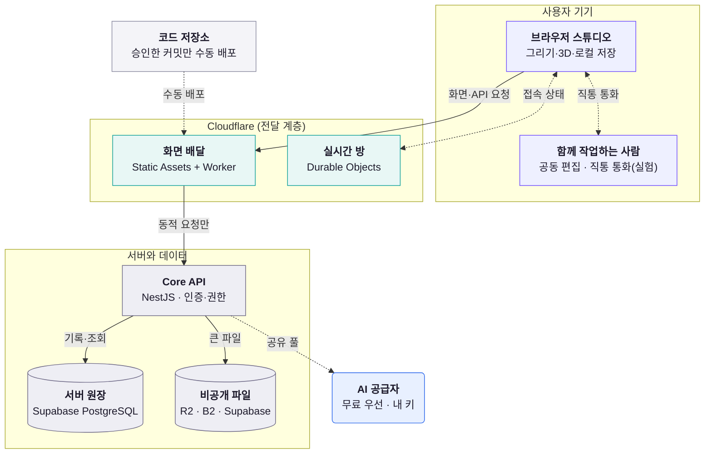

구조를 지탱하는 원칙은 여섯 가지입니다.

1. **원본은 내 기기, 서버는 원장만** — 작업 원본은 OPFS·SQLite 에 두고, 서버는 계정·권한·거래, 함께 편집하고 게시한 작품처럼 여럿이 함께 믿어야 하는 기록을 맡습니다.
2. **정적은 곧장, 계산은 필요할 때만** — 화면 파일은 Cloudflare 가 바로 내주고, Worker 는 지정한 경로에서만, 서버는 동적 요청에만 깨어나 무료 플랜의 한도를 아낍니다.
3. **쓰기 권위는 하나, 몰래 갈아타지 않기** — 데이터마다 쓰기 권위를 하나만 두고, GPU·DB 가 막혀도 슬쩍 다른 것으로 바꾸지 않고 알립니다. AI 도 애매한 실패는 다시 보내지 않습니다.
4. **AI 는 제안만, 확정은 사람이** — 글 도구의 결과는 제안으로 돌아오고(이미지 도구는 새 이미지 요소로 추가되고 기기 안 ONNX 는 선택한 이미지를 바로 바꿉니다), 호출 전에 예산을 예약하며, 유료 길은 사용자가 허락해야 열립니다.
5. **지키는 일은 문서가 아니라 검사가** — 경계·접근성·번들 예산은 테스트와 래칫이 지키고, 배포는 승인한 커밋 하나를 사람이 올립니다.
6. **확인한 것만 말한다** — 상태 배지는 코드·설정으로 확인한 현재 상태이고, 운영에서 확인하지 못한 것은 그렇다고 적었습니다.

## 3. 읽는 순서

| 읽는 사람 | 추천 순서 | 어디까지 |
| --- | --- | --- |
| 비전문가·투자자 (약 15분) | 한 장 지도 → 1 작업실 → 2 화면을 여는 순간 → 3 작품 저장 → 6 AI → 9 배포 → 12 AI 개발 | 도식, 한 줄 요약, 쉽게 말해, 흐름 단계까지 |
| 개발자·스터디 참가자 | 1 → 12 순서로 | 구간마다 접어 둔 상세(배경 지식·서비스에서 쓰인 곳·선택과 대가)를 펼쳐 보고, 도감 카드로 내려가기 |
| 발표자 (질문 대비) | 질문에서 구간으로 바로 이동 | 서버가 잠들면? → 2·7, AI 비용은? → 6, 화면과 서버 버전이 어긋나면? → 10, 품질은 누가 지키나? → 11, AI 로 만들었는데 믿을 수 있나? → 12 |

구간 사이의 흐름은 이렇습니다. 한 사람의 작업은 1(브라우저 안)·2(화면이 뜨는 길)·3(저장의 주인) 세 구간으로 설명하고, 4(함께 그릴 때)·5(공간과 3D)·6(AI)는 그 위에 얹히는 기능이며, 7(실패 대비)이 이 모두의 바닥입니다. 그 구조를 8(코드 구성) → 9(배포) → 10(버전 맞추기) → 11(품질) → 12(AI 개발) 가 만들고 지킵니다.

## 4. 12개 구간 한눈에

| 번호 | 구간 | 답하는 질문 | 한 줄 요약 | 도식 | 상태 |
| ---: | --- | --- | --- | --- | --- |
| 1 | 브라우저 안의 작업실 (`browser-studio`) | 앱을 열면 내 기기 안에서 무엇이 일하나? | 그리는 일과 저장하는 일은 내 브라우저 안에서 끝나고, 서버는 그다음에 만납니다. | 계층 | 운영 경로(`live`) |
| 2 | 화면을 여는 순간 (`request-journey`) | 주소를 치면 어떤 길을 지나 화면이 뜨나? | 화면 파일은 Cloudflare 가 바로 내주고, 서버는 계산이 필요한 요청만 받습니다. | 순서도 | 설정 필요(`configured`) |
| 3 | 내 작품은 어디에 저장될까 (`data-authority`) | 원본·원장·파일·실시간 상태의 주인은 누구인가? | 혼자 그릴 때의 원본은 내 기기에, 여럿이 함께 믿어야 하는 기록과 함께 그린 문서의 변경은 서버 원장 하나에 둡니다. | 흐름도 | 설정 필요(`configured`) |
| 4 | 함께 그릴 때 (`realtime-collab`) | 여러 사람이 동시에 그릴 때 무엇이 오가나? | 문서 변경은 서버가 권한을 검사한 뒤 전달하고, 접속·통화 신호는 따로 흐릅니다. | 순서도 | 실험 기능(`experimental`) |
| 5 | 가상 스튜디오와 3D (`virtual-studio-3d`) | 2D 공간과 3D 장면은 어떻게 맞물리나? | 2D 공간(Phaser)과 3D 장면(three.js)은 따로 돌고, 프로젝트와 작품 문서로 만납니다. | 흐름도 | 운영 경로(`live`) |
| 6 | AI가 끼어드는 길 (`ai-path`) | AI 요청은 어디를 거쳐 누가 승인하나? | AI는 예산을 먼저 예약하고 무료 길부터 시도하며, 글 도구의 결과는 검토할 제안으로 돌아옵니다. | 흐름도 | 설정 필요(`configured`) |
| 7 | 실패해도 작업이 남는 이유 (`resilience`) | 서버·네트워크·GPU·AI 한도가 막히면? | 실패는 숨기지 않고 알리되, 작업이 놓일 바닥은 기기 저장입니다. 기기 저장이 막히면 그 사실을 알립니다. | 계층 | 운영 경로(`live`) |
| 8 | 코드는 어떻게 나뉘어 있나 (`monorepo-layout`) | 앱·패키지·도메인은 어떤 규칙으로 나뉘나? | 앱끼리는 서로의 코드를 가져다 쓰지 않고, 함께 쓰는 약속만 좁은 패키지에 둡니다. | 계층 | 운영 경로(`live`) |
| 9 | 코드가 서비스가 되는 길 (`build-and-ship`) | 커밋에서 운영까지 무엇을 거치나? | 병합은 배포가 아닙니다. CI 를 통과한 뒤 사람이 승인한 커밋 하나를 단위별로 손으로 올립니다. | 흐름도 | 설정 필요(`configured`) |
| 10 | 프런트와 백엔드를 한 버전으로 맞추기 (`front-back-alignment`) | 화면과 서버가 서로 다른 빌드를 보지 않게 하는 장치는? | 승인한 SHA 하나를 단위마다 관문에서 확인하고, 번들과 서버는 SHA 대신 내용 해시와 프로토콜 버전으로 어긋남을 거릅니다. | 순서도 | 설정 필요(`configured`) |
| 11 | 무엇이 품질을 지키나 (`quality-gates`) | 래칫·테스트·접근성·보안 검사는 어디서 막나? | 내 컴퓨터의 훅, PR 의 CI core, 빌드·배포 스크립트의 검사, 사람이 여는 수동 배포 관문까지 단계마다 다른 문이 막습니다. | 계층 | 운영 경로(`live`) |
| 12 | AI와 함께 만드는 개발 방식 (`ai-assisted-dev`) | AI 도구를 쓸 때 규칙과 검증은 어떻게 걸었나? | 규칙은 AGENTS.md 한 곳에 두고, AI 의 변경도 같은 하네스·CI 검사를 받으며 운영 배포엔 사람의 승인이 필요합니다. | 흐름도 | 운영 경로(`live`) |

## 5. 앱이 돌아가는 구조 (구간 1~7)

### 1. 브라우저 안의 작업실 (`browser-studio`)

- 답하는 질문: 앱을 열면 내 기기 안에서 무엇이 일하나?
- 상태: 운영 경로(`live`) · 도식: 계층
- 한 줄 요약: 그리는 일과 저장하는 일은 내 브라우저 안에서 끝나고, 서버는 그다음에 만납니다.
- 쉽게 말해: 브라우저는 '내 책상 위 작업실'입니다. 화면 담당, 계산 담당, 서랍(저장) 담당이 한 방에 모여 있어서, 인터넷이 느려져도 그리는 일은 멈추지 않습니다.

```mermaid
%%{init: {"flowchart": {"wrappingWidth": 420}}}%%
flowchart TB
  ui["<b>화면과 입력</b><br/>화면은 React, 문서 표시·펜 입력은 Konva<br/>React 19 · Konva · Vite"]
  document["<b>문서와 명령</b><br/>직렬화되는 문서로 저장, 되돌리기는 편집 기록(스냅샷)<br/>studio-project-model · command-registry"]
  engines["<b>그리기·3D 엔진</b><br/>엔진마다 맡은 일을 코드 원장에 적고 테스트가 검사<br/>Canvas2D · Skia · Pixi · three.js"]
  workers["<b>일꾼 (Worker·WASM)</b><br/>필터·PNG 같은 무거운 일은 화면 밖에서 처리<br/>Web Worker · Rust/WASM"]
  storage["<b>기기 저장소</b><br/>전용 Worker 의 SQLite WASM 과 OPFS 복구 저널<br/>SQLite WASM · OPFS · Web Locks"]
  shell["<b>앱 셸 보관</b><br/>앱 셸을 보관해 오프라인에서도 열림<br/>Service Worker · Cache API"]
  ui --> document
  document --> engines
  engines --> workers
  workers --> storage
  storage --> shell
  style ui fill:#eef0ff,stroke:#6d4aff,color:#1d1a2b
  style document fill:#eef0ff,stroke:#6d4aff,color:#1d1a2b
  style engines fill:#eef0ff,stroke:#6d4aff,color:#1d1a2b
  style workers fill:#eef0ff,stroke:#6d4aff,color:#1d1a2b
  style storage fill:#eef0ff,stroke:#6d4aff,color:#1d1a2b
  style shell fill:#eef0ff,stroke:#6d4aff,color:#1d1a2b
  subgraph bracket1["한 번 연 뒤 서버 없이 동작"]
    ui
    document
    engines
    workers
    storage
    shell
  end
```

*내 기기 안의 여섯 층* — 아래로 갈수록 작품을 지키는 층입니다. 한 번 온라인으로 연 뒤에는 모두 서버 없이 내 기기 안에서 돕니다.

**흐름**

1. 주소를 열면 React 앱이 뜨고, /studio 에서 Konva 캔버스가 작품을 보여 줍니다.
2. 펜을 내릴 때 그릴 표면을 한 번 고릅니다. 필터·PNG 같은 무거운 일만 일꾼(Worker·WASM)이 맡고, 기본 붓의 획 계산은 화면 스레드에서 돕니다.
3. 작품은 직렬화되는 문서로 저장되고, 되돌리기는 편집 기록(스냅샷)으로 동작하며, 복구는 아래의 저널이 맡습니다.
4. 편집이 1.5초 멈추거나 펜을 뗄 때 OPFS 복구 저널에 자동 저장됩니다.
5. 카탈로그·설정은 전용 Worker 한 개가 쥔 SQLite WASM 에 두고, 같은 문서는 탭 하나만 저장을 맡습니다.
6. Service Worker 가 앱 셸을 보관해 한 번 열어 본 스튜디오는 오프라인에서도 열립니다.

**서비스에서 쓰인 곳 (기능 → 대표 경로)**

| 기능·영역 | 대표 경로 |
| --- | --- |
| 캔버스·입력 (/studio) | `packages/studio-engine-registry/src/renderer-roles.ts` |
| 획 시작과 표면 고정 | `apps/web/src/domains/creator/brush/studio-stroke-surface-route.ts` |
| 로컬 DB와 자동 저장 | `apps/web/src/domains/creator/studio-local-database.ts` |
| Worker 일꾼 규약 | `apps/web/src/domains/creator/studio-crc32-worker-client.ts` |
| 서비스 워커 (앱 셸 보관) | `apps/web/src/app/service-worker/studio-service-worker-policy.ts` |

**오해하기 쉬운 점**: '오프라인이면 다 된다'는 뜻이 아닙니다. 한 번 온라인으로 연 뒤의 그리기·저장까지이고 협업·AI·게시는 서버가 필요합니다. 브라우저별 실측(WebGPU·격리)은 이 페이지에서 확인하지 못했습니다.

**더 보기**: 도감 카드(`/about/technology/atlas#<id>`) `renderer-role-ledger` · `stroke-surface-route-pointerdown` · `sqlite-wasm-opfs-sah-pool` · `autosave-crash-recovery-journal` · `worker-envelope-64-workers` · `service-worker-app-shell-policy` / 제작 스토리 챕터 `architecture` · `brush-render-authority` · `storage` · `worker-architecture` · `pwa-continuity` / 용어집 `renderer-role-ledger` · `stroke-surface-route` · `sqlite-wasm` · `opfs` · `web-worker` · `service-worker`

### 2. 화면을 여는 순간 (`request-journey`)

- 답하는 질문: 주소를 치면 어떤 길을 지나 화면이 뜨나?
- 상태: 설정 필요(`configured`) · 도식: 순서도
- 한 줄 요약: 화면 파일은 Cloudflare 가 바로 내주고, 서버는 계산이 필요한 요청만 받습니다.
- 쉽게 말해: Cloudflare 는 건물 로비의 안내 데스크입니다. 미리 인쇄해 둔 안내문(화면 파일)은 데스크에서 바로 건네고, 상담이 필요한 일(로그인·저장)만 안쪽 사무실(서버)로 연결해 줍니다.

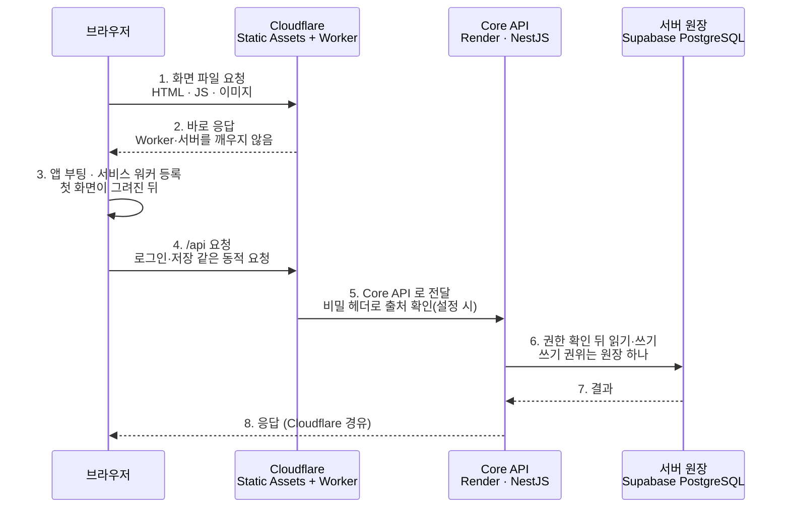

*주소를 친 뒤의 길* — 정적 화면은 Cloudflare 에서 끝나고, 동적 요청만 Core API 와 원장 DB 까지 갑니다.

**흐름**

1. 주소를 열면 브라우저가 Cloudflare 에 화면 파일(HTML·JS·이미지)을 요청합니다.
2. 화면 파일은 Static Assets 가 Worker 실행 없이 바로 내줍니다. 서버는 깨어나지 않습니다.
3. 앱이 뜨면 필요한 코드를 더 받고, 첫 화면이 그려진 뒤 서비스 워커를 등록합니다.
4. 로그인·저장처럼 계산이 필요한 /api 요청만 Worker 가 먼저 받아 Core API 로 전달합니다.
5. Core API 는 (비밀 헤더를 설정했다면) Cloudflare 를 거친 요청만 받고, 권한을 본 뒤 서버 원장을 읽고 씁니다.
6. 서버가 잠들어 있으면 첫 요청만 느리고, 브라우저는 처음 90초의 지연을 '연결 준비 중'으로 보여 줍니다.

**서비스에서 쓰인 곳 (기능 → 대표 경로)**

| 기능·영역 | 대표 경로 |
| --- | --- |
| 화면 파일 서빙 (Cloudflare) | `deploy/cloudflare-static/wrangler.jsonc` |
| 동적 요청 7갈래 | `deploy/cloudflare-static/src/index.ts#classifyDynamicRoute` |
| Core API 서버 | `render.yaml` |
| 상태 확인 3단 | `apps/api/src/modules/health/health.service.ts` |
| 대형 파일 배달 | `deploy/cloudflare-static/src/large-static-assets.ts` |

**오해하기 쉬운 점**: '정적 요청은 Worker 를 거치지 않는다'에는 예외가 있습니다(먼저 실행하는 26개 경로: 링크 미리보기 크롤러·대형 파일 등). 운영 대시보드와 실제 사용량은 확인하지 못했고 코드·설정만 근거입니다.

**더 보기**: 도감 카드(`/about/technology/atlas#<id>`) `static-first-edge-gateway` · `health-live-ready-capabilities` · `large-asset-delivery-r2-range` · `edge-origin-auth-trusted-proxy` · `server-down-fallback-deadline` · `response-header-contract-csp` / 제작 스토리 챕터 `infrastructure` · `cost-engineering` · `pwa-continuity` / 용어집 `health-live-ready` · `csp` · `hashed-name-immutable-cache` · `offline-shell`

### 3. 내 작품은 어디에 저장될까 (`data-authority`)

- 답하는 질문: 원본·원장·파일·실시간 상태의 주인은 누구인가?
- 상태: 설정 필요(`configured`) · 도식: 흐름도
- 한 줄 요약: 원본은 내 기기에, 여럿이 함께 믿어야 하는 기록은 서버 원장 하나에 둡니다.
- 쉽게 말해: 집에는 내 작업 책상(내 기기)이 있고, 동네에는 공증 사무소(서버 원장)가 있고, 큰 짐은 창고(파일 저장소)에, 회의실 칠판(실시간 상태)은 회의가 끝나면 곧 지워집니다. 물건마다 주인이 정해져 있습니다.

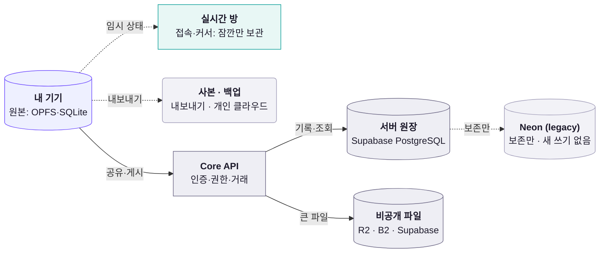

*물건마다 정해진 주인* — 원본은 기기, 기록은 서버 원장 하나, 큰 파일은 용도별 저장소, 잠깐의 상태는 실시간 방이 맡습니다.

**흐름**

1. 그리는 동안의 작품 원본은 내 기기(OPFS·SQLite WASM)가 쥡니다.
2. 원하면 내보내기 파일이나 연결한 개인 클라우드(기본은 Google Drive)에 사본을 둡니다. 이 사본이 백업입니다.
3. 계정·권한·게시·결제 같은 기록은 Core API 를 거쳐 서버 원장(Supabase PostgreSQL)에만 씁니다.
4. 큰 파일은 용도별 비공개 저장소(코드는 R2·B2·Supabase, 배포 설정은 Supabase)에 두고 참조만 원장에 남깁니다.
5. 접속 상태·커서 같은 잠깐의 정보는 Durable Objects 가 맡고, 이벤트는 15분만 보관하도록 설정돼 있습니다.
6. 예전 Neon DB 는 legacy 로 보존만 하고, 새 운영 쓰기의 권위로 되돌리지 않습니다.

**서비스에서 쓰인 곳 (기능 → 대표 경로)**

| 기능·영역 | 대표 경로 |
| --- | --- |
| 작업 원본 (내 기기) | `apps/web/src/domains/creator/studio-local-database.ts` |
| 서버 원장 | `apps/api/src/platform/database/pg-connection.ts` |
| 비공개 파일 저장소 | `apps/api/src/platform/adapters/private-object-storage/private-object-storage.config.ts` |
| 임시 실시간 상태 | `deploy/cloudflare-realtime/src/room.ts` |
| 내보내기와 개인 클라우드 | `apps/web/src/domains/creator/save-first/studio-project-package.ts` |

**오해하기 쉬운 점**: 기기 저장은 운영 경로이고, 서버 원장·파일 저장소·Durable Objects 는 설정 또는 운영 확인이 남은 상태입니다. 무료 DB 16곳은 일부만 준비된 후보이며 연합 기능은 꺼져 있고, 오래된 문서의 Neon 서술은 legacy 보존 DB 이야기입니다.

**더 보기**: 도감 카드(`/about/technology/atlas#<id>`) `supabase-single-writer-authority` · `sqlite-wasm-opfs-sah-pool` · `opfs-content-addressed-store` · `storage-persistence-quota-safe-mode` · `file-system-access-resave` · `federated-free-data-plane` / 제작 스토리 챕터 `storage` · `infrastructure` · `cost-engineering` / 용어집 `data-authority-ledger` · `opfs` · `sqlite-wasm` · `indexeddb` · `migration-checksum-ledger`

### 4. 함께 그릴 때 (`realtime-collab`)

- 답하는 질문: 여러 사람이 동시에 그릴 때 무엇이 오가나?
- 상태: 실험 기능(`experimental`) · 도식: 순서도
- 한 줄 요약: 문서 변경은 서버가 권한을 검사한 뒤 전달하고, 접속·통화 신호는 따로 흐릅니다.
- 쉽게 말해: 공동 작업실의 출입문에는 경비(서버)가 있어 입장권을 확인합니다. 칠판에 적는 변경은 경비가 규칙을 본 뒤 기록하고 모두에게 알리고, 복도의 잡담(커서·접속)과 통화 연결은 별도 통로로 오갑니다.

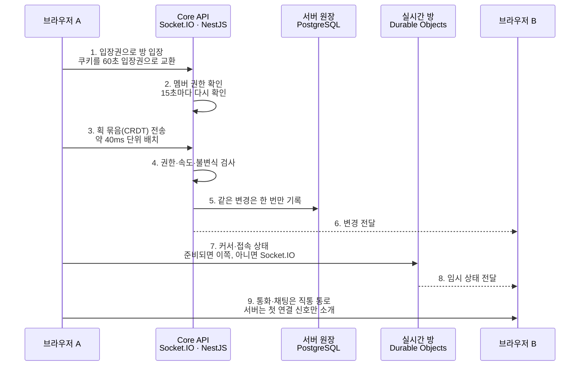

*함께 그릴 때 오가는 것* — 문서는 서버를 거쳐 검사받고, 임시 상태는 실시간 방으로, 통화는 브라우저끼리 직접 갑니다.

**흐름**

1. 작업실에 들어갈 때 로그인 쿠키를 60초짜리 입장권으로 바꿔 Socket.IO 에 건넵니다.
2. 서버는 입장권을 확인한 뒤 소켓 정보에서 지우고(한 번만 쓰게 막는 저장소는 없음), 작품 멤버 권한을 본 뒤 방에 넣습니다(정원 30명).
3. 그림 변경은 의미 단위로 묶은 CRDT 업데이트로 보내고, 서버가 권한·속도·불변식을 먼저 검사합니다.
4. 검사를 통과한 변경만 PostgreSQL 에 한 번 기록하고 방 안의 다른 사람에게 전달합니다.
5. 같은 레이어를 동시에 건드리지 않도록 번호표(revision)가 붙은 15초짜리 잠금을 씁니다.
6. 접속 상태·커서는 Durable Objects 가, 통화·채팅은 브라우저끼리 직통 통로가 맡습니다.

**서비스에서 쓰인 곳 (기능 → 대표 경로)**

| 기능·영역 | 대표 경로 |
| --- | --- |
| 공동 작업실 입장 | `apps/api/src/modules/creator/studio-live-auth-ticket.controller.ts` |
| 동시 그리기 문서 | `apps/web/src/domains/creator/live/studio-crdt-document.ts` |
| 편집 잠금 | `apps/api/src/modules/creator/studio-live-lock.repository.ts` |
| 접속 상태·화면 공유 신호 | `deploy/cloudflare-realtime/src/room.ts` |
| 허들 직통 통로 | `apps/web/src/domains/creator/live/huddle/studio-p2p-huddle-controller.ts` |

**오해하기 쉬운 점**: 'Socket.IO 가 WebRTC 신호를 한다'는 부정확합니다. 음성 신호 중계 코드는 있으나 운영 스위치(STUDIO_LIVE_VOICE_ENABLED)는 저장소 설정 기준으로 꺼져 있어, 서버를 지나는 WebRTC 신호는 데이터 통로 시작·화면 공유 신호 정도입니다. CRDT·Durable Objects·허들은 실험 또는 설정 단계이며 부하·다른 네트워크 통화는 검증하지 않았습니다.

**더 보기**: 도감 카드(`/about/technology/atlas#<id>`) `socket-io-room-tickets` · `yjs-crdt-document` · `crdt-lock-revision` · `durable-objects-realtime` · `webrtc-three-plane-signaling` · `webrtc-datachannel-direct-lane` / 제작 스토리 챕터 `collaborative-crdt-boundary` · `webrtc-media-authority` · `authentication` / 용어집 `socket-io` · `crdt` · `yjs` · `durable-objects` · `webrtc` · `signaling` · `presence`

### 5. 가상 스튜디오와 3D (`virtual-studio-3d`)

- 답하는 질문: 2D 공간과 3D 장면은 어떻게 맞물리나?
- 상태: 운영 경로(`live`) · 도식: 흐름도
- 한 줄 요약: 2D 공간(Phaser)과 3D 장면(three.js)은 따로 돌고, 프로젝트와 작품 문서로 만납니다.
- 쉽게 말해: 가상 스튜디오는 팀이 모이는 '로비'이고, 3D 는 캐릭터와 배경을 만드는 '공방'입니다. 로비와 공방은 서로의 도구를 빌려 쓰지 않고, 완성품(작품 문서)과 안내(어느 문으로 갈지)로만 오갑니다.

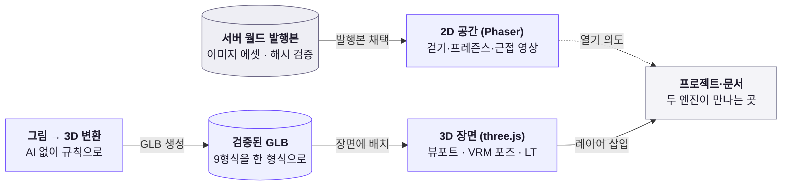

*두 세계가 만나는 곳* — 엔진은 따로 쓰고, 프로젝트와 작품 문서에서 만납니다. 2D 공간은 3D 모듈을 가져오지 않습니다.

**흐름**

1. 공간에 들어갈 때 Phaser 엔진을 받도록 설계돼 있습니다(/studio/space, 협업은 /studio/p/…/space).
2. 방(월드)은 서버가 확정한 발행본이고(발행본이 없으면 내장 월드가 열립니다), 브라우저는 해시를 다시 계산해 맞을 때만 채택합니다.
3. 문·구역·NPC 는 '어디로 갈지'만 정하고, 쓸 자격은 도착한 기능이 따로 판단합니다.
4. 3D 는 별도 화면(/studio/bg3d, /studio/poser)에서 three.js 가 그리며 Phaser 를 쓰지 않습니다.
5. 그림 한 장은 규칙으로 GLB 가 되고, 가져온 3D 파일 9형식은 검증된 GLB 하나로 정규화됩니다.
6. 3D 장면은 캡처되어 컬러·톤·질감선·주선 네 레이어로 2D 작품에 들어갑니다.

**서비스에서 쓰인 곳 (기능 → 대표 경로)**

| 기능·영역 | 대표 경로 |
| --- | --- |
| 가상 스튜디오 화면 | `apps/web/src/domains/creator/virtual-space/StudioVirtualSpacePage.tsx` |
| 월드 발행 (서버 확정) | `apps/api/src/modules/studio-project-graph/studio-world-publication.repository.ts` |
| 3D 뷰포트와 LT 삽입 | `apps/web/src/domains/creator/bg3d/StudioBg3dEditorViewport.tsx` |
| VRM 캐릭터 포즈 | `apps/web/src/domains/creator/studio-humanoid-bones.ts` |
| 3D 파일 들이기·그림에서 3D | `apps/web/src/domains/creator/bg3d/studio-bg3d-model-import.ts` |

**오해하기 쉬운 점**: '가상 스튜디오 안에서 3D 를 본다'는 오해입니다. 2D 공간은 이미지 에셋과 Phaser 만 쓰고 3D 와 코드로 이어진 곳을 찾지 못했습니다. 운영 DB 의 실제 발행 월드와 다중 사용자 실측은 확인하지 못했습니다.

**더 보기**: 도감 카드(`/about/technology/atlas#<id>`) `virtual-studio-architecture-overview` · `world-authority-cas-projection` · `space-is-not-permission` · `three-r3f-viewport` · `vrm-humanoid-rig` · `glb-optimization-pipeline` · `lift-2d-to-3d` / 제작 스토리 챕터 `virtual-studio-world-authority` · `web-3d-engine` / 용어집 `virtual-studio` · `vrm` · `threejs` · `r3f` · `gltf` · `humanoid-bones`

### 6. AI가 끼어드는 길 (`ai-path`)

- 답하는 질문: AI 요청은 어디를 거쳐 누가 승인하나?
- 상태: 설정 필요(`configured`) · 도식: 흐름도
- 한 줄 요약: AI는 예산을 먼저 예약하고 무료 길부터 시도하며, 결과는 제안으로만 돌아옵니다.
- 쉽게 말해: AI 는 택시와 비슷합니다. 타기 전에 미터기 한도를 먼저 정하고(예산 예약), 요금이 안 드는 노선부터 알아보고, 유료 택시는 내가 손을 들어야만 탑니다. 도착한 결과는 짐이 아니라 제안서라서, 내가 받아들일 때만 작품에 들어옵니다.

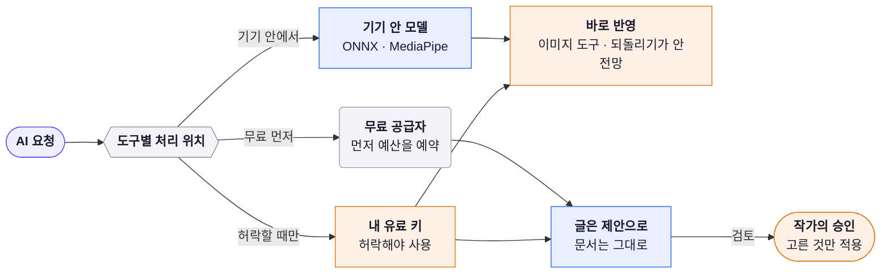

*AI 요청이 지나는 문* — 기기 안 → 무료 → (허락한 경우) 유료 순으로 열고, 글 도구 결과는 제안으로 돌아와 작가가 승인하며 이미지 도구는 바로 반영됩니다.

**흐름**

1. 처리 위치는 라우터 한 곳이 아니라 사용자가 연 도구가 정합니다(기기 안 모델, 검토된 무료 공급자, 허락한 경우만 내 유료 키). 정해진 순서는 무료 길 안에서뿐입니다.
2. 기기 안 모델(ONNX·MediaPipe)은 그림이 서버로 나가지 않아 키도 한도도 필요 없습니다.
3. 무료 길은 호출 전에 하루 한도를 먼저 예약하고, 한도에 닿으면 공급자를 부르지 않고 멈춥니다.
4. 확실히 거절된 경우만 다음 무료 공급자로 넘기고, 시간 초과·5xx 같은 애매한 실패는 다시 보내지 않습니다.
5. 유료 키는 설정에서 허락해야 자동 순서에 들어오며, 내 키는 기본적으로 이 탭의 메모리에만 둡니다.
6. 글 도구 결과는 문서를 바로 고치지 않고 제안으로 돌아오며, 작가가 고른 것만 한 번의 되돌리기 단위로 적용됩니다. 이미지 도구는 새 이미지 요소로 추가되고, 기기 안 이미지 도구(ONNX)는 선택한 이미지를 바로 바꿉니다.

**서비스에서 쓰인 곳 (기능 → 대표 경로)**

| 기능·영역 | 대표 경로 |
| --- | --- |
| AI 설정 · 무료 길 고르기 | `apps/web/src/shared/ai/free-ai-policy.ts` |
| 호출 전 예산 예약 | `apps/web/src/shared/ai/free-ai-runtime-budget.ts` |
| 서버 공유 무료 풀 | `apps/api/src/modules/studio-ai/studio-ai-provider.ts` |
| 내 키 (BYOK) 호출 | `apps/web/src/shared/ai/user-ai-transport.ts` |
| 기기 안 AI와 제안 검토 | `apps/web/src/domains/creator/studio-onnx-inference-provider.ts` |

**오해하기 쉬운 점**: '무료 우선 = 공짜'가 아니며 서버 공유 무료 풀은 키·운영 확인 대기('설정 필요')입니다. 한도 날짜 경계는 UTC 자정입니다. 모든 AI 가 기기 안에서 도는 것도 아니고, 글·이미지 생성은 클라우드입니다. 결과가 모두 제안으로 돌아오는 것도 아닙니다.

**더 보기**: 도감 카드(`/about/technology/atlas#<id>`) `free-first-ai-routing` · `quota-ledger-budget` · `ambiguous-failure-no-retry` · `byok-paid-approval-gate` · `free-ai-provider-allowlist` · `onnx-runtime-web-inference` · `ai-proposal-not-commit` / 제작 스토리 챕터 `free-ai-routing` · `ai-routing` · `on-device-inference` / 용어집 `ai-routing` · `quota-ledger` · `byok` · `ai-provider-allowlist` · `ai-proposal-review` · `ambiguous-failure` · `onnx`

### 7. 실패해도 작업이 남는 이유 (`resilience`)

- 답하는 질문: 서버·네트워크·GPU·AI 한도가 막히면?
- 상태: 운영 경로(`live`) · 도식: 계층
- 한 줄 요약: 실패는 숨기지 않고 알리되, 작업이 놓일 바닥(기기 저장)은 끝까지 남겨 둡니다.
- 쉽게 말해: 배의 격벽과 비슷합니다. 한 칸에 물이 새도 다른 칸이 막아 주도록 칸을 나눴습니다. 서버가 멈추면 기기 안 저장이, 저장이 막히면 알림과 복구가, GPU 가 끊기면 마지막 정상 화면이 작품을 지킵니다.

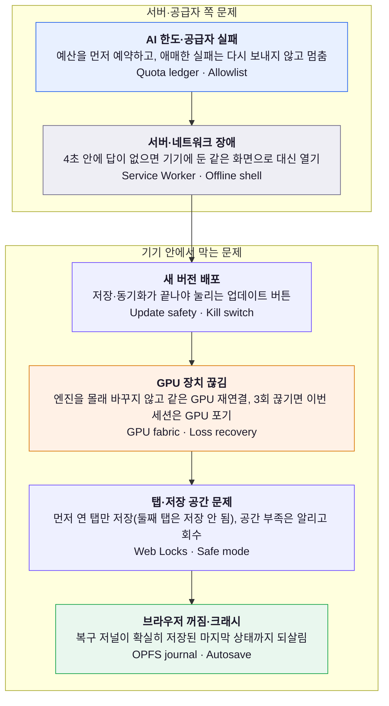

*무엇이 막히면 무엇이 남나* — 바깥의 장애일수록 위, 기기 안의 방어일수록 아래입니다. 맨 아래 복구 저널이 마지막 바닥입니다.

**흐름**

1. 편집이 1.5초 멈추거나 펜을 뗄 때 복구 저널에 기록해, 브라우저가 꺼져도 마지막 상태로 돌아옵니다.
2. 같은 문서를 탭 두 개로 열면 먼저 연 탭만 저장합니다. 나머지 탭도 그릴 수는 있지만 그린 내용은 저장되지 않으며, 화면에 그렇게 안내합니다.
3. 저장 공간이 모자라면 조용히 실패하지 않고 알린 뒤, 안전 모드에서 복구 기록을 정리합니다.
4. 서버가 4초 안에 답하지 않거나 5xx 를 주면 기기에 준비해 둔 같은 스튜디오 화면을 대신 엽니다.
5. GPU 가 끊기면 다른 엔진으로 몰래 바꾸지 않고 같은 GPU 재연결을 시도하며 마지막 정상 프레임을 지킵니다.
6. AI 는 한도에 닿으면 호출하지 않고 애매한 실패는 다시 보내지 않으며, 새 버전은 저장이 끝나야 적용됩니다.

**서비스에서 쓰인 곳 (기능 → 대표 경로)**

| 기능·영역 | 대표 경로 |
| --- | --- |
| 자동 저장과 복구 | `apps/web/src/domains/creator/studio-opfs-recovery-journal.ts` |
| 탭 하나만 저장 | `apps/web/src/domains/creator/studio-autosave-document-leader.ts` |
| 서버 장애 때 같은 화면 | `apps/web/src/app/service-worker/studio-service-worker-navigation.ts` |
| GPU 끊김 복구 | `apps/web/src/domains/creator/studio-device-loss-recovery.ts` |
| 저장 공간·업데이트 안전 | `apps/web/src/domains/creator/studio-storage-recovery-runtime.ts` |

**오해하기 쉬운 점**: '오프라인이면 다 된다'고 말하지 마세요. 첫 방문 오프라인은 불가하고 협업·AI·게시는 서버가 필요합니다. 결함 주입·소크 시험은 시뮬레이션이며 실기기 검증이 남은 항목이 있습니다.

**더 보기**: 도감 카드(`/about/technology/atlas#<id>`) `autosave-crash-recovery-journal` · `web-locks-broadcastchannel-single-author` · `storage-persistence-quota-safe-mode` · `server-down-fallback-deadline` · `user-approved-update-kill-switch` · `webgpu-tier-budget-recovery` · `fault-injection-and-soak` / 제작 스토리 챕터 `pwa-continuity` · `storage` · `troubleshooting-evidence` / 용어집 `fail-visible` · `gpu-device-loss` · `kill-switch` · `fault-injection` · `web-locks` · `offline-shell` · `soak-test`

## 6. 만들고 지키는 구조 (구간 8~12)

구간 10 은 "SHA 처럼 백엔드·프런트 빌드를 맞추는 기술"에 대한 답입니다. 결론부터 말하면, **승인한 SHA 하나를 단위마다 관문에서 확인하는 절차**와 **번들·서버가 SHA 대신 내용 해시·프로토콜 버전으로 어긋남을 가리는 장치**가 있고, 번들이나 API 응답에 커밋 SHA 가 새겨져 있지는 않습니다.

### 8. 코드는 어떻게 나뉘어 있나 (`monorepo-layout`)

- 답하는 질문: 앱·패키지·도메인은 어떤 규칙으로 나뉘나?
- 상태: 운영 경로(`live`) · 도식: 계층
- 한 줄 요약: 앱끼리는 서로의 코드를 가져다 쓰지 않고, 함께 쓰는 약속만 좁은 패키지에 둡니다.
- 쉽게 말해: 한 건물(저장소) 안에 가게(앱)가 여럿 입주해 있지만 서로의 벽에는 구멍을 내지 않습니다. 같이 써야 하는 물건만 공용 창고(패키지)에 두고, 경비(래칫)가 벽의 구멍 수를 숫자로 셉니다.

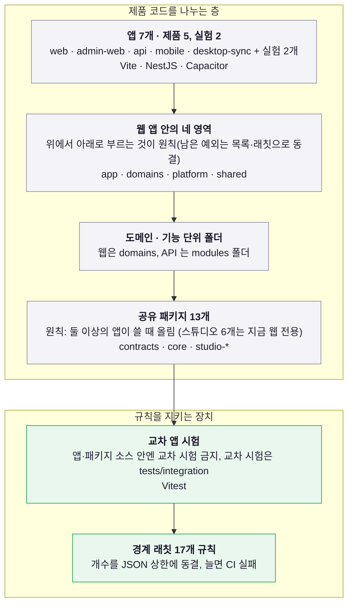

*한 저장소를 나누는 여섯 층* — 앱은 서로 모르고, 앱 안은 한 방향으로만 의존하며, 어긴 개수는 숫자로 잠깁니다.

**흐름**

1. 저장소 한 곳에 앱 7개(apps)와 공유 패키지 13개(packages)를 두고 pnpm 작업공간으로 묶습니다.
2. 앱끼리는 서로의 소스를 가져다 쓰지 않습니다. 함께 쓸 약속만 packages 로 나눕니다.
3. 웹 앱 안은 app → domains → platform → shared 방향으로만 의존하고, 기능은 도메인 폴더에 둡니다.
4. 다른 앱을 건드리는 시험은 앱·패키지 소스 안에 두지 못하게 막고, tests/integration 으로 옮깁니다.
5. 나쁜 import 는 개수를 세어 JSON 상한에 고정하고, 늘어나면 CI 가 멈춥니다.

**서비스에서 쓰인 곳 (기능 → 대표 경로)**

| 기능·영역 | 대표 경로 |
| --- | --- |
| 웹 앱의 네 영역과 도메인 | `apps/web/src/domains` |
| 작업공간과 앱·패키지 목록 | `pnpm-workspace.yaml` |
| 공유 계약 패키지 | `packages/contracts/package.json` |
| 경계 래칫 | `scripts/validate-app-boundaries.mjs` |
| 스튜디오는 예외 | `docs/architecture/studio-current-boundaries.md` |

**오해하기 쉬운 점**: '경계가 모두 0건'이라고 말하면 틀립니다. 앱 사이 직접 import 는 0이지만, 2026-10-08 기준 웹 shared→domains 25건과 platform→domains 예외 파일 6개, 도메인 간 깊은 import(상한 58)가 남았습니다(실측은 검증 스크립트가 매번 셉니다).

**더 보기**: 도감 카드(`/about/technology/atlas#<id>`) `module-boundary-ratchet` · `shared-contract-patterns` · `renderer-role-ledger` · `implemented-not-wired-modules` / 제작 스토리 챕터 `architecture` · `quality` / 용어집 `monorepo` · `ratchet` · `renderer-role-ledger`

### 9. 코드가 서비스가 되는 길 (`build-and-ship`)

- 답하는 질문: 커밋에서 운영까지 무엇을 거치나?
- 상태: 설정 필요(`configured`) · 도식: 흐름도
- 한 줄 요약: 병합은 배포가 아닙니다. CI 를 통과한 뒤 사람이 승인한 커밋 하나를 단위별로 손으로 올립니다.
- 쉽게 말해: 공장 검수(CI)를 마친 제품도 출하 도장(승인 SHA)이 찍혀야 나갑니다. 창고가 셋(DB·서버·화면)이라 같은 제품 번호로 하나씩 차례로 싣고, 서버와 화면 창고는 문제가 생기면 직전 상태로 되돌립니다. DB 창고는 되돌리는 문이 없어 추가만 싣습니다.

```mermaid
flowchart LR
  subgraph auto["자동 · GitHub"]
    ci["<b>PR · CI core</b><br/>필수 7개 잡 통과"]
    main["<b>main 병합</b><br/>배포가 아님"]
  end
  subgraph manual["수동 · 사람이 승인하고 실행"]
    approve["<b>사람의 승인</b><br/>40자리 SHA 1개"]
    db["<b>① DB 변경</b><br/>수동 실행 · 확인 문구"]
    api["<b>② Core API</b><br/>Render 수동 배포"]
    web["<b>③ 정적 웹</b><br/>Cloudflare 수동 배포"]
  end
  check["<b>배포 후 점검</b><br/>로그인·업로드·실시간"]
  rollback["<b>되돌리기</b><br/>서버·화면은 직전 배포 · DB 는 자동 복구 없음"]
  ci -->|"통과"| main
  main -->|"별도 절차"| approve
  approve -->|"SHA 입력"| db
  db -->|"검증 뒤"| api
  api -->|"origin 통과"| web
  web --> check
  check -.->|"문제 시"| rollback
  style ci fill:#f2f2f7,stroke:#a09cb8,color:#1d1a2b
  style main fill:#f4f4f8,stroke:#8a8aa0,color:#1d1a2b
  style approve fill:#fff1e6,stroke:#d97706,color:#1d1a2b
  style db fill:#eeeef4,stroke:#6b6684,color:#1d1a2b
  style api fill:#eeeef4,stroke:#6b6684,color:#1d1a2b
  style web fill:#e8f7f5,stroke:#0e9f99,color:#1d1a2b
  style check fill:#eef0ff,stroke:#6d4aff,color:#1d1a2b
  style rollback fill:#fff1e6,stroke:#d97706,color:#1d1a2b
```

*커밋이 운영에 오르는 길* — 자동 검사를 통과한 뒤에는 사람이 승인한 SHA 하나가 DB, API, 정적 웹 순서로 손을 거쳐 오릅니다.

**흐름**

1. PR 에서는 ci.yml 의 core 가 7개 잡의 실제 성공을 요구하고, 문서는 core 성공을 main 병합 조건으로 적습니다.
2. main 에 합쳐도 배포되지 않습니다. render.yaml 은 자동 배포를 끄고, 어떤 워크플로도 push 로 배포하지 않습니다.
3. 사람이 승인한 40자리 main SHA 와 바꿀 배포 단위를 먼저 기록합니다.
4. DB 변경이 있으면 수동 마이그레이션 워크플로를 먼저 돌리고, 그다음 Core API 를 손으로 올려 origin 을 검증합니다.
5. 마지막에 정적 웹을 dry-run 한 뒤 Cloudflare 에 올리고 로그인·업로드·실시간을 점검합니다.
6. 문제가 생기면 서버와 화면은 직전에 검증한 배포로 되돌리고, DB 는 자동으로 되돌리지 않습니다.

**서비스에서 쓰인 곳 (기능 → 대표 경로)**

| 기능·영역 | 대표 경로 |
| --- | --- |
| CI core: 병합 조건 7개 잡 | `.github/workflows/ci.yml` |
| 정적 웹 수동 배포 스크립트 | `scripts/deploy-cloudflare-static.mjs` |
| Core API 서비스와 origin 검증 | `render.yaml` |
| 수동 DB 마이그레이션 워크플로 | `.github/workflows/production-database-migrations.yml` |
| 배포 금지를 코드로 검사 | `scripts/release-workflow-policy.mjs` |

**오해하기 쉬운 점**: '버튼 한 번에 DB·API·웹이 같은 SHA 로 올라간다'고 말하면 틀립니다. 세 단계는 각각 수동이고 정적 웹은 운영자 환경에서 다시 빌드합니다. 운영 대시보드의 설정과 현재 SHA는 열람하지 않았습니다.

**보충**: DEPLOY.md 가 적은 CI 잡 이름이 `.github/workflows/ci.yml` 과 다르면(2026-10-08 확인 시에는 달랐습니다) ci.yml 이 맞습니다. 현재 core 가 모으는 잡은 lint, typecheck, static(회귀 시험 5샤드), serial, a11y, build, database(스튜디오 검수 불변식)입니다. 배포 금지 정책 스캐너(`scripts/release-workflow-policy.mjs` 등)는 core 가 아니라 로컬 전체 검증과 수동 점검에서 돕니다.

**더 보기**: 도감 카드(`/about/technology/atlas#<id>`) `manual-sha-release-gate` · `static-first-edge-gateway` · `release-order-expand-contract-rollback` · `checksum-migration-ledger` · `large-asset-delivery-r2-range` / 제작 스토리 챕터 `infrastructure` · `cost-engineering` / 용어집 `ci-cd` · `manual-sha-release` · `migration-checksum-ledger` · `health-live-ready`

### 10. 프런트와 백엔드를 한 버전으로 맞추기 (`front-back-alignment`)

- 답하는 질문: 화면과 서버가 서로 다른 빌드를 보지 않게 하는 장치는?
- 상태: 설정 필요(`configured`) · 도식: 순서도
- 한 줄 요약: 승인한 SHA 하나를 단위마다 관문에서 확인하고, 번들과 서버는 SHA 대신 내용 해시와 프로토콜 버전으로 어긋남을 거릅니다.
- 쉽게 말해: 두 공장(서버·화면)에 같은 설계도 번호(SHA)로 납품하지만, 번호는 출하 서류에만 적히고 제품에는 내용물 지문과 규격 번호가 붙습니다. 규격이 다른 주문은 접수대(서버)가 돌려보냅니다.

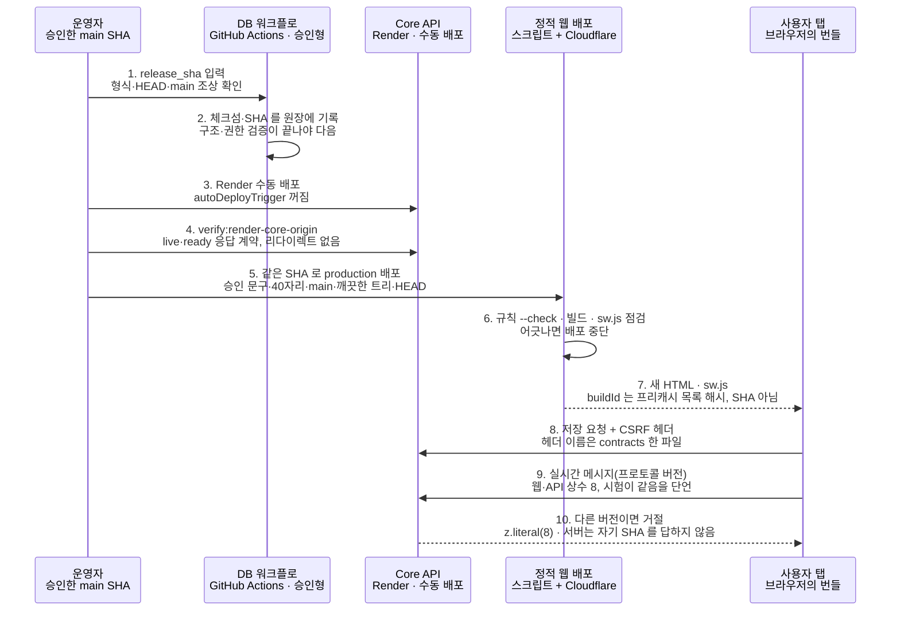

*승인 SHA 하나가 서버와 화면을 맞추는 순서* — 단위마다 SHA 관문을 지나고, 도착한 번들은 프리캐시 해시와 프로토콜 버전으로 서버와의 어긋남을 가립니다.

**흐름**

1. 운영자가 승인한 main SHA 하나로 DB → Core API → 정적 웹 순서를 정하고, 단위마다 같은 SHA 를 씁니다.
2. DB 워크플로는 SHA 가 main 의 조상인지 확인하고, SQL 체크섬과 SHA 를 원장에 남깁니다.
3. Core API 를 올린 뒤 verify:render-core-origin 이 live·ready 응답 계약을 확인해야 화면을 올립니다.
4. 정적 웹 스크립트는 HEAD 가 승인 SHA 와 같을 때만 규칙 검사·빌드·sw.js 점검·배포를 돌립니다.
5. 브라우저에 도착한 번들은 SHA 대신 프리캐시 목록의 해시(buildId)와 해시 이름 파일로 새 버전임을 알립니다.
6. 서버는 다른 프로토콜 버전의 실시간 메시지를 거절해 어긋난 옛 탭이 조용히 섞이지 않게 합니다.

**서비스에서 쓰인 곳 (기능 → 대표 경로)**

| 기능·영역 | 대표 경로 |
| --- | --- |
| 정적 웹 SHA 승인 문 | `scripts/deploy-cloudflare-static.mjs` |
| DB 원장과 이미지의 SHA 기록 | `.github/workflows/production-database-migrations.yml` |
| 빌드 산출물의 지문과 점검 | `apps/web/vite.config.ts` |
| Core API origin 검증 | `scripts/verify-render-core-origin.mjs` |
| 공유 계약과 버전 문 | `packages/contracts/src/security/csrf.ts` |

**오해하기 쉬운 점**: '프런트와 백엔드가 같은 SHA 로 묶여 있다'고 말하지 마세요. 같은 승인 SHA 를 쓰는 것은 절차이고, 번들과 API 응답은 SHA 를 말하지 않습니다. 운영의 현재 SHA 와 대시보드는 열람하지 않았습니다.

**보충**: 운영 사이트에서 지금 어느 커밋이 떠 있는지는 코드로 읽을 수 없습니다. 릴리스 기록과 Cloudflare·Render 대시보드로 확인해야 하며, 이 문서를 쓰면서 대시보드는 열람하지 않았습니다.

**더 보기**: 도감 카드(`/about/technology/atlas#<id>`) `build-fingerprint-map` · `shared-contract-patterns` · `version-pin-layers` · `hashed-assets-cache-contract` · `version-skew-chunk-reload-recovery` · `release-order-expand-contract-rollback` · `manual-sha-release-gate` · `user-approved-update-kill-switch` / 제작 스토리 챕터 `pwa-continuity` · `infrastructure` · `quality` / 용어집 `build-fingerprint` · `manual-sha-release` · `version-skew` · `contract-test` · `expand-contract` · `hashed-name-immutable-cache` · `lockfile-supply-chain`

### 11. 무엇이 품질을 지키나 (`quality-gates`)

- 답하는 질문: 래칫·테스트·접근성·보안 검사는 어디서 막나?
- 상태: 운영 경로(`live`) · 도식: 계층
- 한 줄 요약: 내 컴퓨터의 훅, PR 의 CI core, 빌드·배포 스크립트의 검사, 사람이 여는 수동 배포 관문까지 단계마다 다른 문이 막습니다.
- 쉽게 말해: 공항처럼 문이 여러 개입니다. 집 앞 보안 검색(훅), 탑승구 검사(CI), 활주로 점검(빌드 검사), 기장 승인(수동 배포)을 차례로 지나야 비행기가 뜹니다.

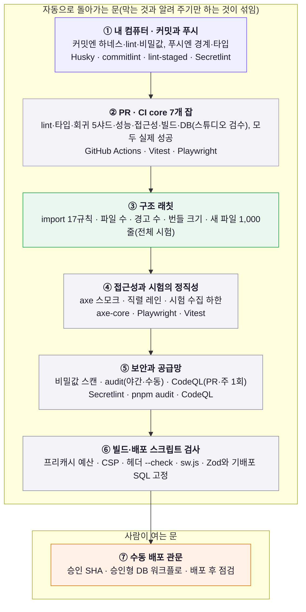

*검사가 막는 일곱 개의 문* — 위쪽일수록 빨리 걸리는 가벼운 검사입니다. 훅은 내 컴퓨터에서 우회할 수 있어 마지막 보증은 CI 이고, 수동 배포 관문만 사람이 엽니다.

**흐름**

1. 커밋할 때는 하네스·잠금 파일·lint·비밀값과 한글 제목을, 푸시할 때는 경계 검사·타입·변경 파일 lint 를 확인합니다.
2. PR 에서는 CI core 의 7개 잡(lint·타입·회귀·성능·접근성·빌드·DB)이 모두 실제로 성공해야 합니다.
3. 구조 래칫이 나쁜 import·파일 수·경고 수·번들 크기를 기록된 값에 묶고, 새 파일 크기는 전체 시험이 지킵니다.
4. 접근성은 핵심 화면을 axe 로 검사하고, 시간을 재는 시험은 직렬 레인에서 돌며, 시험이 줄면 수집 하한이 막습니다.
5. 빌드와 배포 스크립트 안에서는 프리캐시 예산·CSP·헤더 규칙·서비스 워커 파일을 검사하고, 운영 배포는 사람의 승인이 마지막 문입니다.

**서비스에서 쓰인 곳 (기능 → 대표 경로)**

| 기능·영역 | 대표 경로 |
| --- | --- |
| 커밋·푸시 훅 | `.husky/pre-commit` |
| CI core (병합 조건) | `.github/workflows/ci.yml` |
| 구조·크기 래칫과 시험 수집 하한 | `config/architecture-boundary-ratchet.json` |
| 접근성 스모크 | `e2e/a11y-smoke.spec.ts` |
| 보안과 공급망 점검 | `scripts/secretlint-files.mjs` |

**오해하기 쉬운 점**: '모든 PR 이 취약점 감사와 전수 접근성 검사를 통과한다'고 말하면 틀립니다. pnpm audit 는 core 에 없고 야간·수동(의존성이 바뀐 푸시 훅 포함)에서 돌며, 전수 접근성 감사는 수동입니다.

**보충**: 스튜디오 번들 검사(`scripts/check-studio-bundle.mjs`)는 두 층입니다. 코드 안의 '참고 예산'은 차단하지 않는 관측이고, 실제 관문은 `scripts/bundle-baseline.json` 에 기록된 마지막 수용 측정값을 2% 넘게 넘으면 실패하는 래칫입니다(엔진 격리 같은 구조 검사도 실패로 칩니다). 서비스 워커 프리캐시 예산(2026-10-08 기준 critical 2.25 MiB, warm 512 KiB)은 빌드를 실패시킵니다.

**보충**: 취약점 감사(`pnpm audit`)는 core 가 아니라 푸시 훅(의존성 파일이 바뀐 경우)·야간 진단·수동 실행에서 돕니다. `ci.yml` 의 lint 잡이 실행하는 것은 `quality:imports` 와 `quality:secrets` 이고 audit 은 없습니다. CodeQL 은 PR·main push 와 주 1회 돌지만 core 에는 속하지 않습니다. 새 파일 1,000줄 검사는 core 가 아니라 PR 마다 도는 전체 시험(진단)과 로컬 `pnpm test` 가 지킵니다.

**더 보기**: 도감 카드(`/about/technology/atlas#<id>`) `module-boundary-ratchet` · `axe-a11y-matrix` · `test-honesty-and-time-budget-isolation` · `security-supply-chain-chain` · `fault-injection-and-soak` · `drawing-quality-gates` · `oss-supply-chain-pinning` / 제작 스토리 챕터 `quality` · `troubleshooting-evidence` / 용어집 `ratchet` · `axe-wcag` · `fault-injection` · `soak-test` · `lockfile-supply-chain` · `csp`

### 12. AI와 함께 만드는 개발 방식 (`ai-assisted-dev`)

- 답하는 질문: AI 도구를 쓸 때 규칙과 검증은 어떻게 걸었나?
- 상태: 운영 경로(`live`) · 도식: 흐름도
- 한 줄 요약: 규칙은 AGENTS.md 한 곳에 두고, AI 의 변경도 같은 하네스·CI 검사를 받으며 운영 배포엔 사람의 승인이 필요합니다.
- 쉽게 말해: 조수가 여럿 와도 사무실 규칙의 기준은 벽에 붙은 한 장(AGENTS.md)뿐입니다. 조수가 '끝났어요'라고 해도 출입구 검사(훅·CI)를 지나야 하고, 건물 밖으로 내보내는 일(운영 배포)은 책임자 서명(사람의 승인)이 있어야 합니다.

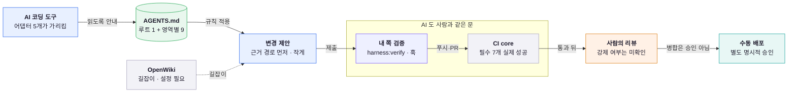

*AI 의 변경이 지나는 문* — 규칙은 한 곳에서 읽고, 결과는 정책상 사람의 변경과 같은 훅·CI 를 지나며(훅은 내 컴퓨터에서 우회할 수 있어 CI 가 마지막 보증), 운영 배포만 사람이 승인합니다.

**흐름**

1. 도구별 안내 파일(CLAUDE.md 등)은 세부 규칙을 복사하지 않고 핵심만 요약해 AGENTS.md 를 먼저 읽으라고 가리킵니다.
2. AI 는 근거 경로를 먼저 찾고, 한글 기록·증거 우선·비밀값 금지 규칙에 따라 작은 변경을 제안합니다.
3. 작성자는 harness:verify 로 바뀐 범위의 lint·비밀값·경계·타입을 확인하고, 커밋·푸시 훅이 한 번 더 막습니다.
4. PR 에서는 사람이 쓴 변경과 똑같이 CI core 의 필수 7개 잡이 실제로 성공해야 합니다.
5. 병합 전 사람의 리뷰는 강제 여부를 확인하지 못했고, 운영 배포는 별개로 사용자의 명시적 승인이 필요합니다.
6. 문서와 코드가 다르면 소스·테스트가 먼저이고, OpenWiki 는 길잡이로만 씁니다.

**서비스에서 쓰인 곳 (기능 → 대표 경로)**

| 기능·영역 | 대표 경로 |
| --- | --- |
| 에이전트 작업 규칙(AGENTS.md) | `AGENTS.md` |
| 도구별 어댑터 | `CLAUDE.md` |
| 하네스와 훅 | `scripts/agent-harness.mjs` |
| OpenWiki 길잡이 | `openwiki/INSTRUCTIONS.md` |

**오해하기 쉬운 점**: AI 도구를 실제로 얼마나 썼는지, Gemini·Copilot·Cursor 가 쓰였는지, OpenWiki 주간 갱신이 PR 을 냈는지, 병합 전 사람의 리뷰가 강제되는지는 저장소로 확인하지 못했습니다. 이 구간은 규칙과 검증 장치의 구조를 설명합니다.

**보충**: `harness:verify` 는 바뀐 파일 범위의 빠른 게이트입니다. 전체 시험은 `--full` 을 붙이거나 CI 에서 돕니다.

**더 보기**: 도감 카드(`/about/technology/atlas#<id>`) `agents-md-single-policy` · `agent-harness-verify-gates` · `openwiki-fact-precedence` · `opencode-loop-commands` / 제작 스토리 챕터 `ai-assisted-engineering` · `troubleshooting-evidence` · `quality` / 용어집 `agent-harness` · `openwiki` · `conventional-commits` · `adr`

## 7. 읽을 때 주의

- **운영 상태는 열람하지 않았습니다.** 모든 서술은 코드·설정·시험·문서에서 확인한 것이며, Cloudflare·Render·GitHub 대시보드의 실제 값과 운영 응답 헤더는 읽지 않았습니다. Render 자동 배포가 꺼져 있다는 서술도 `render.yaml` 기준입니다. 상태 배지가 `live` 여도 "운영에서 지금 이렇게 돈다"는 뜻은 아니고 "저장소의 운영 경로에 연결돼 있다"는 뜻입니다.
- **"프런트와 백엔드가 같은 SHA 로 묶여 있다"고 말하지 마세요.** 같은 승인 SHA 를 쓰는 것은 사람이 따르는 절차이고, 번들과 API 헬스 응답은 SHA 를 말하지 않습니다(구간 10).
- **운영 DB 표현**: Supabase PostgreSQL 이 현재 운영 권위이고 Neon 은 legacy 로 보존됩니다. 정본은 [`canonical-database-topology.md`](../operations/canonical-database-topology.md)이며, 오래된 문서에 남은 Neon 서술은 정본과 다를 수 있습니다.
- **GitHub 쪽 설정**(브랜치 보호, 필수 검사 지정, 환경 승인자)은 저장소 파일로 확인할 수 없습니다. 병합 조건이 core 라는 서술은 문서가 적은 내용입니다.
- **사용자 결정이 필요한 사안은 단정하지 않았습니다**: 크롤링 정책, 일부 라이브러리(mixbox·wasm-vips·Remotion)의 라이선스 판단, 운영 비밀·Durable Objects 활성 범위 같은 운영 상태가 그렇습니다.
- 수치 중 **래칫 상한, 시나리오 수, 경고 상한**처럼 정리하며 바뀌는 값은 "2026-10-08 기준"으로 날짜를 붙였습니다. 앱·패키지 개수, 승인 SHA 자릿수, 프로토콜 버전처럼 구조를 이루는 상수는 시험이 코드와 대조합니다.

## 8. 파일 지도

기준 폴더는 `apps/web/src/domains/legal/technology/` 입니다.

| 역할 | 파일 |
| --- | --- |
| 구간 계약(타입) | `engineering-architecture-guide-types.ts` — 구간·한 장 요약의 필드와 규칙 |
| 구간 집계 | `engineering-architecture-guide-content.ts` — 앱이 돌아가는 구조 + 만들고 지키는 구조 |
| 한 장 지도·원칙 | `engineering-architecture-guide-overview.ts` |
| 구간 1~7 | `engineering-architecture-guide-runtime.ts` 와 `-runtime-a/b/c.ts` |
| 구간 8~12 | `engineering-architecture-guide-delivery.ts`(집계) · `-delivery-layout.ts`(8·9) · `-delivery-align.ts`(10) · `-delivery-guard.ts`(11·12) |
| 화면 | `EngineeringArchitecturePage.tsx` 와 `EngineeringArchitecture*.tsx`, 공용 블록 `EngineeringGuideBlocks.tsx` |
| 계약 검사 | `engineering-architecture-guide-content.test.ts` — 길이·경로·도감/챕터/용어 id·도식·과장 표현 |
| 수치 대조 | `engineering-architecture-guide-delivery.test.ts`(웹 쪽)와 `tests/integration/web-api/domains/legal/technology/engineering-architecture-guide-delivery.api-facts.test.ts`(웹과 API 를 함께 읽는 단언) |
| 수치 대조 (구간 1~7) | `engineering-architecture-guide-runtime.facts.test.ts`(웹 쪽 수치·경계)와 `tests/integration/web-api/domains/legal/technology/engineering-architecture-guide-runtime.api-facts.test.ts`(구간 4·6 의 API 쪽 수치) |
| 화면 시험 | `EngineeringArchitecturePage.test.tsx` — 한 장 지도·구간 순서·접힘 펼침·도감/챕터/용어 링크·영어 화면에 한글이 없는지 |

도식은 손으로 그린 그림이 아니라 선언(`graph` / `sequence` / `layers`)이고, 같은 선언이 화면과 이 문서의 mermaid 로 쓰입니다. 규칙은 [`engineering-atlas.md`](engineering-atlas.md)의 도식 선언 절과 같습니다.

## 9. 고치고 검증하는 방법

구간 내용을 고치면 같은 변경에서 이 문서의 해당 구간도 맞춥니다. 어긋나면 코드가 맞습니다.

```bash
# 저장소 루트에서 실행합니다. 전제: pnpm install 이 끝나 있어야 합니다. 부작용은 없지만 시험이 무거우니 다른 무거운 검사와 동시에 돌리지 않습니다.
pnpm exec vitest run \
  apps/web/src/domains/legal/technology/engineering-architecture-guide-content.test.ts \
  apps/web/src/domains/legal/technology/engineering-architecture-guide-delivery.test.ts \
  apps/web/src/domains/legal/technology/engineering-architecture-guide-runtime.facts.test.ts \
  apps/web/src/domains/legal/technology/EngineeringArchitecturePage.test.tsx \
  tests/integration/web-api/domains/legal/technology/engineering-architecture-guide-delivery.api-facts.test.ts \
  tests/integration/web-api/domains/legal/technology/engineering-architecture-guide-runtime.api-facts.test.ts
pnpm run validate:documentation   # 이 문서의 내부 링크를 포함한 문서 검증
node scripts/validate-app-boundaries.mjs   # 시험이 다른 앱 소스를 읽지 않는지(교차 앱 시험 래칫) 확인
```

성공 기준은 위의 시험 파일이 모두 통과하고, 문서 검증과 경계 검증이 "passed"로 끝나는 것입니다. 수치 대조가 실패하면 코드가 바뀐 것이므로 해당 구간의 수치를 먼저 고치고, 그다음 화면과 이 문서를 맞춥니다.
