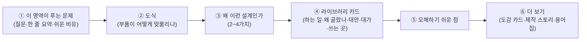
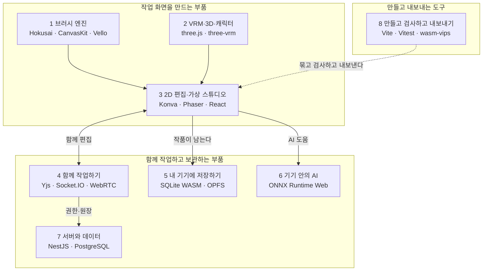
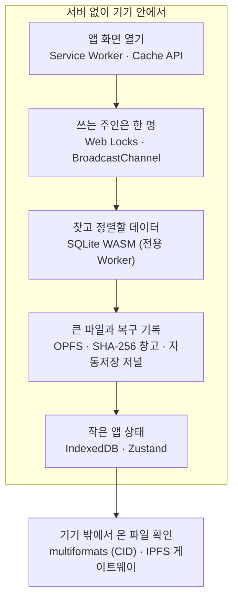
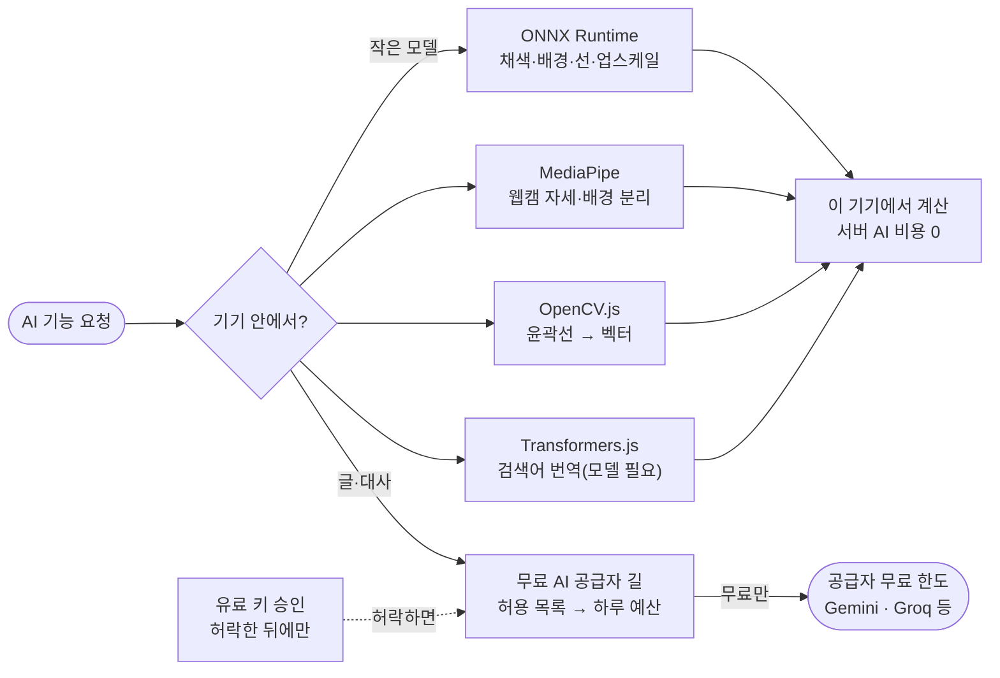
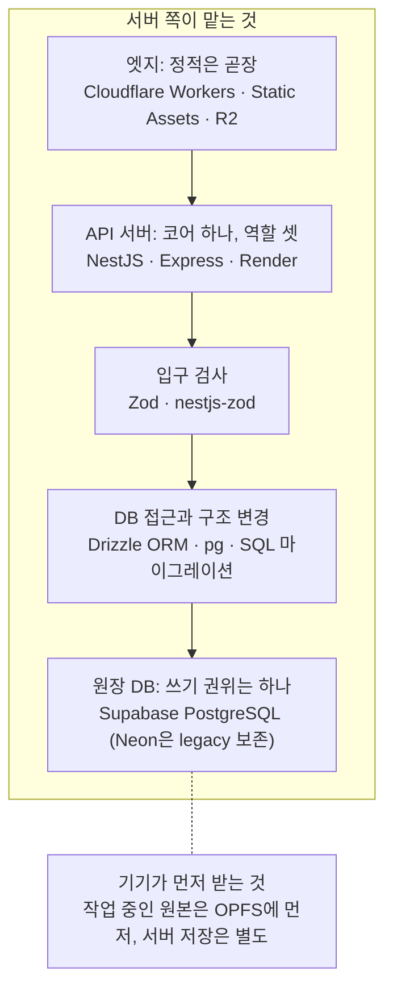
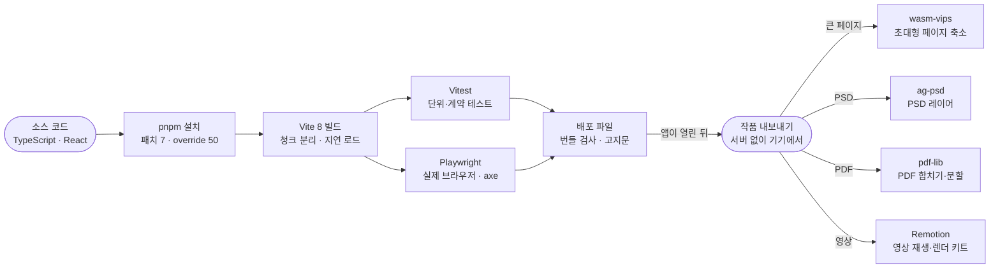

# 주요 라이브러리와 선택 이유

기준일: 2026-10-08. 이 문서는 `/about/technology/libraries`("주요 라이브러리와 선택 이유")의 구조·읽는 법·영역별 요약을 설명한다.
사실의 우선순위는 `AGENTS.md`를 따른다(소스·테스트 → 승인된 ADR → 아키텍처 문서 → OpenWiki). 이 문서와 코드·데이터 파일이 다르면 코드·데이터 파일이 맞다.

## 1. 무엇을 위한 문서인가

[아키텍처 해설](./engineering-architecture.md)이 "구조가 어떻게 맞물리나"를 보여 준다면, 이 페이지는 "무엇으로 만들었고 왜 그것을 골랐나"를 보여 준다.
2026-10-08 기술 발표 준비 요청이 출발점이다: VRM·브러시 엔진 같은 핵심 라이브러리를 소개하고, 왜 이런 설계와 이런 라이브러리를 쓰게 됐는지를 발표하기 좋게 풀어 쓴다.

| 자료 | 단위 | 답하는 질문 |
| --- | --- | --- |
| 이 페이지(라이브러리 해설) | 영역 8개 · 라이브러리 카드 | 이 영역의 부품은 무엇이고, 왜 그 설계로 나눴고, 왜 그것을 골랐나? |
| [아키텍처 해설](./engineering-architecture.md) | 구간 12개 | 이 서비스는 어떤 층과 길로 맞물려 돌아가나? |
| [기술 도감과 기술 지도](./engineering-atlas.md) | 카드 한 장 = 기술 하나 · 지도 한 장 = 같은 종류 대상 | 한 기술을 깊이 보려면? 오픈소스 전체 목록·라이선스는? |
| [제작 스토리](./engineering-story.md) | 챕터 | 왜 그렇게 만들게 됐나(이야기)? |

이 페이지는 **요약층**이다. 사실의 상세 증거는 오픈소스 지도(`engineering-map-open-source*.ts`)·도감 카드·ADR·코드에 있고, 이 페이지는 그것을 영역별로 묶어
"왜 이런 설계인가"와 "왜 골랐나·검토한 대안·대가"를 한곳에서 읽게 한다. 근거를 문서에서 찾지 못한 "왜"는 쓰지 않고, 카드의 `대가·주의` 칸에 "확인하지 못함"으로 적는다.

2026-10-08 기준 규모(테스트는 최소·최대 개수만 고정하며 이 수치는 데이터 파일에서 센 값이다): 영역 8개, 카드 54장(운영 경로 44 · 설정 필요 7 · 실험 기능 2 · 참고 연동 1), 오픈소스 지도 44행 중 35행과 연결.

## 2. 읽는 순서

### 2.1 화면에서 한 영역을 읽는 순서

영역마다 같은 순서다. 발표라면 영역 하나가 약 3분이다.



카드는 접힌 상태에서도 이름·종류·한 줄 소개·상태·라이선스가 보이고, 펼치면 하는 일·왜 골랐나·검토한 대안·대가·쓰는 곳(파일 경로)이 나온다. 인쇄할 때는 모두 펼친다.

### 2.2 청중별 추천 경로

| 청중 | 먼저 | 다음 | 깊이 내려가기 |
| --- | --- | --- | --- |
| 투자자·비전문가 | 맨 위 한 장 요약(도식 + 고르는 원칙 6개) | 영역 1(브러시)·2(VRM·3D) 머리와 쉬운 비유, 영역 5·7의 "왜 이런 설계인가" | 카드의 "대가·주의"와 영역 "오해하기 쉬운 점" |
| 개발자·스터디 | 영역 5~8의 "왜 이런 설계인가" | 카드의 "쓰는 곳(파일)" 경로를 열어 코드 확인 | 도감 카드 → ADR → 제작 스토리 챕터 |
| 발표자(짧은 발표) | 한 장 요약 → 영역 1 → 영역 2 → 영역 5 | 질문이 나오면 해당 영역의 카드를 펼쳐 답 | 영역 7·8은 질문 대비용으로 펼쳐 둔다 |

짧은 발표(약 12분)의 예: 한 장 요약 3분 → 브러시 엔진 3분 → VRM·3D 3분 → 내 기기에 저장하기 3분. 서버·빌드·AI는 질문이 나올 때 영역을 열어 답한다.

## 3. 한눈에 보는 스택



화살표는 "이 영역의 결과를 저 영역이 받는다"는 뜻이지 호출 순서가 아니다. 위쪽 세 영역은 내 기기(브라우저) 안에서 돌고, 서버와 Cloudflare는 협업·권한·원장을 맡는다.

## 4. 라이브러리를 고르는 원칙 6가지

한 장 요약(`engineering-library-guide-overview.ts`)의 원칙이다. 각 원칙은 코드·ADR·번들 검사·테스트로 근거를 댈 수 있는 것만 적었다.

| 원칙 | 근거 |
| --- | --- |
| 한 가지 일에는 주인이 한 명 | 렌더러 역할 원장(ADR-0003·0019)과 어긋나면 실패하는 테스트 |
| 무거운 부품은 필요할 때만 | 번들 검사(`scripts/check-studio-bundle.mjs`)가 3D·CRDT·Babylon 이 첫 화면 번들로 돌아오면 빌드를 실패시킨다 |
| 실패를 다른 엔진 뒤에 숨기지 않는다 | ADR-0018 — 시작 전에 엔진을 고르고 실패해도 몰래 갈아타지 않는다 |
| 가능한 한 브라우저 안에서 | 저장은 SQLite WASM, AI는 ONNX Runtime Web — 단 일부 모델 파일은 실행할 때 내려받는다 |
| 라이선스 조건을 숨기지 않는다 | ADR-0008 — 허용형은 직접 번들, LGPL·비상업은 표시해 별도 확인 대상으로 남긴다. 빌드가 고지문을 만들고 허용 목록 밖 라이선스는 감사에서 실패한다 |
| 버전을 고정하고 고친 곳을 남긴다 | 핵심 엔진은 정확한 버전으로 고정, 직접 빌드한 WASM은 해시로 봉인, 고친 곳은 pnpm 패치 7개와 포크 2개(wgpu-toon·braces) |

## 5. 영역별 요약

표의 "상태"는 코드로 확인한 현재 상태다(운영 경로 = 제품 또는 검증 파이프라인에서 실행되는 경로, 설정 필요 = 코드와 운영 계약은 있으나 공급자 등록·환경 설정이 남음).
"라이선스"는 설치본 `package.json`이나 라이선스 근거 파일에 적힌 라벨이며 법률 판단이 아니다(6절).

### 5.1 영역 1 · 브러시 엔진 (운영 경로)

- 질문: 펜 한 획은 어떤 엔진을 거쳐 화면에 닿나?
- 한 줄: 획은 입력 보정 → 선 모양 → 붓 종류 → 화면 표시로 나뉘고, 일마다 맡은 엔진이 하나씩 있다.
- 왜 이런 설계인가: 획을 단계로 쪼개 주인을 하나씩 · 엔진은 펜을 내릴 때 한 번만 고른다 · 무거운 계산은 Worker와 WASM으로 · 기준선을 먼저 두고 새 엔진은 겨룬다.

| 이름 | 하는 일 | 왜 골랐나(요약) | 라이선스 | 상태 |
| --- | --- | --- | --- | --- |
| Hokusai | 연필·목탄·수채·유화처럼 번지는 붓을 계산하는 Rust 엔진 | 순수 Rust라 WASM 한 가지 도구체인에 맞고 libmypaint(C)의 포팅·메모리 경계 위험을 피한다 | MIT OR Apache-2.0 | 운영 경로 |
| perfect-freehand · lazy-brush | 압력·속도에 따라 굵기가 달라지는 잉크 선 | 가볍고 결정적인 윤곽 계산, 허용형이라 그대로 번들 | MIT | 운영 경로 |
| CanvasKit (Skia) | 정밀 벡터 렌더러 | 경로·글자·필터를 한 성숙한 그래픽 코어에서 제공해 기준 출력으로 삼기 좋다 | BSD-3-Clause | 운영 경로 |
| Vello · ThorVG | GPU 벡터 렌더러와 SVG·Lottie 전문 엔진 | 페이지의 GPU 장치를 그대로 받아 써서 그림을 CPU로 되읽지 않는다 | Apache-2.0 OR MIT | 설정 필요 |
| p5.brush | 수채 번짐·흐름선 같은 절차적 붓 | 절차적 질감을 처음부터 만들지 않고 가져다 쓴다 | MIT | 설정 필요 |
| Mixbox | 물감처럼 섞이는 색(파랑+노랑=초록) | RGB 평균은 칙칙해지지만 안료 모델은 초록이 된다 | CC-BY-NC-4.0 | 운영 경로 |
| libmypaint | 비교 기준선으로만 쓰는 브러시 엔진 | .myb 생태계의 사실상 기준 구현(ADR-0006) | ISC | 참고 연동 |
| Google Ink | 직접 WASM으로 빌드한 잉크 브러시 | 동역학이 풍부해 전문 잉킹 후보, PoC 게이트 전에는 출하 경로에 올리지 않음(ADR-0005·0009) | Apache-2.0 | 실험 기능 |

오해하기 쉬운 점: "엔진이 많다"와 "전부 쓴다"는 다르다. 일상 경로는 perfect-freehand와 CanvasKit이고 나머지는 명시 변환·선택형·비교용·후보다.

### 5.2 영역 2 · VRM·3D·캐릭터 (운영 경로)

- 질문: 3D 장면과 VRM 캐릭터는 무엇으로 그리고 움직이나?
- 한 줄: 장면은 three.js 하나가 소유하고, 캐릭터는 VRM 표준 위에서 움직이며, 전문 계산은 필요할 때만 따로 불러온다.
- 왜 이런 설계인가: 대화형 장면의 주인은 하나 · 거대 엔진 하나 대신 역할별로 · 엔진은 폴백이 아니라 선택 · 전문 계산은 필요할 때만 Worker에서.

| 이름 | 하는 일 | 왜 골랐나(요약) | 라이선스 | 상태 |
| --- | --- | --- | --- | --- |
| three.js | 브라우저에서 3D 장면을 그린다 | 장면의 주인을 three/R3F 하나로 두면 선택·기즈모·GPU 자원·캡처 시점이 충돌하지 않는다 | MIT | 운영 경로 |
| three-vrm | VRM 캐릭터의 표정과 뼈대를 움직인다 | VRM 로딩과 정규화 뼈, 툰 재질(MToon)을 three 위에서 한 번에 제공 | MIT | 운영 경로 |
| VRM | 뼈와 표정에 표준 이름표를 붙인 3D 캐릭터 형식 | 뼈 이름이 표준이라 한 번 만든 포즈를 어느 캐릭터에든 입힐 수 있다 | Per-model terms | 운영 경로 |
| React Three Fiber · drei | React 안에서 three.js 장면을 선언적으로 쓴다 | 화면 전체가 React라 3D 뷰포트도 같은 방식으로 상태와 이어진다 | MIT | 운영 경로 |
| Babylon.js | 법선 맵 추출 같은 전문 작업용 3D 엔진 | PBR·IBL·그림자·후처리·glTF 내보내기가 한 패키지에 있다(ADR-0026) | Apache-2.0 | 운영 경로 |
| glTF Transform · meshoptimizer | 3D 모델(GLB)을 줄이고 다듬는다 | 구조 편집·압축·LOD·텍스처 압축을 허용형 도구가 한 흐름으로 제공 | MIT | 운영 경로 |
| Manifold · three-bvh-csg | 3D 도형 합치기·빼기 | 미리보기는 빠른 칼, 최종은 새지 않는 칼로 나눠 쓴다 | Apache-2.0 | 운영 경로 |
| Rapier · recast-navigation | 충돌·길 찾기·관절 IK | 결정성과 WASM 내장을 갖춘 변형이라 같은 입력이 같은 결과 | Apache-2.0 | 운영 경로 |

오해하기 쉬운 점: ADR-0026은 아직 Proposed이고 Babylon·자체 물리 솔버 이야기는 실험 앱 방향이다. 제품의 캐릭터 경로는 three-vrm이다.

### 5.3 영역 3 · 2D 편집과 가상 스튜디오 (운영 경로)

- 질문: 편집 캔버스·가상 공간·화면 UI는 무엇이 받치나?
- 한 줄: 편집 캔버스의 표시·입력은 Konva가, 가상 스튜디오는 Phaser가 맡고, 둘 다 React 화면 위에 얹힌다.
- 왜 이런 설계인가: 표시·입력·선택은 Konva, 나머지는 섬으로 · 월드 내용은 데이터, 권한은 따로 · 큰 엔진은 들어갈 때만 불러온다 · 화면 UI와 캔버스 UI를 나눈다.

| 이름 | 하는 일 | 왜 골랐나(요약) | 라이선스 | 상태 |
| --- | --- | --- | --- | --- |
| Konva · react-konva | 편집 캔버스의 무대 | react-konva로 React 화면과 같은 방식으로 이어지는 2D 장면 라이브러리 | MIT | 운영 경로 |
| PixiJS | 선택 강조·핸들을 GPU로 그리는 투명 오버레이 | 문서 픽셀과 입력은 Konva가 갖고 Pixi는 오버레이 섬 하나만 단독 소유 | MIT | 운영 경로 |
| Phaser | 가상 스튜디오의 이동·카메라·충돌 | 게임 엔진을 쓰고 방 구조는 데이터가 소유해 월드를 바꿔도 장면을 다시 쓰지 않는다 | MIT | 운영 경로 |
| Paper.js · Rough.js · polygon-clipping | 벡터 합치기·겹침 계산·손그림 느낌 | 벡터 수학을 직접 짜지 않고 검증된 라이브러리를 쓴다 | MIT | 운영 경로 |
| React 19 · React Compiler | 모든 화면의 UI 뼈대 | Konva와 R3F가 모두 React용 연결 부품이라 같은 컴포넌트 방식으로 이어진다 | MIT | 운영 경로 |
| Zustand | 여러 화면이 함께 쓰는 작은 상태 | 화면 상태를 문서 상태와 분리해 담는 가벼운 저장소(설계 문서 V5가 후보) | MIT | 운영 경로 |
| Tailwind CSS · Radix UI · cmdk | 스타일·접근성 갖춘 대화상자/메뉴·명령 팔레트 | 접근성이 필요한 입력은 직접 만들지 않고 검증된 부품을 쓰도록 정했다(설계 문서 V11) | MIT | 운영 경로 |

오해하기 쉬운 점: "Konva를 걷어낸다"는 목표이지 현재가 아니다. 지금은 Konva가 표시·입력·선택의 주인이고 CanvasKit 섬은 승인된 요소만 표시한다(ADR-0025).

### 5.4 영역 4 · 함께 작업하기 (설정 필요)

- 질문: 동시 편집과 실시간 연결은 무엇으로 맞추나?
- 한 줄: "실시간"을 하나로 묶지 않고 문서·접속 상태·통화 신호·영상마다 통로와 주인을 따로 둔다.
- 왜 이런 설계인가: '실시간' 하나로 묶지 않고 주인을 나눈다 · CRDT는 권한을 모르므로 서버가 먼저 · 큰 미디어는 서버를 거치지 않는다 · 작은 방은 풀메시, 큰 모임은 다른 길.

| 이름 | 하는 일 | 왜 골랐나(요약) | 라이선스 | 상태 |
| --- | --- | --- | --- | --- |
| Yjs | 여러 사람이 동시에 고쳐도 하나로 합치는 공동 편집(CRDT) | 오프라인 편집 뒤 재접속·중복·순서 뒤바뀜에도 같은 결과가 나온다 | MIT | 운영 경로 |
| Automerge | 오프라인 변경을 '제안 기록'으로 모으는 선택형 도구 | 정본은 Yjs 하나, Automerge는 오프라인 제안 기록으로만 허용 | MIT | 운영 경로 |
| Socket.IO | 협업의 서버 통로(WebSocket) | NestJS 게이트웨이와 브라우저 클라이언트가 같은 라이브러리로 이어진다 | MIT | 설정 필요 |
| WebRTC | 브라우저끼리 직접 영상·음성·데이터 | 유료 TURN·SFU 없이 P2P 직접 연결을 기본으로 삼았다 | Web standard | 실험 기능 |
| Cloudflare Durable Objects | 방 하나에 관리인 한 명 | 한 방의 요청을 객체 하나가 차례로 처리해 순서를 맞춘다 | Service terms | 설정 필요 |
| Cloudflare Realtime TURN | 직접 연결이 막힌 네트워크의 중계 | 키를 브라우저에 고정하지 않고 서버가 짧은 수명으로 즉석 발급 | Service terms | 설정 필요 |

오해하기 쉬운 점: Durable Objects와 TURN은 선택형 구성이라 운영에서 켜져 있는지와 인증된 방 입장·WAN 수용은 이 페이지가 단정하지 않는다.

### 5.5 영역 5 · 내 기기에 저장하기 (운영 경로)

- 질문: 서버 없이도 작품이 남게 하는 부품은 무엇일까?
- 한 줄: 찾을 것은 SQLite, 큰 파일은 OPFS, 앱 화면은 Service Worker가 기기에 둔다.
- 쉬운 비유: 작업실 서랍장 — 서류철(SQLite)·번호표 붙은 보관함(OPFS)·열쇠는 한 사람만(Web Locks). 서랍장이 작업실 안에 있어 방을 비우면(사이트 데이터 삭제) 함께 사라진다.



왜 이런 설계인가:

1. **작품 원본은 내 기기가 먼저 받는다** — 운영 정본 문서가 개인 창작 원본의 권위를 기기(OPFS·로컬·BYOS)에 두고 중앙 DB에는 불필요한 개인 원본을 저장하지 않는다고 적는다. 서버가 잠들어도 정적 화면과 로컬 편집은 계속된다.
2. **저장소마다 맡은 일을 나눈다** — 찾고 정렬할 데이터는 SQLite, 큰 파일과 복구 기록은 OPFS 파일, 작은 앱 상태는 IndexedDB. 창작 데이터가 localStorage·IndexedDB로 되돌아가면 정적 검사(ADR-0014)가 같은 PR에서 실패한다.
3. **쓰는 주인은 한 명으로 정한다** — DB 파일은 전용 Worker 하나만 열고(Chromium에서 두 Worker가 같은 풀을 열면 오류가 났다), 문서 편집은 Web Lock으로 탭 하나만 한다.
4. **브라우저 저장소는 백업이 아니라고 말한다** — OPFS를 열 수 없으면 '이 탭 메모리에만 유지'라고 알리고 localStorage로 몰래 대체하지 않으며, 내보내기·개인 클라우드 사본을 함께 안내한다.

| 이름 | 하는 일 | 왜 골랐나(요약) | 대가·주의 | 라이선스 | 상태 |
| --- | --- | --- | --- | --- | --- |
| SQLite WASM | 브라우저 안의 DB. 브러시·필터 라이브러리, 저장 대기 기록, 체크포인트를 SQL로 | 찾고 정렬할 카탈로그가 커서 localStorage JSON 대신 SQL·트랜잭션 DB(ADR-0012) | WASM 약 0.86MB, Worker 하나만 DB를 쥐어 탭이 둘이면 한 탭만 쓴다. 실측은 Chromium·macOS 중심 | Apache-2.0 | 운영 경로 |
| OPFS | 비공개 파일 공간. 자동저장 저널·에셋 창고·SQLite 파일 | 큰 파일을 서버에 올리지 않고 바로 기기에, 임시 파일에 쓰고 닫을 때 바꿔 중간에 꺼져도 원본이 남는다 | 파일 탐색기로 볼 수 없고 사이트 데이터를 지우면 사라진다(백업 아님) | Web standard | 운영 경로 |
| Service Worker | 오프라인에서도 앱이 열리게 앱 셸을 캐시 | 서버가 잠들어도 열려야 한다. 라우팅·버전 판단이 순수 함수라 브라우저 없이 테스트 | Background Sync는 DB 손상 위험으로 안 씀. Workbox 같은 라이브러리를 고르지 않은 이유를 적은 문서는 못 찾음 | Web standard | 운영 경로 |
| IndexedDB | 컷 목록·참여 같은 앱 상태(Zustand) 영속화 | localStorage는 작고 동기식. 옮길 때 읽고·쓰고·다시 읽어 같을 때만 옛 키 삭제 | 창작 문서의 원본 저장소는 아님(ADR-0014). 첫 화면에 동기로 필요한 값은 localStorage에 남김 | Web standard | 운영 경로 |
| Web Locks | 탭이 여럿이어도 쓰는 주인 한 명 | 시각 기록은 시계 오차에, 메시지 선출은 유실에 약해 브라우저가 보장하는 락으로 | 협조적 락이라 확인하지 않는 코드는 못 막고 다른 기기와는 조율 못 함 | Web standard | 운영 경로 |
| multiformats | 내용 지문(CID)으로 IPFS에서 받은 파일 검증 | Helia(`@helia/verified-fetch`)는 보안 권고 미해소로 제외, CID 계산·검증만 하는 multiformats + 게이트웨이 fetch | 게이트웨이 3곳(ipfs.io·dweb.link·trustless-gateway.link)은 운영 CSP connect-src에 없어 운영 브라우저에서 막힐 가능성이 큼(실브라우저 미검증) | Apache-2.0 OR MIT | 운영 경로 |

오해하기 쉬운 점: '저장됨'은 이 기기 안에 저장됐다는 뜻이다. 사이트 데이터를 지우거나 기기를 잃으면 함께 사라지므로 내보내기·클라우드 사본이 따로 필요하고, Safari·Firefox 실측은 없다.

### 5.6 영역 6 · 기기 안의 AI (운영 경로 — 번역 모델·공유 AI 풀은 설정 필요)

- 질문: 서버 없이 AI를 돌리는 부품과 고르는 기준은?
- 한 줄: 그림 한 장으로 끝나는 작은 모델은 기기에서, 글을 쓰는 큰 모델은 무료 공급자 길로 보낸다.
- 쉬운 비유: 밀키트를 집에서 데워 먹는 것 — 재료(모델 파일)를 한 번 받아 오지만 그림이 식당(서버)으로 나가지 않는다. 큰 요리는 식당에 맡기되 무료 시식 코너부터 들른다.



왜 이런 설계인가:

1. **기기에서 끝낼 수 있는 일은 기기에서** — 그림 한 장을 받아 한 장을 돌려주는 작은 모델만 기기에서 돌린다. 서버 GPU 비용과 업로드가 사라지고 큰 언어·확산 모델은 클라우드 경로(내 키·무료 공급자)에 맡긴다.
2. **런타임은 같은 출처 파일로, 모델은 해시로 확인** — 운영 CSP가 외부 스크립트·WASM 실행을 막아 ONNX·MediaPipe 런타임은 Vite가 해시를 붙인 같은 출처 파일이다. ONNX 모델은 SHA-256이 등록값과 다르면 거절한다.
3. **무료 AI는 허용 목록과 하루 예산으로 닫는다** — 무료로 검토된 공급자 주소·모델만 자동 경로에 들이고 호출 직전에 하루(UTC) 예산을 예약한다. 유료 키는 사용자가 허락해야 순서에 들어온다.
4. **애매한 실패는 다른 공급자로 다시 보내지 않는다** — 402·429처럼 호출 전에 분명히 거절된 경우만 다음 키·모델로 넘어가고, 네트워크 오류·타임아웃·5xx는 그대로 알린다([운영 문서](../operations/free-ai-runtime.md)).

| 이름 | 하는 일 | 왜 골랐나(요약) | 대가·주의 | 라이선스 | 상태 |
| --- | --- | --- | --- | --- | --- |
| ONNX Runtime Web | AI 모델 파일을 기기에서 실행: 채색·배경 제거·선 추출·4배 업스케일·애니풍 변환(모델 6개) | 서버 GPU 비용과 업로드를 없앴고, 모델은 라이선스를 먼저 확인해 MIT·BSD-3-Clause·Apache-2.0만 골랐다 | 첫 사용 때 런타임 WASM 약 26.8MB + 모델(채색 79.3MB). WebGPU가 안 되면 느린 WASM(CPU), 채색은 512×512 고정·옅은 색 | MIT | 운영 경로 |
| MediaPipe Tasks Vision | 웹캠 자세로 VRM 마네킹을 움직이고 배경 분리·참고 이미지 추천 | 영상·사진을 서버에 올리지 않고 읽는다. SIMD 확인 뒤 같은 출처 WASM을 한 번만 로드 | 모델 파일은 실행할 때 구글 저장소에서 받는다(SHA-256 고정은 임베더 1개뿐) — '전부 로컬' 아님. 대안 비교 문서는 못 찾음 | Apache-2.0 | 운영 경로 |
| OpenCV.js | 이미지→벡터 변환의 윤곽선 찾기 | 마스크→경로 커널을 재사용해 새 트레이싱 라이브러리를 들이지 않음(Potrace 계열은 GPL, VTracer는 번들 비용으로 미룸) | 약 13.3MB 지연 로드, 입력 한 변 8,192px 제한. 스마트 선택 Worker 경로는 화면에 연결 안 됨 | Apache-2.0 | 운영 경로 |
| Transformers.js | 한글 검색어를 영어로 옮기는 번역 모델(OPUS-MT) | 번역 API에 검색어를 보내지 않고 서버 AI 비용 0. 모델은 우리 서버에서만 받고 원격 다운로드는 CSP 때문에 끔 | 모델 파일(약 123MB)이 저장소에 없어 배포 때 두어야 켜진다. 배치 스크립트·운영 CSP 통과는 확인 못 함 | Apache-2.0 | 설정 필요 |
| Free-first AI routing | 글·대사·번역·콘티 도움 요청을 서버 공유 풀 또는 사용자 무료 키로 | 호출마다 요금이 붙을 수 있어 무료로 확인된 주소·모델만 자동 경로에. 유료는 사용자가 허락해야 | 서버 공유 풀은 운영자 확인 전('설정 필요'). 허용 목록 검토일 2026-09-16, 운영 CSP가 허용한 AI 주소는 4곳 | Service terms | 설정 필요 |

오해하기 쉬운 점: '전부 기기 안'은 아니다. MediaPipe 모델은 실행할 때 구글 저장소에서 받고, 번역 모델은 배포 때 따로 두어야 켜지며, 글·대사 AI는 클라우드 경로(무료 공급자·내 키)다.

### 5.7 영역 7 · 서버와 데이터 (운영 경로)

- 질문: 서버·원장·파일은 무엇으로 만들었나?
- 한 줄: 정적 화면은 Cloudflare가 곧장 내주고, 기록은 NestJS 서버가 Supabase PostgreSQL 한 곳에만 쓴다.
- 쉬운 비유: 편의점 — 진열대의 물건(화면 파일)은 점원을 부르지 않고 집어 가고, 계산대(API 서버)는 장부 한 권(원장 DB)에만 적는다.



왜 이런 설계인가:

1. **정적은 서버를 깨우지 않는다** — Static Assets가 코드 실행 없이 화면 파일을 내주고, Worker는 지정한 26개 경로(API·링크 미리보기·대형 파일)만 먼저 받는다. 방문자가 늘어도 Worker 호출과 잠든 API 서버를 깨우는 일은 동적 요청으로만 한정된다.
2. **쓰기 권위는 하나만 둔다** — 원장 DB는 Supabase PostgreSQL 하나가 현재 권위이고 Neon은 legacy로 보존한다. 이중 쓰기와 자동 failover는 없으며, 2026-09-26 Neon 무료 한도에 막히자 사람이 승인해 새 DB에서 시작했다([운영 정본](../operations/canonical-database-topology.md)).
3. **하나의 코어를 역할로 나눠 연다** — 같은 NestJS 코드를 `API_RUNTIME_ROLE`로 full·studio-live·capability-worker 세 모양으로 띄우고, 역할 밖 경로는 404, 미들웨어 순서는 테스트가 고정한다.
4. **입구에서 검사하고, 바꾼 SQL은 지문으로 잠근다** — 요청은 컨트롤러에 닿기 전에 Zod로 검사한다. 이미 배포한 SQL은 SHA-256 지문을 기록해 원문이 바뀌면 빌드가 실패하고, 운영 빌드·시작 명령에서 `drizzle-kit push`는 쓰지 않는다.

| 이름 | 하는 일 | 왜 골랐나(요약) | 대가·주의 | 라이선스 | 상태 |
| --- | --- | --- | --- | --- | --- |
| NestJS | Core API 서버의 틀(로그인·카탈로그·협업·실시간) | REST와 Socket.IO 게이트웨이를 한 틀에서 모듈로 나누고, 같은 코드를 역할만 바꿔 띄워 서버 코드를 늘리지 않는다 | 무료 Render에서 한동안 요청이 없으면 절전해 첫 응답이 느리다. NestJS를 다른 프레임워크와 비교한 문서는 못 찾음 | MIT | 운영 경로 |
| Supabase PostgreSQL | 회원·세션·작품·커뮤니티·결제·협업 기록을 보관하는 원장 | 데이터마다 쓰기 권위를 하나로 두려고 이중 쓰기·자동 failover를 두지 않는다 | 연결 풀 기본 3개(환경변수로 1~50 조정). 운영 접속 정보는 비밀이라 저장소로 확인하지 못했고 운영 정본 문서(2026-09-29)와 코드가 일치하는 범위만 쓴다 | Service terms | 운영 경로 |
| Drizzle ORM | 스키마를 TypeScript로 적고 SQL을 타입 안전하게 부른다(pg 드라이버 위) | 서버 코드와 한곳에서 타입을 맞추고, 빈 DB는 generate를 두 번 돌려 같은 DDL인지 비교한 뒤 한 트랜잭션으로 적용 | 적용한 SQL은 고칠 수 없고 새 번호 파일을 더해야 한다. 스키마와 SQL 마이그레이션 두 곳을 맞춘다 | Apache-2.0 | 운영 경로 |
| Zod | 프로젝트 문서·API 요청·환경변수·폼 입력의 모양 검사 | 화면과 서버가 공용 계약 패키지의 모양 정의를 함께 쓰도록 같은 버전(4.4.3)으로 고정 | 8개 워크스페이스를 한꺼번에 올려야 하고 릴리스 검사가 불일치를 막는다. 환경변수 검증은 경고만 하고 부팅은 막지 않는다 | MIT | 운영 경로 |
| Cloudflare Workers | 화면 파일은 곧장, API 경로 26개만 Worker가 먼저 받는 문지기 | 정적 요청이 Worker 호출과 잠든 서버를 깨우지 않게 하는 최소 비용 정책(2026-09-15). 상태 확인은 엣지가 직접 답한다 | 먼저 실행 목록을 사람이 관리하고, SPA 모드는 없는 파일도 200으로 답해 sw.js 누락 같은 사고를 배포 전 검사가 막아야 한다 | Service terms | 운영 경로 |
| Render | Core API와 선택형 실시간 서버를 무료 웹 서비스로 호스팅 | 유료 승격 없이 무료 인스턴스로 운영, 자동 배포는 끄고 승인한 40자리 SHA만 수동 배포 | 한동안 요청이 없으면 절전(DEPLOY.md 기록: 15분·약 1분). SLA가 필요하면 별도 승인 | Service terms | 운영 경로 |

오해하기 쉬운 점: 서버가 쓰는 DB 접속 정보는 비밀이라 이 저장소로 확인할 수 없고, 위 서술은 운영 정본 문서(2026-09-29)와 코드가 일치하는 범위다. 옛 Neon은 legacy로 보존만 하며 쓰기 권위가 아니다.

### 5.8 영역 8 · 만들고 검사하고 내보내기 (운영 경로)

- 질문: 빌드·테스트·내보내기는 무엇으로 하나?
- 한 줄: Vite가 묶고, Vitest·Playwright가 지키고, 내보내기는 기기 안의 wasm-vips·ag-psd 등이 맡는다.
- 쉬운 비유: 공장의 조립 라인과 검수대 — 조립하고(Vite) 검수대 세 곳(단위·브라우저·접근성)을 지나야 출고된다. 손본 부품은 수정 기록표(패치·override)로 남긴다.



왜 이런 설계인가:

1. **무거운 엔진은 필요할 때만, 새면 빌드가 실패** — 3D·CRDT 같은 큰 엔진은 이름 붙인 지연 로드 청크로 나누고, 첫 화면 번들로 돌아오면 `check-studio-bundle`이 빌드를 실패시킨다. 청크 이름을 잘못 붙여 번들이 커져 되돌린 기록도 설정 주석에 남아 있다.
2. **검사는 층으로 나눠 서로 다른 실패를 잡는다** — Vitest는 화면·API·Worker·스크립트 단위를, Playwright는 실제 브라우저의 접근성(axe)을, 정책 스크립트는 번들·라이선스·경계 규칙을 지킨다. CI는 작업 여러 개로 나뉘어 돈다.
3. **고쳐 쓴 곳은 기록으로 남긴다** — pnpm 패치 7개와 override 50개는 `pnpm-workspace.yaml`에, 포크 2개(braces·wgpu-toon)는 저장소 안 폴더에 둔다. 빌드가 라이선스 고지문을 만들고 허용 목록 밖 라이선스는 감사에서 실패한다.
4. **내보내기는 기기 안에서, 까다로운 부품은 따로** — wasm-vips(LGPL 구성요소)는 final 내보내기에서만 dynamic import로, Remotion은 `/product-tour` 경로에서만 불러온다. ADR-0008은 LGPL 계층의 배포 형태를 법무 검토 후 확정한다고 적는다.

| 이름 | 하는 일 | 왜 골랐나(요약) | 대가·주의 | 라이선스 | 상태 |
| --- | --- | --- | --- | --- | --- |
| Vite | 소스를 해시 붙은 파일로 묶고 무거운 엔진은 지연 로드 청크로 나눈다(React Compiler·서비스 워커 생성 포함) | 이름 붙인 청크와 지연 로드 경계를 설정으로 고정해 첫 화면 번들 검사를 빌드 결과(manifest)로 자동화. 번들러는 Rolldown 1.0.3 | React Compiler 변환이 빌드 시간의 91%를 쓴 측정(2026-08-08), 청크 이름을 잘못 붙여 되돌린 적 두 번. 다른 번들러와 비교한 문서는 못 찾음 | MIT | 운영 경로 |
| Vitest | 화면·API·Worker·스크립트 테스트를 한 설정으로 | 수집 루트를 명시하고 루트별 파일 수 하한을 두어 테스트가 조용히 줄어도 CI가 알아챈다. 운영 DB 주소는 테스트가 물려받지 않게 막음 | 실제 브라우저의 GPU·OPFS·WASM을 대신하지 못해 Playwright·실측 하니스가 따로 필요. 시간을 재는 테스트는 별도 설정 | MIT | 운영 경로 |
| Playwright | 핵심 화면을 실제 Chromium으로 열어 axe-core로 접근성 검사 | 접근성·화면 깨짐은 단위 테스트로 안 잡힌다. PR마다 핵심 라우트(데스크톱 10·모바일 4)만 검사하고 전수 감사는 수동 | 접근성의 일부만 잡는다(키보드 순서·대체 텍스트의 뜻은 사람). 비로그인·개발 서버 기준. axe 검사기는 MPL-2.0(개발 전용) | Apache-2.0 | 운영 경로 |
| pnpm patch | 패치 7개와 override 50개를 한곳에 모아 설치할 때 자동 적용 | 운영 CSP가 unsafe-eval을 열지 않아 `new Function`을 쓰는 라이브러리 3곳을 CSP를 풀지 않고 고쳐 쓴다. 포크보다 변경 범위가 작다 | 정확한 버전에 묶여 올릴 때마다 다시 써야 한다. 원본에 보낸 PR은 저장소에서 못 찾음 | 원본 라이선스를 따름 | 운영 경로 |
| wasm-vips | 한 변 8192px를 넘는 초대형 페이지를 최종 내보낼 때 Lanczos3로 축소 | Quality Lab 실측(2026-08-07, 2048→512)에서 PSNR 27.26dB·SSIM 0.9887로 CanvasKit 두 방식(25.31/0.9834, 23.78/0.9768)보다 높았다 | CanvasKit보다 느리다(약 124ms 대 15~30ms, M2 Max 1대). 래퍼만 MIT, 내장 libvips·glib·libheif 등은 LGPLv3 — 상업 배포 조건은 별도 확인 | MIT | 운영 경로 |
| ag-psd | 요소별 레이어 PSD 내보내기, PSD·ABR 가져오기 | 웹툰 작가가 Photoshop에서 요소별로 다시 고칠 수 있어야 해 각 요소를 실제 그린 픽셀 그대로 레이어에 담는다 | 회전·세로쓰기·곡선·효과 글자는 래스터로 남는다. 패치 1개(ABR 오류 경로)의 전용 회귀 테스트는 못 찾음 | MIT | 운영 경로 |
| pdf-lib | 이미 있는 PDF를 합치고 돌리고 나누는 PDF 작업대(썸네일은 pdf.js) | 원고 PDF를 서버에 올리지 않고 브라우저에서 다룬다. 작품의 PDF 내보내기는 외부 라이브러리 없이 직접 조립하는 엔진이 맡는다 | 암호가 걸린 PDF는 열지 못한다(복호화는 범위 밖) | MIT | 운영 경로 |
| Remotion | 제품 투어 영상 재생, 브랜드 필름 렌더, 홍보 영상 로컬 렌더 키트 | 브라우저 녹화는 실시간이지만 Remotion은 프레임을 정확히 계산해 재생 속도와 무관하게 H.264로 렌더한다. 홈 번들에는 넣지 않는다 | 자체 라이선스(SPDX 아님): 자격이 되면 무료, 아니면 Company License. 배포 법인의 자격은 별도 확인 | Remotion License | 운영 경로 |

오해하기 쉬운 점: wasm-vips(LGPL 구성요소)와 Remotion(자체 라이선스)은 설치본이 말하는 라이선스만 적었고 적격성은 판단하지 않았다. resvg·HarfBuzz는 모듈과 테스트만 있고 제품에 연결하지 않아(실험 기능) 카드에서 뺐다.

## 6. 상태와 라이선스를 읽는 법

- **상태**: 운영 경로(제품 또는 검증 파이프라인에서 실행) · 설정 필요(코드와 운영 계약은 있으나 공급자 등록·환경 설정이 남음) · 실험 기능 · 참고 연동(비교용·선택 연결) 등이다. 구현만 있고 제품에 연결되지 않은 것은 `live`로 쓰지 않는다. 카드의 상태는 오픈소스 지도 행의 상태와 같아야 하며 테스트가 대조한다.
- **라이선스**: 설치본 `package.json`의 라벨(npm 패키지) 또는 라이선스 근거 파일(Rust crate·내장 코드)이다. 웹 표준(OPFS·IndexedDB·Service Worker·Web Locks·WebRTC)은 "Web standard", 호스팅·DB 서비스는 "Service terms"로 적는다. 이것은 법률 판단이 아니며, 법적 적합성은 이 표로 결론 내지 않는다.
- **영역 상태**는 그 영역의 중심 경로를 대표한다. 일부 카드가 설정 필요·실험이면 영역의 "오해하기 쉬운 점"에 그렇게 적는다(예: 영역 6의 번역 모델·공유 AI 풀).
- **운영 DB 표현**: Supabase PostgreSQL이 현재 권위이고 Neon은 legacy로 보존한다(정본 [canonical-database-topology](../operations/canonical-database-topology.md)). `DEPLOY.md`와 최소 비용 정책 문서의 DB 서술도 2026-10-08에 같은 표현으로 정리됐다. `DEPLOY.md`에 남은 Neon 언급은 "과거 Neon Free 기준으로 정한 health 규칙" 설명이다.

라이선스 조건이 까다로운 세 곳은 사실만 적고 적격성 판단은 하지 않는다.

| 항목 | 설치본·저장소가 말하는 것 | 이 페이지의 태도 |
| --- | --- | --- |
| Mixbox | `mixbox@2.0.0`은 CC-BY-NC-4.0. 저장소는 provider 권리 라벨·기본 프로파일 `noncommercial-full`·감사 핀으로 다룬다(`THIRD_PARTY_NOTICES.md`). 툴체인 카탈로그는 같은 패키지를 research-only·비실행으로 적어 서술이 어긋난다 | 상업 이용 조건은 별도 확인 |
| wasm-vips | 래퍼 `package.json`은 MIT, 설치본 `THIRD-PARTY-NOTICES.md`는 libvips·glib·libheif 등을 LGPLv3로 적는다. 엔진 레지스트리는 같은 구성요소를 `LGPL-2.1-or-later`로 적어 설치본의 LGPLv3 표기와 다르고, "dev-only 후보·LGPL 격리 배포 필요"라고 덧붙인다. ADR-0008은 LGPL 계층의 배포 형태를 법무 검토 후 확정한다고 적는다. 고지 생성기는 `THIRD-PARTY-NOTICES.md`를 수집하지 않아 생성 고지에는 MIT로만 나온다 | 상업 이용 조건·고지 방식은 별도 확인 |
| Remotion | 자체 라이선스(SPDX 아님, `package.json`은 `SEE LICENSE IN LICENSE.md`). 자격(개인·3인 이하 영리 조직·비영리·평가)이 되면 무료, 아니면 Company License. 저장소는 패키지·버전·라이선스 문구 해시를 고정해 감시한다 | 배포 법인의 자격은 저장소로 확인할 수 없어 별도 확인 |

## 7. 파일과 검증

기준 폴더: `apps/web/src/domains/legal/technology/`.

| 역할 | 파일 |
| --- | --- |
| 데이터 계약 | `engineering-library-guide-types.ts`(영역·카드·한 장 요약 타입), `engineering-library-guide-kit.ts`(`t(ko, en)`) |
| 집계 | `engineering-library-guide-content.ts` — 영역 1~4(`-areas-a*.ts`)와 5~8(`-areas-b.ts`)을 번호 순서로 모은다 |
| 한 장 요약 | `engineering-library-guide-overview.ts` — 전체 스택 도식, 고르는 원칙, 읽는 법 |
| 영역 5~8 데이터 | `engineering-library-guide-areas-b-storage.ts`(5) · `-ai.ts`(6) · `-server.ts`(7) · `-build.ts`(8). 한 파일 600줄 이하 |
| 화면 | `EngineeringLibrariesPage.tsx` 외 `EngineeringLibrar*.tsx`, 공용 블록 `EngineeringGuideBlocks.tsx` |

사실의 정본은 오픈소스 지도·ADR·코드이고, 카드는 지도 행(`mapRowId`)과 상태·라이선스가 어긋나지 않아야 하며 설치본(`package`)의 라이선스와 같아야 한다.

| 검증 | 무엇을 보나 |
| --- | --- |
| `engineering-library-guide-content.test.ts` | 계약 검사기. 영역 id·순서, 길이·개수, 경로 존재(작업 트리에 없어도 git이 추적하면 통과), 도감·챕터·용어 id, 도식 검증(글 잘림·간선 교차), 과장 표현·Neon legacy 표기, 라이선스 = 설치본, 상태 = 지도 행, 필수 이름(Hokusai·Vello·three-vrm·three.js·Yjs·ONNX Runtime Web·SQLite WASM·NestJS·Vite) |
| `engineering-library-guide-areas-b.test.ts` | 영역 5~8의 숫자·상태 주장을 설정 파일에서 읽어 대조: `pnpm-workspace.yaml`의 패치·override·포크 수, `wrangler.jsonc`의 먼저-실행 경로 수, Zod 고정 워크스페이스 수, 접근성 스모크 라우트 수, 설치본 WASM·모델 파일 크기와 번역 모델 합계 바이트(코드 상수), Web Locks 대기 시간·에셋 정리 유예·서비스 워커 계약 버전, 운영 CSP `connect-src`(IPFS 게이트웨이 부재·MediaPipe 모델 저장소·AI 주소 4곳), wasm-vips 근거 수치(코드 주석·속도는 후보 조사 문서의 표)와 LGPL 고지, Remotion 라이선스 필드 |
| `tests/integration/web-api/domains/legal/technology/engineering-library-guide-areas-b.api-facts.test.ts` | 웹 앱 테스트가 다른 앱의 소스를 읽을 수 없어 API 소스를 대조하는 단언만 통합 폴더에 둔다: pg 풀 기본값과 조정 범위, API 실행 역할 3종, 전역 Zod 파이프, API 빌드의 릴리스 호환성 검사 |

```bash
pnpm exec vitest run \
  apps/web/src/domains/legal/technology/engineering-library-guide-content.test.ts \
  apps/web/src/domains/legal/technology/engineering-library-guide-areas-b.test.ts \
  tests/integration/web-api/domains/legal/technology/engineering-library-guide-areas-b.api-facts.test.ts
```

갱신 규칙:

- 개수·크기·허용 목록 같은 수치를 카드에 쓰면 같은 변경에서 설정 파일을 읽어 단언하는 테스트를 더한다(하드코딩하지 않는다). 위 숫자 대조 테스트가 그 예다.
- `tests/benchmarks/results/`·`apps/web/public/vrm/`·`apps/web/public/assets/`의 파일 내용은 CI 부분 체크아웃에 없을 수 있어 읽는 테스트를 만들지 않는다. 그런 근거(예: Quality Lab 수치)는 코드 주석이나 문서에 옮겨 적은 값과 대조한다.
- 라이선스·상태는 카드가 아니라 설치본과 오픈소스 지도가 정본이다. 지도 행이 바뀌면 계약 검사기가 먼저 실패한다.
- 새 외부 링크는 `engineering-external-links.ts`에 한 줄씩 더하고 같은 이름(대소문자 포함)이 이미 있는지 확인한다.

## 8. 확인하지 못한 것

발표 때 단정하지 말아야 하는 항목이다. 데이터 파일의 카드 "대가·주의"와 영역 "오해하기 쉬운 점"에도 같은 내용이 적혀 있다.

- **선택 이유의 문서 근거를 찾지 못함**: NestJS·Vite·Zod를 다른 대안과 비교한 문서, Service Worker를 Workbox 없이 직접 구현한 이유, MediaPipe를 다른 도구와 비교한 문서.
- **운영 상태를 저장소로 확인할 수 없음**: 서버가 쓰는 DB 접속 정보(비밀), Cloudflare·Render 대시보드의 실제 요금제·사용량, 서버 공유 AI 풀의 공급자 운영자 확인, 번역 모델 파일이 실제 배포에 놓였는지.
- **실브라우저 미검증**: IPFS 게이트웨이 3곳이 운영 CSP에서 막히는지, 번역 런타임이 운영 CSP를 통과하는지, WebGPU 실제 성능. 저장소 쪽 실측은 Chromium·macOS 중심이고 Safari·Firefox 실측은 없다.
- **법률 판단**: 6절의 세 곳(Mixbox·wasm-vips·Remotion)은 사용자 결정 사항이다.

## 9. 같이 보기

- [기술 도감과 기술 지도](./engineering-atlas.md) · [아키텍처 해설](./engineering-architecture.md) · [제작 스토리](./engineering-story.md)
- ADR: [0007 저장 구조](../adr/0007-storage-append-journal-two-slot.md) · [0008 라이선스 격리](../adr/0008-license-isolation-policy.md) · [0012 SQLite/OPFS 권위](../adr/0012-v12-sqlite-opfs-local-authority.md) · [0014 Browser KV 경계](../adr/0014-browser-kv-authority-boundary.md)
- 운영: [운영 DB 정본](../operations/canonical-database-topology.md) · [최소 비용·수동 배포 정책](../operations/minimum-cost-deployment-policy.md) · [무료 AI 런타임](../operations/free-ai-runtime.md) · [무료 인프라](../FREE_INFRASTRUCTURE.md)
- 서비스 워커: [캐시 정책·업데이트·복구](../studio-service-worker.md)
- 라이선스 고지: [`THIRD_PARTY_NOTICES.md`](../../THIRD_PARTY_NOTICES.md)(손으로 쓴 부분 목록 — 완전한 목록은 빌드가 만드는 `dist/legal/THIRD_PARTY_NOTICES.generated.md`)
